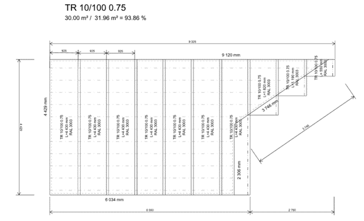
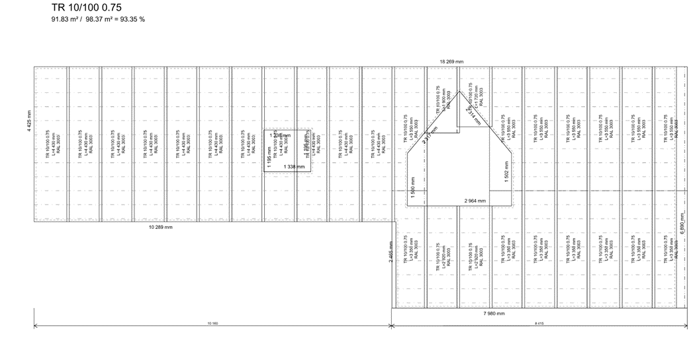

# HiStruct pro střechaře

HiStruct je webová aplikace, která umožňuje snadnou spolupráci či sdílení projektu nebo jeho částí. Takto umožníte náhled na 3D model střechy koncovému zákazníkovi, spolupracujete na projektu s kolegou nebo montážní firmou.
Slouží k rychlému sestavení nabídky, výkazu materiálu a kladečských plánů pro střešní krytiny, oplechování, lemovky a okapové systémy. Systém umožňuje několik módů zadání, které zvyšují efektivitu při práci s projektem.

## Jak zpracovat poptávku střechy v HiStruct?

1. Založím projekt s mapou nebo bez
1. Namodeluji střešní plochy překreslením nebo si pomůžu importem
1. Upravím vygenerované kladení
1. Navolím lemovky a okapový systém nebo jej nechám automaticky vygenerovat
1. Upravím krásnou nabídku, která nám vyhraje zakázku
1. Sdílím projekt se zákazníkem

Hotovo, jdu na kávičku 😊

HiStruct lze rozsáhle přizpůsobit. Systém kladení střešních tvarovek, lemovek, oplechování a okapového systému je nastaven pro každého konkrétního výrobce zvlášť v samostatném konfiguračním souboru. Obsahuje informaci o tom jakým způsobem je třeba střešní plochu tvarovkami vyskládat, dále možné barevné kombinace, informace k výkazu materiálu a další. Tyto a další přizpůsobení děláme v rámci [projektu pro přizpůsobení](CustomisationProject.md).

## Tak a teď podrobněji...

### Zpracovávám novou poptávku

Toto napíše Jirka nebo Hanka?

### Modelování

Začínáme většinou **volbou typu krytiny, lemovek a okapového systému** (ta lze následně měnit) z knihoven. Knihovny krytin a lemovek pro nás znamenají nejen velikost a barvu, ale celý přístup k opláštění konkrétních střešních ploch. Do knihovny jsme díky variabilnímu generátoru zanést konkrétní montážní postup dané krytiny konkrétního výrobce. Kvalitně vytvořený generátor následně eliminuje nutné zásahy do automatického kladení.

**Mám jen pár náčrtků s rozměry 😊**

Pokud nemám k dispozici digitální podklad, musím střešní roviny překreslit. Aby se mi překreslovalo lépe, mám k dispozici několik možností. Pokud je tvar střešní plochy jednoduchý, můžu si [vybrat z předvolených tvarů](ModellingRoofs.md).

**Mám vektorový výkres půdorysu střechy 😊😊**

Pokud mám k dispozici vektorový výkres, bude se mi modelovat snadněji. Do HiStruct lze [importovat *.dxf](ImportDxf.md), případně [převést vektorové *.pdf na *.dxf](ConvertPdfToDxf.md) a to [naimportovat do HiStruct](ImportDxf.md). Na importované *.dxf se lze přichytávat, zadání jednotlivých střešních ploch pak probíhá oklikáním půdorysu s doplněním sklonu pro každou střešní plochu. Výhodou je přesnost a snadné zhotovení 3D modelu. Téměř vždy lze použít [generátor lemovek a okapového systému](GeneratorFlashing.md).

**Mám 3D model z digitálního zaměření 😊😊😊**

Model z digitálního zaměření je výhra. Pokud mám tento model ve vhodném formátu (3D *.pdf nebo přímo *.obj), můžu geometrii rovnou importovat. Do HiStruct lze [importovat *.obj](ImportObj.md), případně [převést 3D *.pdf na *.obj](Convert3dPdfToObj.md) a to [naimportovat do HiStruct](ImportObj.md).

Po importu HiStruct nabídne rozpoznané plochy, ze kterých vyberete, jak se mají převést na HiStruct geometrii. Generátor ploch pak provede převod na střešní nebo stěnové opláštěné plochy,  na kterých lze dále posupovat běžným způsobem

Po vygenerování střešních ploch můžu použít ještě generátor lemovek a okapového systému.

### Kladení

Oplechování, lemovky a okapový systém lze zadat v prostoru chytáním na koncové body střešních rovin, obecně u lemovek a plechů přebíráme sklony střešních rovin kvůli správnému nastavení ohýbacích úhlů. Komplexní možnosti nastavení okapového systému. Zadání pomocí polyline definující navazující okap, lze nastavit sklon okapu. Pro každou část okapu nastavíme i sklon navazující střešní roviny pro správný výpočet ohybu a délky háků. Na každou část okapu lze přidat svody, které mají další možnosti nastavení.

### Lemovky a okapový systém

Je určen zejména k **úspoře času** pro zhotovení 3d modelu lemovek a okapů pro importované nebo zadané geometrie střešních rovin.

HiStruct rozpozná z geometrií blízkých střešních rovin potřebná umístění lemovek a ze zvolených typů provede nagenerování. Nagenerované lemovky lze dále upravovat.

### Kusovníky, dokumenty, výkresy... prostě výstupy

**Kladecí plány**
Kladečské výkresy jsou generovány automaticky ze zadané geometrie a případných změn uživatele. V případě potřeby lze výkres doplnit dalšími poznámkami či kótami.

