# Možnosti opláštění

Podle typu krytiny zvolené na opláštění konkrétní střešní nebo stěnové plochy je zvolen vhodný generátor. Každý typ generátoru může mít specifický ovládací prvek.

## Generátor plechových pásů 

Generátor plechových pásů umisťuje zvolenou krytinu po spádnici plochy. Generátor lze nastavovat pro celou oplášťovanou plochu nebo, některá nastevení jsou pakl dostupná po kliknutí na jednotlivý pás. V editačním módu je pak vždy zobrazen podíl celkové plochy pásů a oplášťovanou plochou.

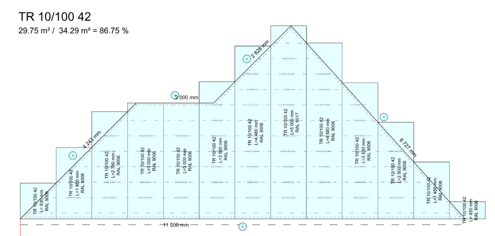

### Směr kladení

Je nastavitelný, výběr z následujících typů:

- zleva 
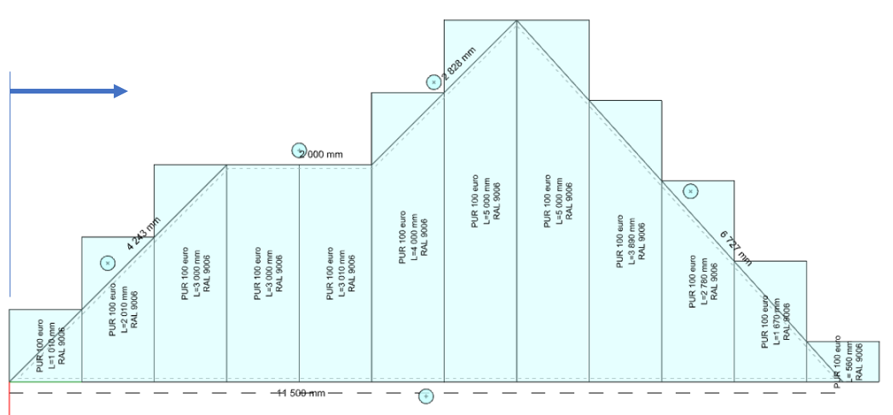

- zprava 
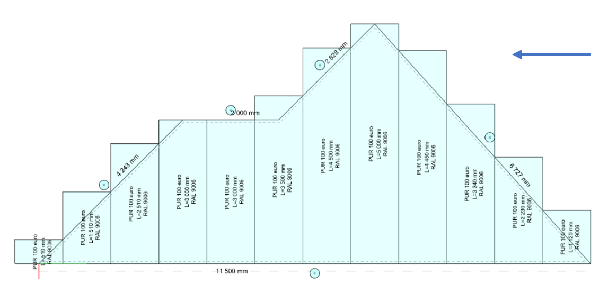

- centrovat střed prostředního pásu krytiny na střed okapové strany
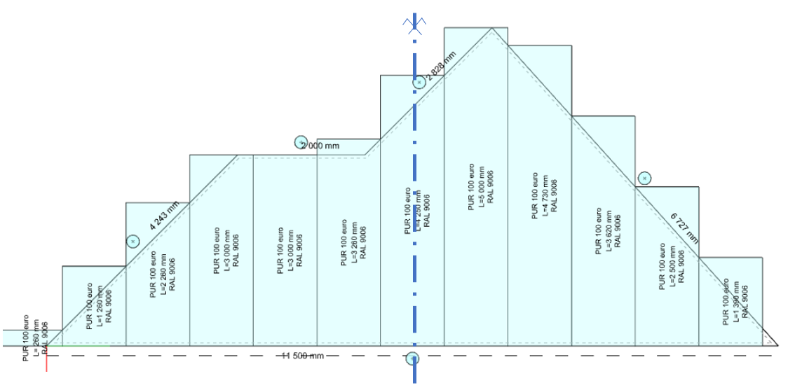

- umístit hranu pásu krytiny na střed okapové strany
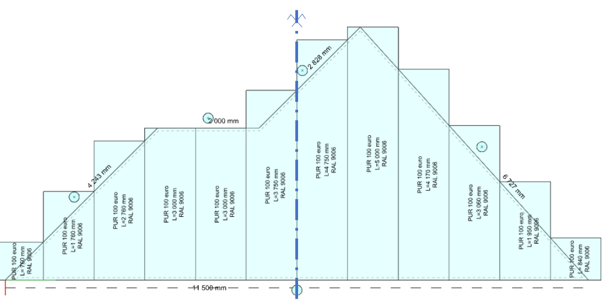

- obecné zadání počátku kladení (kladení zleva + vzdálenost)
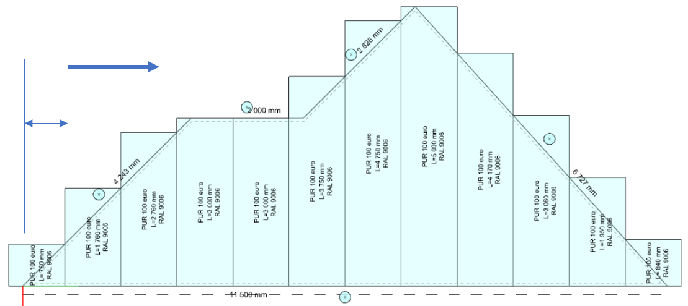

### Úhel kladení pásů

Je nastavitelný jako kladný nebo záporný odklon od spádnice.
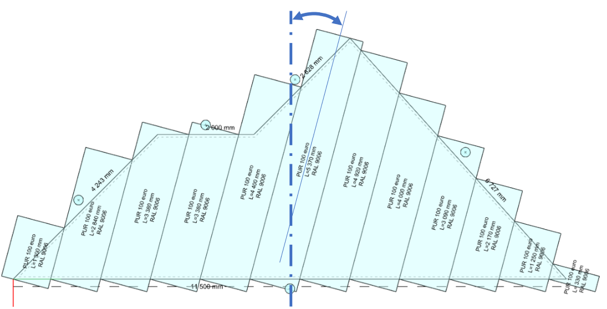

## Každý konkrétní pás
- vypnout ( pak se nezohlední ve výkresech, v detailním modelu ani ve výkazech materiálu.)
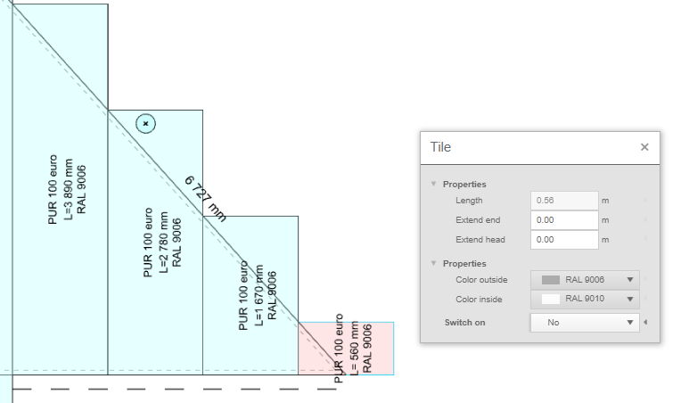

- prodloužit nebo zkrátit přesah
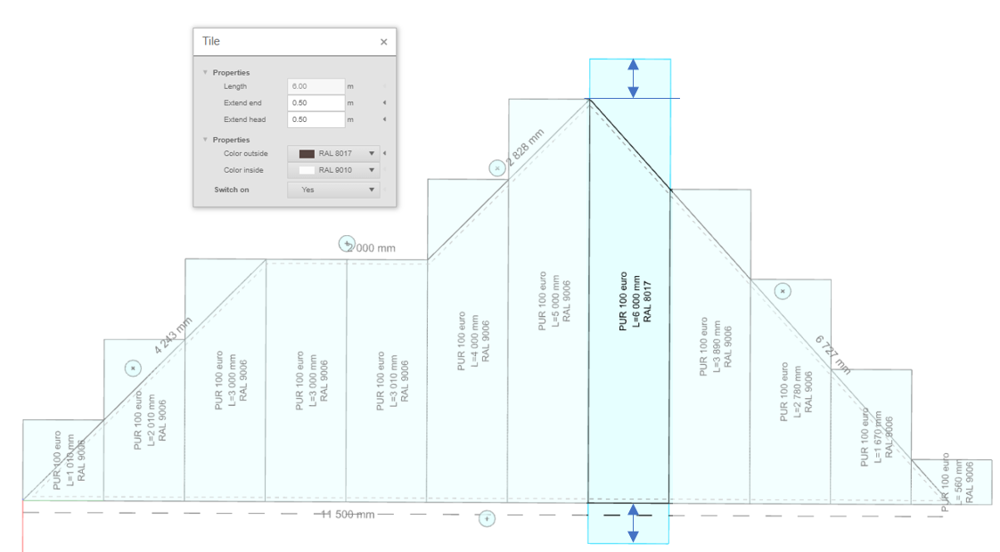

- nadělit ve vhodných místech (podle rastru latí) Kliknutím na naznačená dělení nad latěmi lze pás rozdělit nebo naopak spojit, pokud už byl rozdělen.
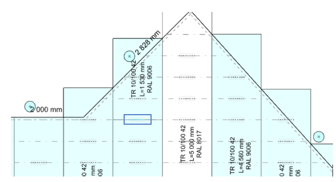

## Prodloužení nebo zkrácení panelů u stran

Pro každou stranu střešního polygonu lze nastavit prodloužení nebo zkrácení panelů, kliknutím na tlačítko nad hranou.
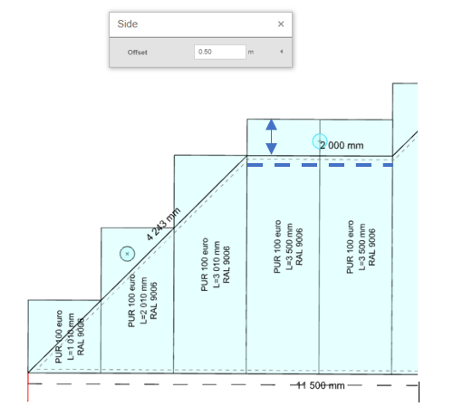
