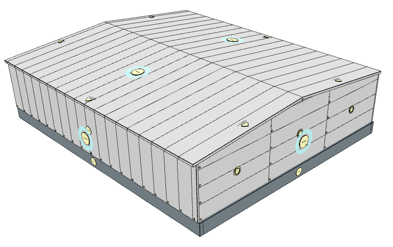

# Kontextové nastavení opláštění

Kontextová tlačítka v modelu umožňují vybrat a nastavit konkrétní část opláštění.

## Tlačítka pro ovládání stěn

[Stěna](wall.md)

[Stěnový díl](wallPart.md)

[Stěnový pás](wallStrip.md)

[Stěnový segment](wallSegment.md)

[Panel](wallPanel.md)

## Tlačítka pro ovládání střechy

[Střecha](roof.md)

[Přesah střechy](../roofOverhang.md)
