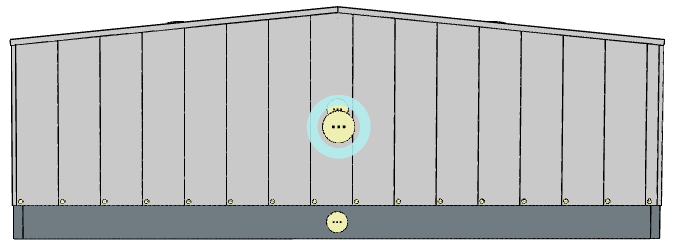

# Nastavení opláštění pro stěnový segment

Stěnový segment je základní část stěnového opláštění, kterou lze vyskládat panely. Stěnové segmenty jsou podřízeny [stěnovým pásům](wallStrip.md). Stěnový pás se může skládat z více stěnových segmentů. Stěnový segment opláštěné stěny se skládá ze [stěnových panelů](wallPanel.md)

Vodorovné kladení - 3 stěnové segmenty

Svislé kladení - jeden stěnový segment

Nastavení stěnového segmentu:

 - [Opláštění stěny](../mainSettings.md)
 - [Kladení panelů na stěnách](../wallOrientation.md)
 - [Barevná schemata pro vodorovně kladené panely](../wallColorSchemeHorizontal.md)
 - [Barevná schemata pro svisle kladené panely](../wallColorSchemeVertical.md)
 - [Sekundární konstrukce](../wallSecondary.md)