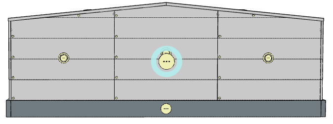
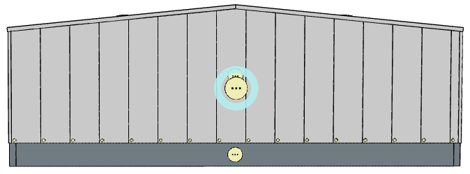

# Nastavení opláštění pro stěnový pás

Stěnový pás je část stěnového opláštění, kterou lze vyskládat stěnovými [segmenty](wallSegment.md). Stěnové pásy jsou podřízeny [stěnovým dílům](wallPart.md).

## Rozdělení na segmenty
Ve výchozím nastavení se dělení pásu na segmenty uplatní pouze pro vodorovné kladení panelů. Při svislém kladení panelů zůstává stěnový pás nedělený (obsahuje právě jeden stěnový segment).

Vodorovné kladení - 3 stěnové segmenty

Svislé kladení - jeden stěnový segment

Další nastavení se uplatní pro všechny podřízené stěnové segmenty:

 - [Opláštění stěny](../mainSettings.md)
 - [Kladení panelů na stěnách](../wallOrientation.md)
 - [Barevná schemata pro vodorovně kladené panely](../wallColorSchemeHorizontal.md)
 - [Barevná schemata pro svisle kladené panely](../wallColorSchemeVertical.md)
 - [Sekundární konstrukce](../wallSecondary.md)
