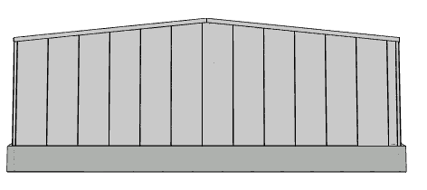
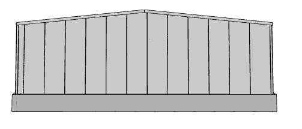
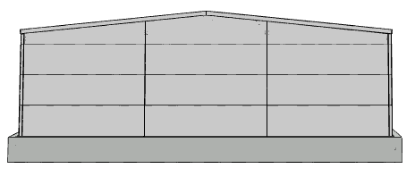
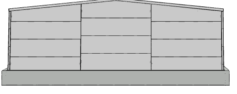
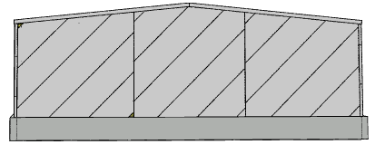
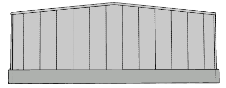
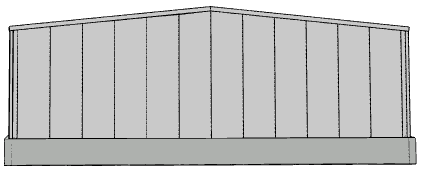

# Kladení panelů na stěnách

## Směr kladení panelů
Stěnová opláštění umožňují nastavení směru kladení panelů a případného centrování a odsazení počátku kladení panelů. 

### Svislý směr kladení panelů +Y a -Y
Panely jsou kladeny vždy z jednoho směru v lokálním souřadném systému kladeného segmentu.

 

### Vodorovný směr kladení + X a -X
Panely jsou kladeny vždy z jednoho směru v lokálním souřadném systému kladeného segmentu.

 

### Obecný směr kladení
Panely jsou kladeny vždy z jednoho směru v lokálním souřadném systému kladeného segmentu natočeného o zadaný úhel natočení.

## Nastavení počátku kladení
Touto volbou lze ovlivnit umístění počátku pro kladení panelů, zejména pro svislý směr kladení.
Volba _Centrovat panely na osu_ vynutí umístění panelu na střed segmentu, zatímco volba _Centrovat panely na hranu_ umístí na střed segmentu hranu panelu. 

 

Doplňkově je možné obecné posunutí počátku kladení panelů o zadanou hodnotu.
