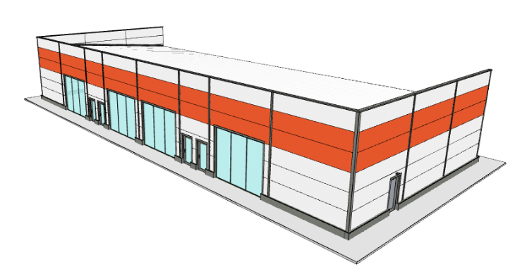
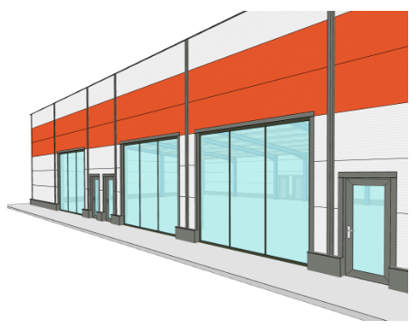
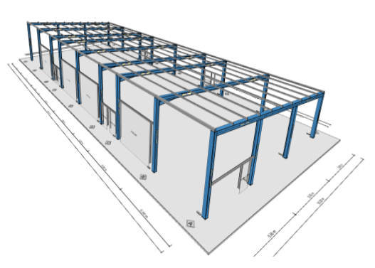
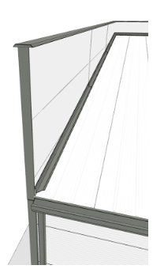

# Story: Koupelnové studio

Společnost zabývající se výrobou a prodejem sanitární keramiky potřebovala v co nejrychlejším čase vybudovat předváděcí studio a showroom koupelen. Budova měla být umístěna v lokalitě obchodní zóny pro pěší.

>“*Konfigurátor HiStruct nám pomohl získat poměrně jasnou představu, jak nejvhodněji showroom zakomponovat do okolní zástavby*,” přibližuje nespornou výhodu možnosti konfigurace obchodní ředitel firmy. 

Budova je hlavní stěnou otočená do ulice. Pro efektivní vzhled jsou ve fasádě umístěny prosklené výkladní portály. 

Aby se stavba lépe začlenila do okolní zástavby, je fasáda vyzdvihnuta do atiky. Vchodové dveře jsou umístěné do zúžených modulů o šířce 3 m. Toto vhodně rozděluje budovu na tři celky, které mohou mít odlišné využití.

Velikost | 36 x 15 x 5,3 m
-- | --
Půdorysná plocha | 540 m2
Počet polí a délka polí | 8 x 5 / 3 m
Zateplení | Ano, 120 mm PUR
Konstrukce | Ocel, 23 tun
Plocha otvorů | 72 m2

Nosná konstrukce je tvořena ocelovými válcovanými profily typu HEB. Díky pultovému typu střechy jsou střešní nosníky rovné bez klasického zalomení.

### Tip: Detaily oplechování
Konfigurátor automaticky vkládá detaily oplechování pro krytí atikové části, napojení střešních rovin apod.

[Modelovat](https://app.histruct.com/buildingconfigurator/cs/edit/component/556079)

