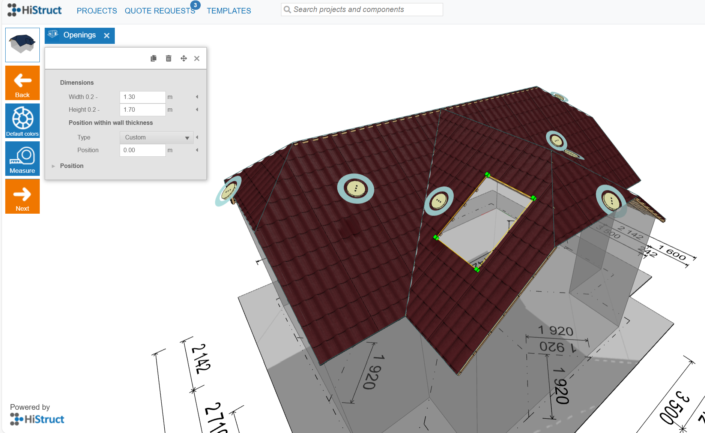

# 🪟 Jak pracovat s otvory krok za krokem

 The **Otvory** nabídka vám dává plnou kontrolu nad okny a dalšími typy otvorů ve vašem projektu střechy. Můžete přidávat nové otvory, upravovat jejich rozměry a polohu a dokonce je duplikovat nebo přesouvat jen pár kliknutími.

 ⚠️ ***Poznámka:** Některé funkce jako **tlačítko Ovládání** a **tlačítko Upravit** jsou dostupné pouze v **pokročilém režimu**. Podívejte se do [**Průvodce nastavením**](13_settings.md)* *pro pokyny k odemknutí všech funkcí.*

## 1️⃣ Přidání otvoru

 Na každé střešní ploše se po vstupu do menu **Otvory** zobrazí **tlačítko Ovládání**. Klikněte na toto tlačítko pro otevření seznamu dostupných otvorů, vyberte požadovaný typ a bude automaticky umístěn na vybranou střešní plochu. Samozřejmě jej můžete následně upravovat.

## 2️⃣ Úprava otvorů

 Jakmile vyberete otvor v 3D modelu kliknutím na něj, **můžete změnit velikost a přemístit otvor přímo v 3D modelu přetažením myší (drag & drop).**

 Současně se otevře panel vlastností otvoru. Zde můžete:

- Změnit šířku a výšku (zadejte přesné hodnoty v metrech)

- Upravit polohu číselně pro maximální přesnost

 **👉** Výchozí barvy otvorů lze nastavit pomocí tlačítka Výchozí barvy v levém postranním menu, kde můžete definovat standardní barvy pro vybrané typy otvorů.

## 3️⃣ Kopírování otvorů

 **Dokončili jste jeden otvor a chcete ho znovu použít?**
 Klikněte na otvor a použijte ikonu kopírování v panelu vlastností - vybraný otvor bude duplikován a zachová všechna svá nastavení. To usnadňuje vytváření konzistentních rozvržení bez začínání od nuly. Pokračujte úpravou polohy nově vytvořeného otvoru přes panel vlastností.

## 4️⃣ Přesouvání otvorů

 Existují dva způsoby, jak přesunout otvor:

1.  **Přetáhnout a pustit** přímo v modelu - stačí kliknout a posunout myší.

2.  Použijte **ikonu Přesunout** v panelu vlastností - po kliknutí se zobrazí vodicí čára a můžete otvor přesněji přemístit.

## 5️⃣ Měření otvorů

 Použijte tlačítko Měřit pro ověření přesné velikosti a umístění vašich otvorů v modelu.

 ✅ To je všechno – váš model je nyní doplněn o otvory. Jste připraveni pokračovat? Dále je čas vygenerovat výstupy — dokumenty, detailní výkresy, kusovník (BOM) a další, abyste připravili dokonalou cenovou nabídku. 
**👉 Podívejte se na [další článek](12_outputs.md)** **, kde zjistíte jak je získat.**