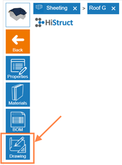
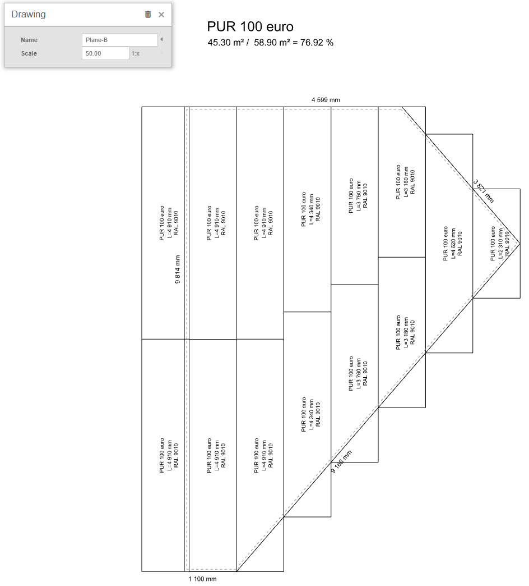
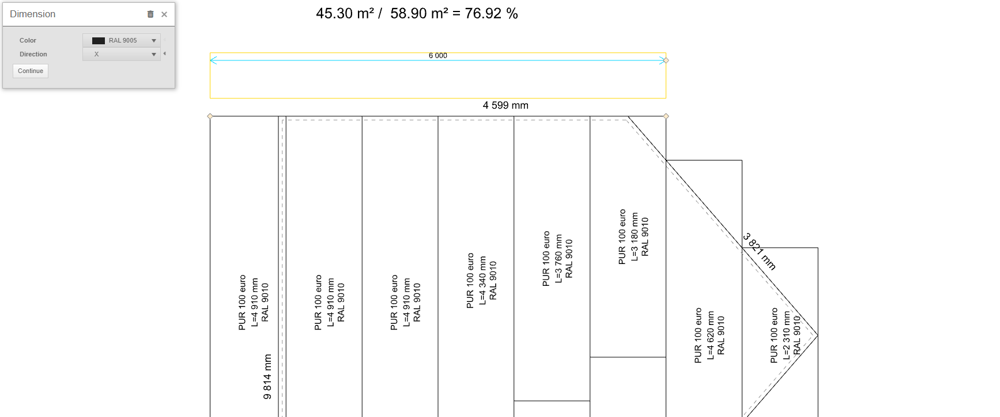
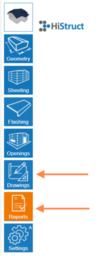

# 📏 Vytvoření instalačního výkresu pro rovinu střechy

Výkres rozvržení střešní roviny je klíčovou součástí procesu návrhu budovy, která umožňuje převést projektovou dokumentaci do praktického návrhu na střeše. Tento výkres slouží jako podrobný průvodce pro stavitele při instalaci střešního systému a obsahuje důležité informace o umístění materiálů, spojích a všech technických aspektech, které jsou nezbytné pro kvalitní a bezpečnou konstrukci střechy.

V HiStruct jsou kompletní výkresy všech střešních rovin **automaticky generovány na základě 3D modelu. Pro úpravu těchto výkresů:**

1.  V **menu Krytina** jednoduše přejděte na konkrétní rovinu střechy pomocí **Ovládacího tlačítka**, které vidíte přímo na dané střešní rovině

2.  Klikněte na tlačítko **Výkresy**.

3.  Nyní můžete dále výkres upravovat: přidat kóty, přidat popisky, změnit název a měřítko v záložce Vlastnosti.

## Přidání kót

> Zadání kóty provedete kliknutím na **Kóta**, výběrem dvou bodů, mezi kterými chcete kótu zakreslit, a následným zadáním vzdálenosti pro zakreslení kótovací čáry. Po kliknutí na kótu lze:

- **Změnit její barvu**

- **Určit směr, ve kterém se bude kóta zakreslovat.** Směr může být nastaven na ***X*, *Y*,** anebo ***Výchozí***, což změří nejkratší vzdálenost mezi body. Případně můžete zvolit směr ***Úhel***, který zakreslí kótu ve zvoleném úhlu.

- Poslední možností v úpravě kóty je tlačítko **Pokračovat**, které vygeneruje další kótu ve stejném směru.

> **💡** Pokud chcete **upravit jakýkoliv bod u přidané kóty**, stačí **kliknout na kótu** a pohybem žlutých bodů již kótu upravujete**.**

>

**❓Kde mohu najít a stáhnout vygenerované výkresy?**\
Po vygenerování a případné úpravě jsou výkresy automaticky zahrnuty do výstupů. Vraťte se zpět do hlavního levého menu:

- Přejděte do **Výkresy ⇒ Sestavy** v hlavním levém menu. Zde můžete výkresy dále upravovat – například: přidat kóty, popisky nebo změnit název a měřítko v záložce **Vlastnosti**.

- **Stáhnout je můžete** pod oranžovým **tlačítkem Zprávy ⇒ Krytiny BOM**, kde jsou výkresy zahrnuté.

- Když jste v konkrétním výkresu, můžete jej stáhnout jako PDF pomocí tlačítka fotoaparátu a následně vytisknout do PDF

⚠️ ***Poznámka:** Některé funkce jako **Ovládací** a **Editační tlačítka** jsou dostupné pouze v **Pokročilém režimu**. Podívejte se na [**Průvodce nastavením**](13_settings.md) *pro instrukce k odemčení všech funkcí.*

**👉 Zpět na článek  [*Jak pracovat s menu Krytina*](8_sheeting_menu.md)**

**👉 [*Zpět na hlavní článek*](index.md)**