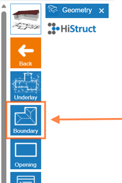

# 👉 Jak vytvořit tvar střechy z obrysu a začít kreslit přímo

1.  **Klikněte na kartu Geometrie a zvolte tlačítko Ohraničení.** Tím povolíte kreslení tvaru střechy. Klikněte kdekoli v pracovní ploše, ale obvykle je nejjednodušší kliknout přímo na výchozí bod (zobrazené zelené a červené souřadnice).

2.  **Kreslení kurzorem.** Při pohybu kurzoru se může automaticky přichytávat podél vodorovného (X - červená) nebo svislého (Y - zelená) směru, nebo kolmo na poslední nakreslenou hranu.

3.  **Nastavení délky hrany.** Pokud chcete konkrétní délku, zadejte číslo v metrech a stiskněte **Enter**. Hrana se okamžitě upraví na tuto délku.

4.  **Uzavření obrysu.** Tvar dokončíte buď dosažením výchozího bodu, nebo stisknutím **Enter**.

## 💡Další způsoby kreslení hran:

1.  **Nastavení globálních souřadnic:**

- Zadejte přesnou pozici dalšího rohu od pevného výchozího bodu (0;0).

- Například 2;4 znamená 2 metry vpravo a 4 metry nahoru od počátku souřadnicového systému.

2.  **Nastavení relativních souřadnic**

- Zadejte pozici dalšího rohu vzhledem k poslednímu nakreslenému bodu.

- Například \@2;4 znamená 2 metry vpravo a 4 metry nahoru od posledního bodu.

3.  **Nastavení polárních souřadnic**

- Zadejte další roh pomocí úhlu a vzdálenosti, např. \>135;6.

- Úhel se měří od kladné osy X proti směru hodinových ručiček.

## 💡Tipy:

- Pokud se nakreslené hrany zbarví do **růžova**, znamená to, že mezi nimi vznikl pravý úhel.

- Poslední bod můžete kdykoli smazat stisknutím **DELETE**.

A to je vše! Teď vidíte svou střechu téměř hotovou. V dalších krocích vyberete krytinu, lemování, přidáte otvory a vygenerujete výstupy. 

**👉 [*Přejít na další kroky*](8_sheeting_menu.md)**.

**👉 [*Zpět na hlavní článek*](index.md)**