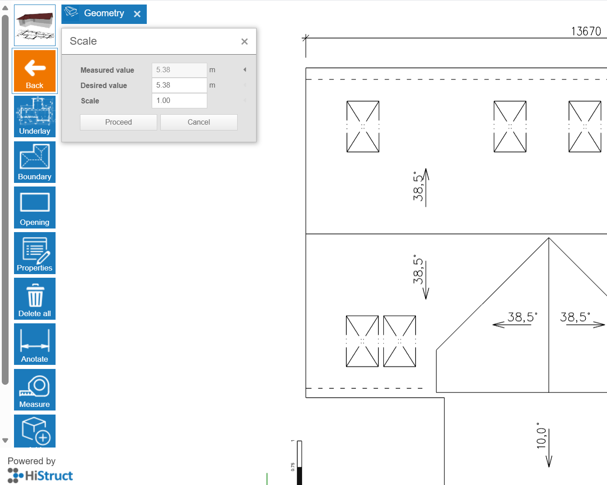

# 👉 Jak vložit soubory DXF pro přesné modelování? 

1.  **Zvolte tlačítko Podklad** a klikněte na **Import \*.dxf**. Tím se otevře dialogové okno, kde můžete nahrát svůj výkres.

2.  **Určení bodu vložení.** Po výběru souboru je nutné určit bod vložení výkresu kliknutím do scény.

3.  **Nastavení správného měřítka výkresu.** Protože jsou výkresy v různých měřítcích, je nejprve nutné nastavit správné měřítko, aby model odpovídal skutečným rozměrům (Měřítko můžete nastavit kliknutím na šedé obdélníkové tlačítko v modelovacím prostoru po importu souboru):

 

a.  Nejprve klikněte na **tlačítko Měřítko**.

b.  Klikněte na dva body, pro které znáte skutečnou vzdálenost na výkresu.

c.  Poté zadejte požadovanou vzdálenost a stiskněte **Enter**.

d.  Klikněte na **Pokračovat** a software automaticky vypočítá měřítko.

 **💡Pokud jste nastavili správnou hodnotu měřítka, naměřené hodnoty budou odpovídat čarám na výkresu.**

4.  **Kreslení střechy.** Jednoduše klikněte na tlačítko Obrys a obtáhněte importovaný půdorys střechy.

 A to je vše! Nyní můžete vidět svou střechu téměř hotovou. V dalších krocích si můžete vybrat krytinu, oplechování, upravit otvory a vygenerovat výstupy.

**👉 [*Přejít na další kroky*](8_sheeting_menu.md)**

**👉 [*Vrátit se na hlavní článek*](index.md)**