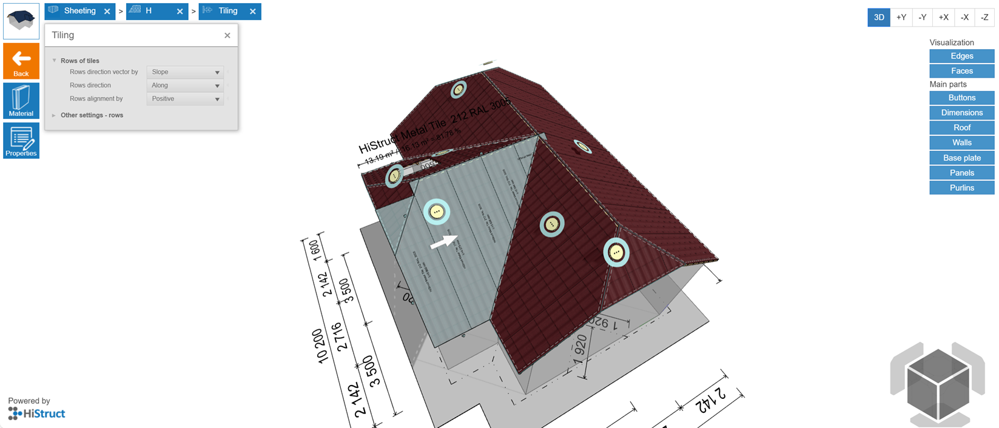
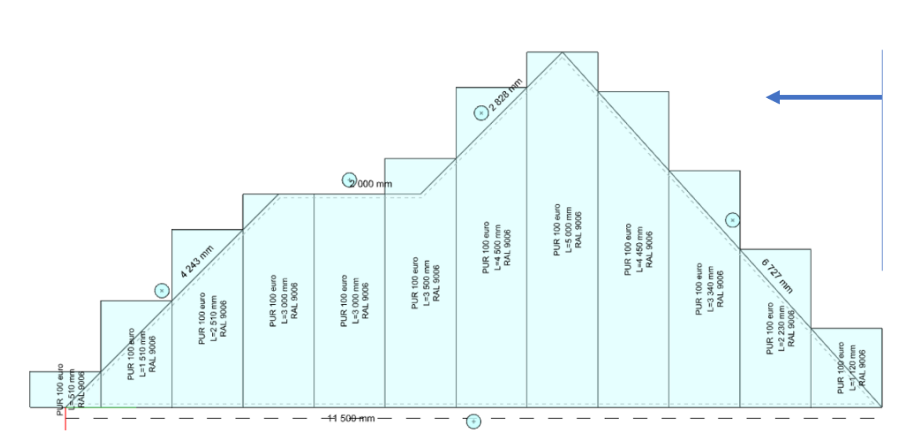
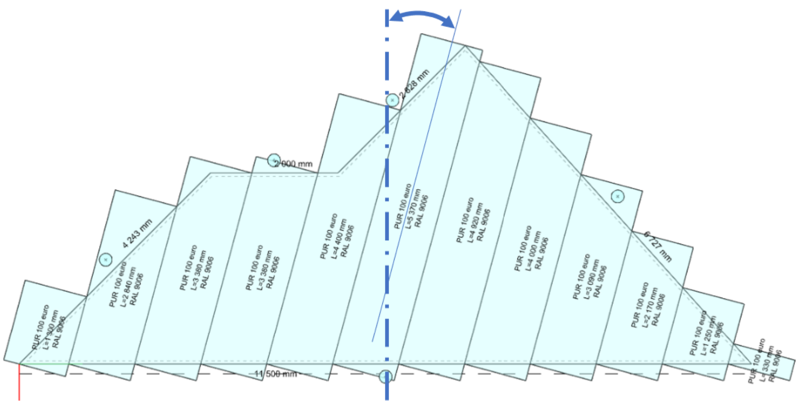
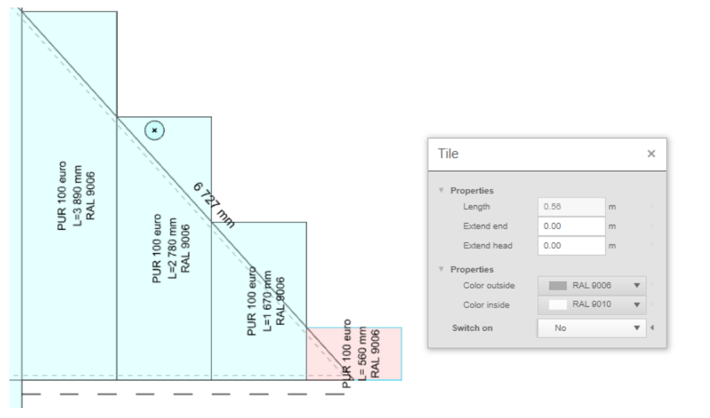
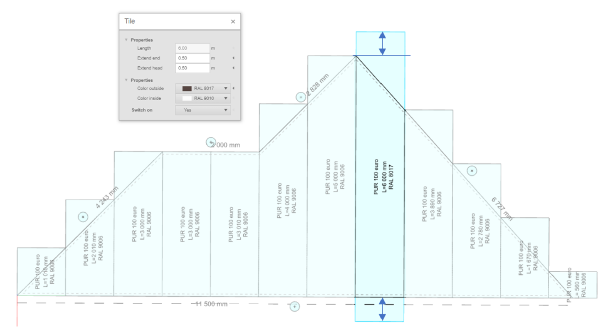
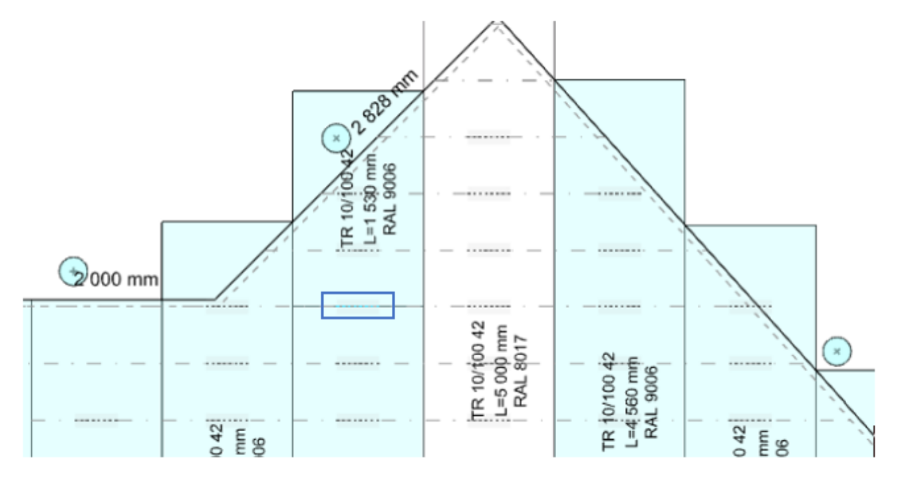

# 🛠️ Rychlé a snadné nastavení kladení krytiny

HiStruct Roofs automaticky umisťuje vybraný střešní materiál podél rovné plochy. **Po vygenerování lze pásy upravovat dle potřeby.**

**💡 Chcete-li vidět, jak jsou jednotlivé pásy rozloženy**, přejděte do nabídky **Krytina** ⇒ klikněte na **Ovládací tlačítko Upravit** u vrstvy střešní krytiny umístěné přímo na modelu střechy [viz předchozí návod](8_sheeting_menu.md) ⇒ a stiskněte tlačítko **Kladení** v menu vlevo.

⚠️ ***Poznámka:** Některé funkce, jako **Ovládací tlačítko Kontrola** a **Ovládací tlačítko Upravit**, jsou dostupné pouze v **Pokročilém režimu**. Podívejte se do [**návodu Nastavení**](13_settings.md) *pro informace o odemčení všech funkcí.*

📌 **Nyní se nacházíte v režimu úprav. Můžete:**

- Upravit celé kladení

- Upravit jednotlivé pásy

> **Směr kladení**
>
> Je možné konfigurovat, z následujících typů:

- **pozitivní**

> 

- **negativní**

> 
- **centrovat dlaždici**

> 

- **centrovat spoj**

> 

- **obecná specifikace začátku kladení (kladeni pozitivní + vzdálenost)**

> 
>
> **Úhel kladení pásů**
>
> **Lze upravit jako pozitivní nebo negativní odchylku od základní linie.**
>
> 
>
> **Každý konkrétní pás**

- **zakázat (poté se nepromítá do výkresů, detailního modelu nebo výkazů materiálu.)**

> 

- **prodloužit nebo zkrátit přesah**

> 

- **překrýt ve vhodných místech (podle rastru latí). Kliknutím na vyznačená dělení nad latěmi lze pás rozdělit, nebo naopak sloučit, pokud byl již rozdělen.**

> 

> **Prodloužení nebo zkrácení panelů na stranách**
>
> Pro každou stranu střešního polygonu můžete nastavit prodloužení nebo zkrácení panelu kliknutím na tlačítko nad hranou.
>
> 

**👉 Zpět na článek  [*Jak pracovat s menu Krytina*](8_sheeting_menu.md)**

**👉 [*Zpět na hlavní článek*](index.md)**