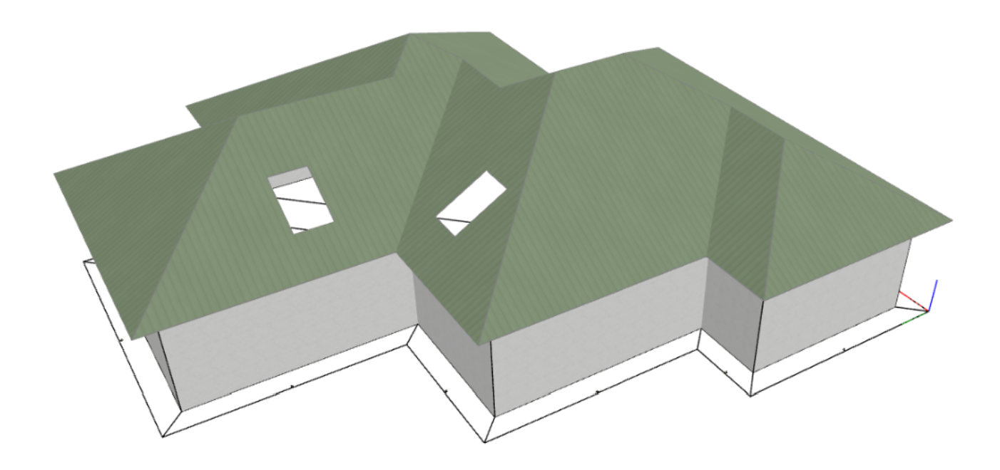

# 🚀 Jak funguje generátor oplechování a okapů HiStruct

Je především navržen tak, aby **ušetřil čas** při vytváření 3D modelů oplechování a okapů z importovaných nebo zadaných geometrií střešních ploch.

Generátor lze také obecně použít pro rovinné geometrie, které jsou zadány z výkresu nebo zcela ručně a následně upraveny tak, aby co nejlépe seděly na hranách dotýkaných střešních ploch. Nemusí sedět dokonale, stačí, když jsou v rámci běžných tolerancí.

HiStruct automaticky identifikuje požadovaná místa pro oplechování z geometrií přilehlých střešních ploch a poté vygeneruje odpovídající typy oplechování. Tato vygenerovaná oplechování lze pak dále upravovat podle potřeby.

