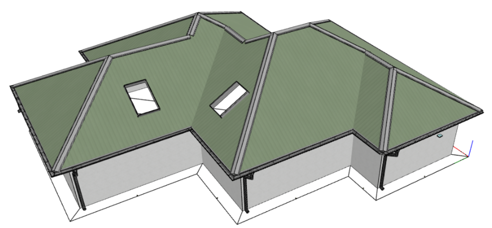

# 🚀 Jak funguje generátor lemování a žlabů v HiStruct

Je navržen především tak, aby **šetřil čas** při tvorbě 3D modelu lemování a okapů pro importované nebo specifikované geometrie střešních rovin.

Generátor lze obecně použít i pro rovinné geometrie, které jsou zadány z výkresu nebo zcela ručně a jsou jen upraveny tak, aby co nejlépe navazovaly na okraje střešních rovin, kterých se mají dotknout. Nemusí přesně sedět, stačí zapadnout do běžné tolerance.

HiStruct automaticky rozpozná potřebná místa pro lemování z geometrií blízkých střešních rovin a následně vygeneruje odpovídající typy lemování. Tato vygenerovaná lemování lze dále upravovat podle potřeby.

