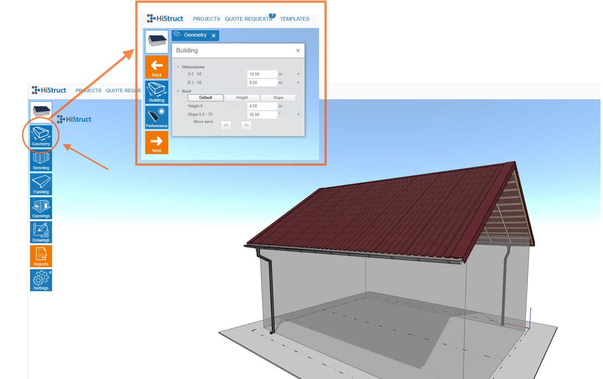

# 🏠 Jak začít modelovat střechu pomocí šablony

Pokud chcete modelovat jednoduchou střechu standardního tvaru a máte k dispozici rozměry, jedním z nejjednodušších způsobů, jak získat model střechy, je použít jednu z našich předdefinovaných šablon:

1.  Při vytváření nového projektu vyberte vhodnou šablonu z nabízených předdefinovaných šablon. Nebo přímo otevřete **Šablony** v levém horním rohu menu HiStruct a zvolte vhodnou šablonu střechy. Zvolená šablona se otevře přímo v aplikaci.

2.  Klikněte na kartu **Geometrie** pro zadání základních rozměrů budovy, výšky budovy a sklonu střechy. Můžete také posunout okap pro změnu okapové hrany.

A to je vše! Nyní vidíte střechu téměř hotovou. V dalších krocích vyberete krytinu, oplechování, přidáte otvory a vygenerujete výstupy.

**👉 [*Přejít na další kroky*](8_sheeting_menu.md)**

**👉 [*Vrátit se do hlavního článku*](index.md)**