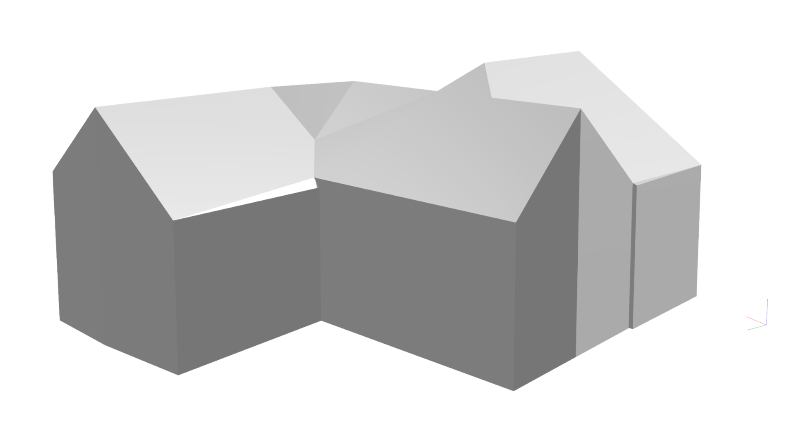
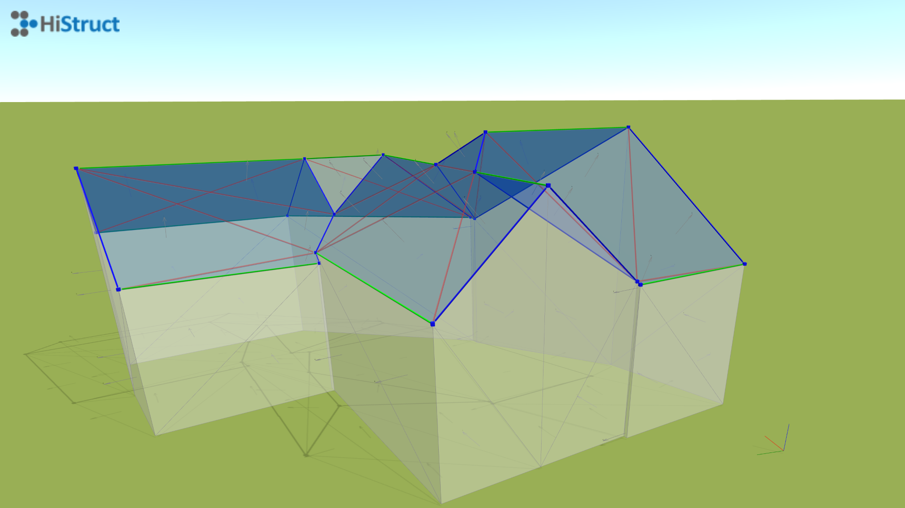
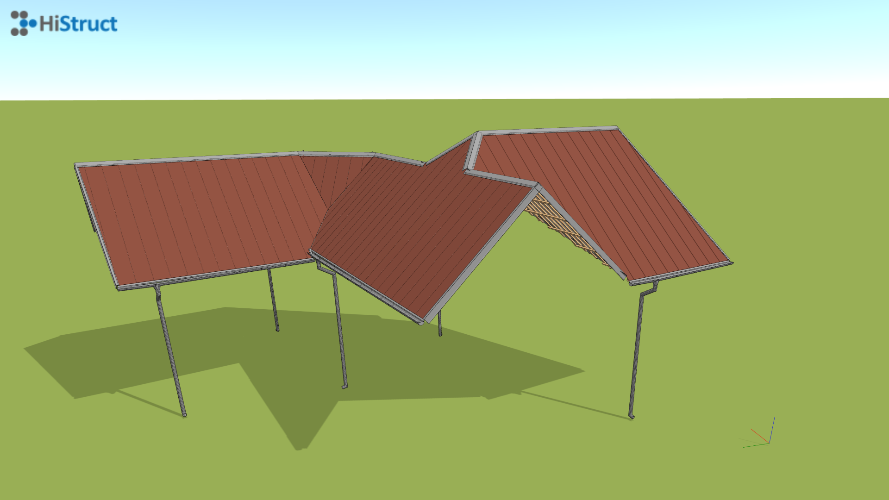

# 🏠 Automatické generování střechy pomocí OBJ modelu

Máte 3D model z BIM projektu, leteckého snímkování dronem nebo satelitního zaměření? Skvělé – HiStruct rozumí OBJ skvěle. S OBJ HiStruct automaticky vygeneruje 3D model střechy. Pokud takový model nemáte k dispozici, existují společnosti, které nabízejí zaměření stávajících budov. Ať už je zaměření provedeno drony nebo satelity, výsledkem je obvykle detailní 3D model ve formátu OBJ.

**❓Co když obdržím 3D model ve formátu PDF a nemám OBJ?**

Pokud máte 3D model v PDF formátu, je potřeba jej převést do formátu OBJ, který HiStruct podporuje. Je to snadné. Podívejte se na [tento návod](6_PDF_to_OBJ.md), jak rychle převést 3D model z PDF do OBJ.

Výsledný model může vypadat takto:

## Jak vložit OBJ model do HiStructu

1.  **Klikněte na tlačítko Import.obj.** Otevře se dialog, kde můžete nahrát svůj model.

2.  **Zvolte bod vložení.** Po výběru souboru klikněte kamkoli ve scéně, kde chcete model zobrazit.

3.  **Nechte generátor střechy zapracovat.** HiStruct automaticky rozpozná roviny a hrany střechy a vytvoří 3D model z trojúhelníkových ploch definovaných těmito hranami.

4.  **Ruční úpravy podle potřeby.** I když je generátor téměř dokonalý, občas může některá hrana chybět nebo plocha být nesprávně zařazena. Jakoukoli vygenerovanou hranu nebo plochu můžete doladit přímo v modelu.

## 🔧 Doladění modelu

<u>**Hrany**</u>

- **Klikněte na libovolnou hranu** pro úpravu jejích **vlastností**

- **Jednotlivé hrany jsou barevně rozděleny do 3 skupin podle funkce:**

> **🟦 Štítová hrana** – šikmá hrana na konci střešní roviny; vymezuje okraj této plochy.\
> **🟩 Okapová hrana** – vodorovná hrana střešní roviny.\
> **🟥 Vnitřní hrana** – hrana uvnitř střešní roviny, používá se pouze pro rozdělení ploch; při generování střechy se ignoruje.

- **Každou hranu můžete zapnout nebo vypnout a nastavit, zda je vodorovná.**

<u>**Plochy**</u>

- Stejně jako u hran můžete **měnit vlastnosti každé rozpoznané plochy**.

- Podle orientace HiStruct rozhoduje, zda je plocha součástí střechy.

- Klikněte na libovolnou plochu pro zahrnutí nebo vyloučení z generování střechy. Na zahrnutých plochách budou vygenerovány krytiny, podkonstrukce a oplechování.

- Plochy jsou barevně rozděleny do dvou skupin:\
  🟦 **Modrá** – součást střechy; používá se při generování.\
  ⬜ **Bílá** – není součástí střechy; je vyloučená.

5. **Když je vše v pořádku, klikněte na „Další“** a nechte HiStruct udělat zbytek.

6.  Generátor vás provede dalšími kroky a pomůže vám bez námahy vytvořit střechu dle vašich představ – včetně všech doplňků.

**👉 [*Přejít na další kroky*](8_sheeting_menu.md)** 

**👉 [*Zpět na hlavní článek*](index.md)**