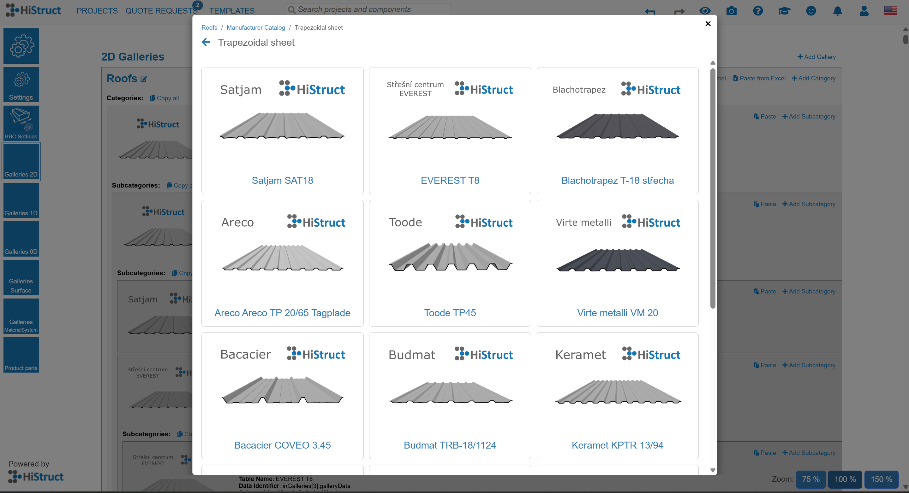

# 📝 Jak fungují knihovny krytin a oplechování v HiStruct

V HiStructu jsou knihovny krytin a oplechování víc než jen seznamy velikostí a barev. Ukládají všechna pravidla pro to, jak by měly být střešní materiály instalovány.

V rámci [projektu přizpůsobení](18_customisationProject.md) nakonfigurujeme knihovnu tak, aby obsahovala konkrétní instalační postupy pro střešní materiály každého výrobce. Díky vestavěnému generátoru proměnných systém tyto postupy poté aplikuje automaticky, čímž odpadá potřeba ručních úprav. To zajistí, že krytina je položena přesně a efektivně; ušetří vám čas a zároveň udrží váš model přesný.

**👉 [*Zpět na hlavní článek*](index.md)**