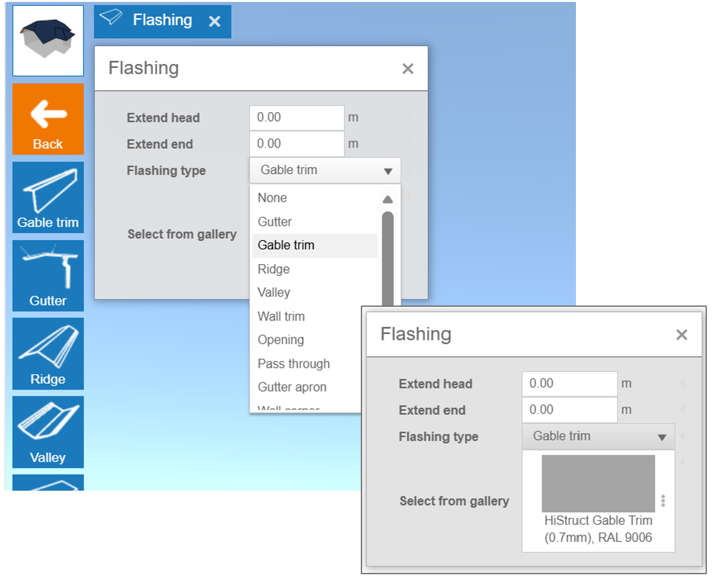

# 🌧️ Flashing and Gutter System - Ovládnutí detailů

 V Histructu jsou oplechování a okapový systém generovány automaticky. V nabídce **Oplechování** můžete upravovat jednotlivé prvky oplechování a žlabového systému, včetně jejich materiálu a barvy.

 **💡Úpravy lze provést dvěma způsoby:** 

- Upravovat skupiny pomocí tlačítek vlevo

- Upravovat jednotlivé prvky přímo v 3D modelu

 ⚠️ ***Poznámka:** Některé funkce, jako tlačítka **Ovládání** a **Upravit**, jsou přístupné pouze v **režimu Pokročilý**. Podívejte se do [**Průvodce nastavením**](13_settings.md)* *pro pokyny k odemknutí všech funkcí.* 

## 1️⃣Úprava skupin prvků pomocí tlačítek vlevo

 Na levé straně obrazovky najdete vyhrazená tlačítka pro každou skupinu prvků oplechování. Výběrem jednoho z těchto tlačítek můžete změnit materiál a barvu celé skupiny najednou. Počet uvedených skupin oplechování závisí na konkrétním modelu střechy a její geometrii.

**Dostupné skupiny obvykle zahrnují:**

- Štítové oplechování

- Žlab

- Kapací lišta

- Hřebenové oplechování

- ... a další, v závislosti na vašem modelu.

 💡 Všechny změny, které provedete, se použijí na každý prvek v rámci vybrané skupiny. To umožňuje rychle a efektivně udržet konzistentní vzhled střechy.

## 2️⃣ Úprava jednotlivých prvků přímo v modelu

 Pro maximální flexibilitu můžete upravovat prvky jednotlivě kliknutím přímo na ně v 3D modelu. Po výběru prvku se otevře *panel Oplechování*, který vám umožní:

- **Prodloužit prvek** o zadanou délku, buď od jeho začátku, nebo konce.

- **Změnit materiál nebo barvu** pomocí možností dostupných v galerii.

- **Upravit typ oplechování**, pokud automatické rozpoznání selže.

 Tato metoda je ideální, když chcete doladit drobné detaily nebo použít odlišná nastavení pro specifické části střechy.

## Úprava geometrie žlabu

 Kromě automaticky generovaného oplechování a okapového systému vám HiStruct nabízí pokročilé možnosti úprav žlabů a svodů. Můžete je upravovat stejně jako jakýkoli jiný prvek oplechování - stačí kliknout na žlab v 3D modelu a otevře se **panel Oplechování**. Odtud můžete snadno přizpůsobit systém žlabů tak, aby odpovídal přesným požadavkům vašeho projektu.

- **Změnit vzdálenost od zdi:** Můžete změnit vzdálenost svodu od zdi, což umožní přidat kolena a přiblížit žlab ke zdi.

- **Prodloužit svod:** Svod lze prodloužit buď pomocí dialogového okna, nebo jednoduše přetažením zelených bodů na svodu.

- **Změna pozice žlabu – přetažením:** Pozici žlabu můžete také snadno změnit výběrem žlabu a jeho přesunutím myší.

 Tato flexibilní úprava zajišťuje, že systém žlabů přesně vyhovuje potřebám vašeho objektu.

## Přidání okapového svodu

 V HiStructu jsou okapové svody generovány automaticky, aby zajistily dostatečný odtok z žlabu. Pokud však potřebujete, můžete přidat další svod:

1.  Klikněte na **tlačítko plus**

2.  Do vybraného žlabu bude přidán nový svod

3.  Nově vytvořený svod můžete dále přesunout a také upravit kliknutím na něj jako na jakýkoli jiný prvek oplechování.

 **A to je vše! Váš model je téměř připravený! V dalších krocích můžete přejít k přidávání oken a dalších otvorů. 👉 Přejít na [další kroky](10_openings.md)**.