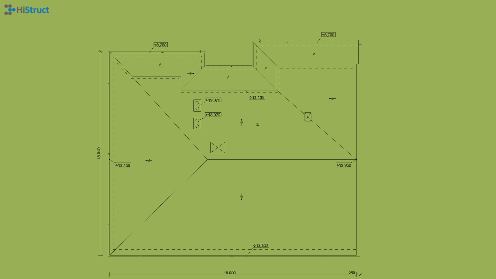
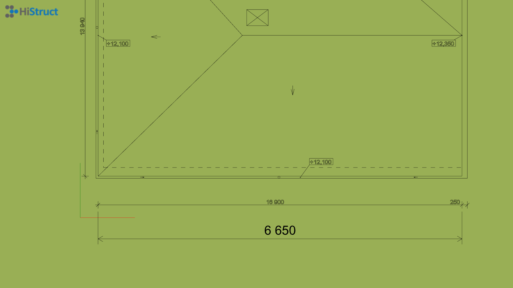
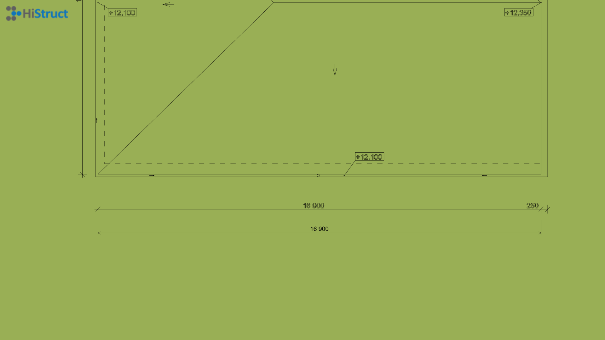
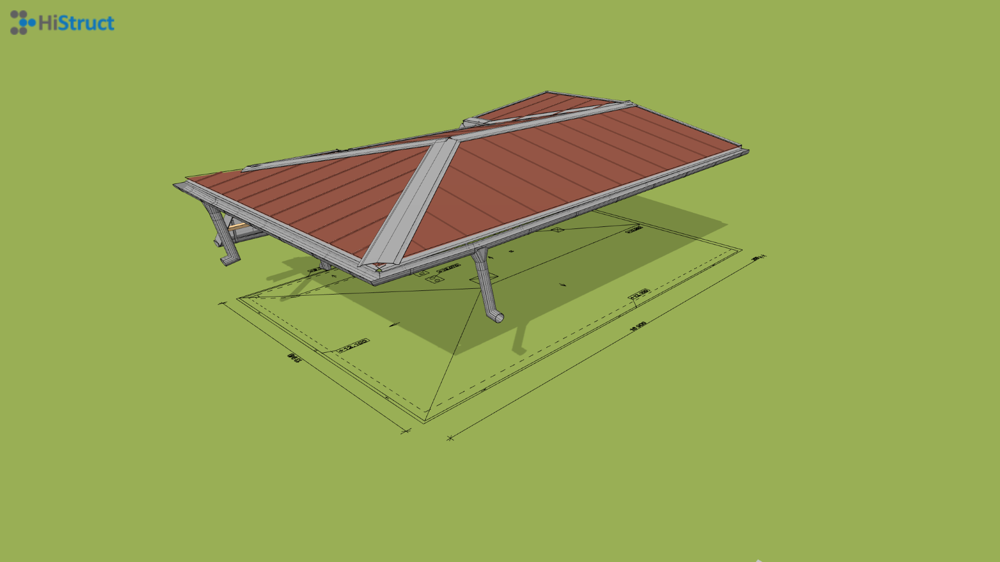

# Vložení podkladu DXF pro snadnější modelování

Pokud máte jakýkoliv čárový podklad pro vaší střechu, vložením do modelovacího prostoru si výrazně ulehčíte svojí práci. Tento podklad umožní přesnější kreslení vaší střechy a díky automatickému přichycování kurzoru navíc zvýší přesnost modelu. Nemáte výkres v DXF ale pouze ve formátu PDF? Nevadí většina čárových výkresů lze snadno [konvertovat na DXF](convertPdfToDxf.md) Pojďme se kouknout jak na to...

## Jak vložit DXF do HiStruct?

1. Otevřete záložku *Podklad* a klikněte na tlačítko *Import \*.dxf*. Otevře se dialogové okno, kde můžete nahrát svůj výkres.
2. Po výběru souboru je třeba určit vkládací bod výkresu kliknutím do scény.

## Nastavení správného měřítka výkresu
Jelikož jsou výkresy v různých měřítkách, je nejprve nutné nastavit správné měřítko aby model odpovídal rozměrům skutečným. 

1. Nejprve je nutné změřit pomocí tlačítka *Měření* jednu ze známých hran
2. Vypočíst měřítko jako skutečná délka dělená délkou naměřenou
3. Kliknout na vložený výkres a změnit v záložce *Vlastnosti* jeho měřítko
Pokud jste nastavili správnou hodnotu měřítka, pak se Vám budou shodovat hodnoty naměřené s kótami z výkresu. 

## Od výkresu ke kompletní střeše
Nyní máme naimportovaný podklad ve formě DXF a je možné modelovat střechu běžným způsobem, ať už pomocí jednotlivých střešních rovin, nebo s využitím našeho automatického řešiče, který vytváří střechu jen z obrysového polygonu takové střechy.

