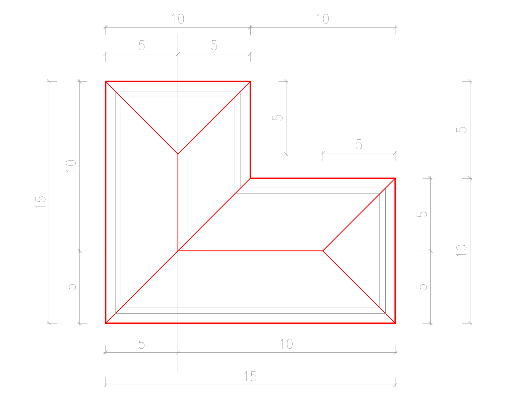
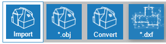
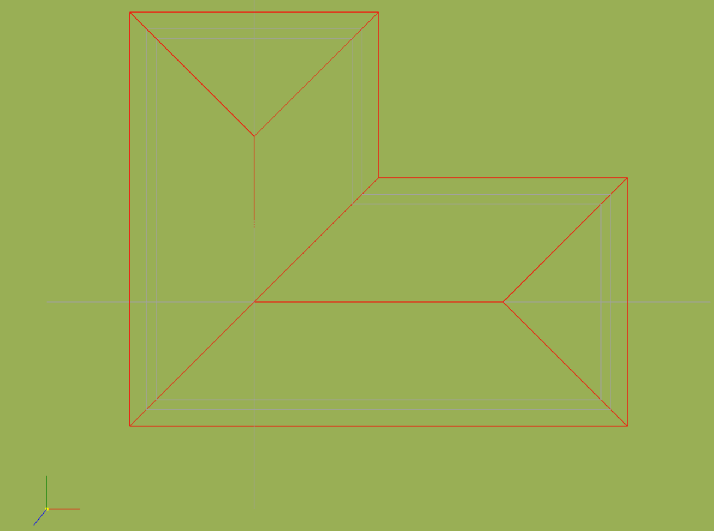
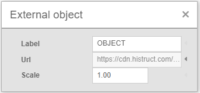
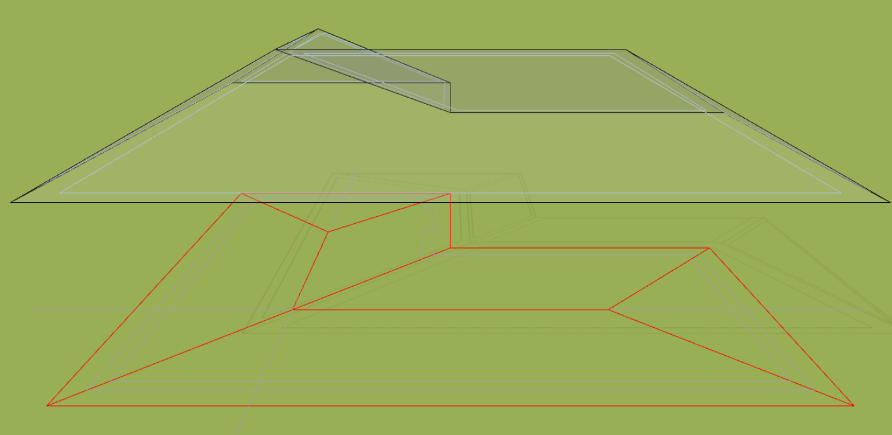
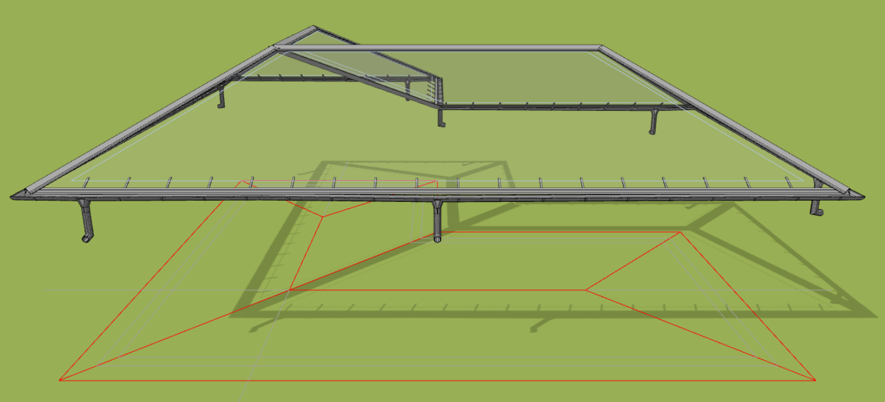

# Import výkresu s příponou DXF

Ať už se chystáte namodelovat střechu nebo celý dům, využití výkresu vám práci významně usnadní. Výhodou je především rychlost a také kontrola nad tvarem a velikostí každého modelovaného prvku. 

## Jak si připravit výkres před vložením?

### Zvýraznění důležitých prvků
Vložený výkres je zpravidla tvořen jen čarami, proto je rozumné důležité části výkresu zvýraznit odlišnou barvou.

### Verze a velikost DXF souboru
HiStruct podporuje většinu verzí DXF souborů, ale doporučujeme volit soubory do velikosti 2 MB pro maximální rychlost při editaci modelu.

### Podporované objekty souboru DXF
V HiStruct jsou podporovány různé typy objektů, jako jsou *LINE, LWPOLYLINE, POLYLINE, SOLID, POINT, INSERT, SPLINE, CIRCLE, ARC* a *ELLIPSE*. 

### Výkres připravený pro vložení
Níže uvádíme příklad výkresu. Důležité hrany střechy jsme zvýrazbnili červenou barvou a nepotřebné objekty odstranili. Díky tomu můžeme model vytvořit rychleji a zároveň se nemusíme starat o rušivé prvky.

 

## Jak vložit výkres DXF do HiStruct?

V hlavním menu kliknete na tlačítko *Import* a vybrete příslušný soubor s příponou **.dxf*.

### Zvolení počátku
Nyní stačí kliknout do scény a vybrat bod, kde chcete umístit začátek výkresu.

### Úprava měřítka
Pokud je výkres v jiných jednotkách než v metrech, můžete jednoduše změnit jednotky pomocí tlačítka *Upravit*.

### Umístění výkresu
S vloženým výkresem je možné pracovat stejně jako s jakýmkoli jiným objektem. Lze ho posouvat nebo otáčet.

## Jak z výkresu vytvořit model?
Na importované *.dxf se lze přichytávat, zadání jednotlivých střešních ploch pak probíhá oklikáním půdorysu [pomocí obecného tvaru](modellingRoofs.md) s doplněním sklonu pro každou střešní plochu. 

Tímto způsobem můžete vytvořit přesný 3D model, na němž lze téměř vždy využít funkci [generátoru lemovek a okapového systému](roofFlashingGenerator.md)

