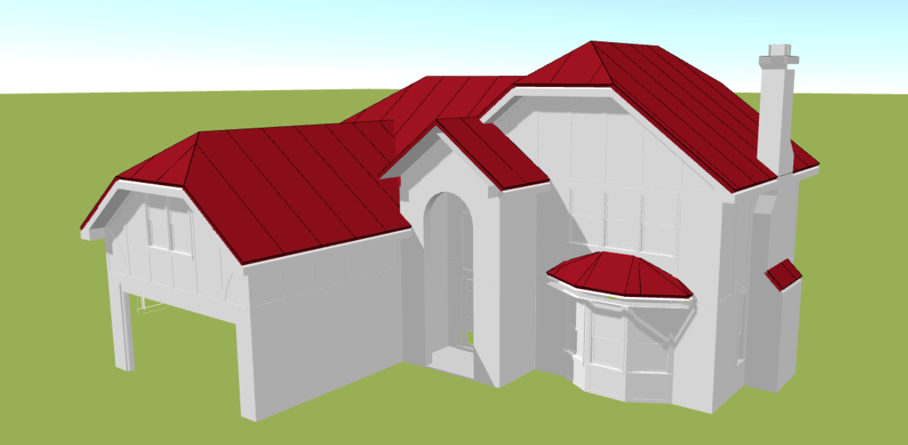
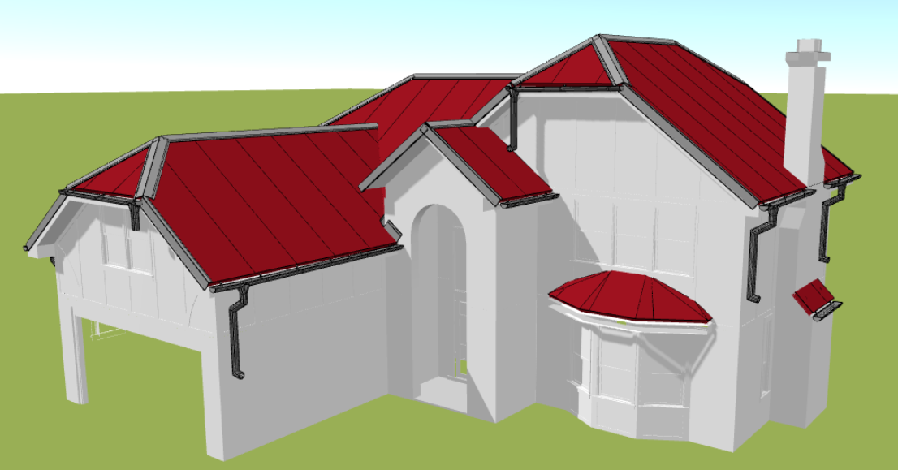

# Import modelu OBJ
3D modely budov mají obrovský potenciál, ať už plánujete nový projekt nebo rekonstrukci stávající budovy. Použití modelu ve formátu OBJ v HiStruct může výrazně urychlit vaši práci a poskytnout vám přesné výsledky. Ale jak na to? Je to vlastně docela jednoduché, a já vám ukážu, jak rychle vytvořit střechu s použitím modelu ve formátu OBJ.

## Kde získat takový model?
Existuje spousta služeb, které vám umožní získat 3D model vašeho domu, ať už pomocí satelitních snímků nebo dokonce pomocí dronů. Výsledkem těchto měření bývá model ve formátu OBJ. Pro naši ukázku budu používat jeden z volně dostupných modelů z internetu, na kterém vám ukážu, jak vytvořit střechu.

## Jak vložit OBJ do HiStruct?
Pokud máte model ve formátu OBJ, můžete ho snadno importovat do vašeho projektu. Stačí kliknout na tlačítko *Import* a vybrat soubor s příponou **.obj*.

### Otočení modelu a změna měřítka

Po importu je důležité správně otočit model. To můžete udělat pomocí nástrojů, které používáte i pro jiné objekty v HiStruct. Dále bude třeba změnit měřítko modelu OBJ, což lze snadno provést pomocí tlačítka *Upravit*.

## Jak přidat střechu k modelu?
Na importovanému *.obj lze vymodelovat střechu, a to tak, že budete postupně přidávat střešní roviny klikáním na vrcholy pomocí nástroje [obecného tvaru](modellingRoofs.md). 

Tímto způsobem můžete vytvořit detailní 3D model, na kterém téměř vždy můžete spustit [generátor lemování a okapového systému](roofFlashingGenerator.md).

