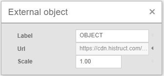

# Import modelu OBJ

3D model budovy má velký potenciál, ať už jde o nový projekt nebo rekonstrukci stávající budovy. Využití modelu ve formátu OBJ v HiStruct může výrazně zrychlit tvou práci a zároveň ti poskytne přesný výsledek. Ale jak na to? Je to snadné, a já ti ukážu, jak rychle vytvořit střechu s využitím modelu ve formátu OBJ.

## Kde získat takový model?
Existuje řada služeb pro zaměření stávajícího domu, ať už pomocí satelitu, nebo s využitím dronu, kde výsledkem tohoto zaměření může být model ve formátu OBJ. Pro ukázku použiji jeden z modelů volně dostupný na internetu na kterém budu chtít vytvořit model střechy.

 

## Jak vložit OBJ do HiStruct? 
Pokud mám model ve formátu OBJ, můžu ho snadno vložit do mého projektu. Stačí kliknout na tlačítko *Import* a vybrat soubor s příponou **.obj*.

### Otočení modelu a změna měřítka

Po vložení je nutné správně pootočit modelem, otočení objektu je možné pomocí nástrojů obdobně jako pro jiné objekty. Nyní je ještě potřeba abych změnil měřítko modelu OBJ, což lze snadno pomocí tlačítka *Upravit*.

## Jak modelu přidat střechu?
Na importované *.obj se lze přichytávat, zadání jednotlivých střešních ploch pak probíhá oklikáním půdorysu [pomocí obecného tvaru](modellingRoofs.md). 

 

Tímto způsobem mohu vytvořit přesný 3D model na kterém je možné téměř vždy pustit [generátor lemovek a okapového systému](roofFlashingGenerator.md)

