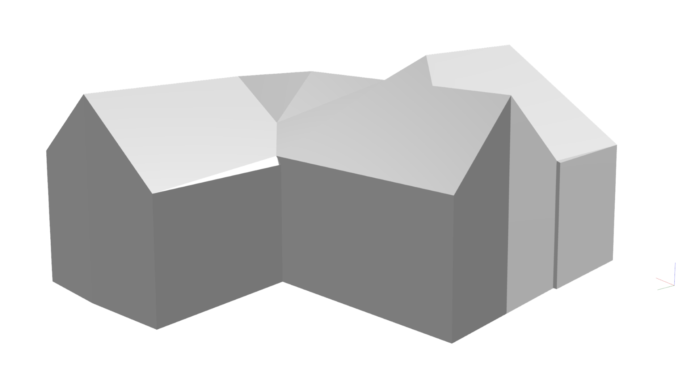

# 🏠 Využití OBJ modelu k automatickému generování střechy
S rozvojem BIM technologií se čím dál častěji setkáváme s tím, že stavební projekty mají svůj 3D model, a často ještě dříve, než jsou skutečně realizovány. Pokud ale takový model stavba nemá, jsou k dispozici společnosti, které nabízejí zaměření stávajících objektů. Bez ohledu na to, zda se zaměřuje pomocí dronů nebo satelitů, výsledkem bývá obvykle detailní 3D model ve formátu OBJ, pokud model ve formátu OBJ nemáte koukněte se jak lze model do tohoto formátu  [konvertovat](convert3dPdfToObj.md). Výsledný model může vypadat například takto:

## Jak vložit OBJ do HiStruct?

Chcete-li maximálně využít OBJ modelu, doporučujeme použít náš inovativní automatický generátor střech. Ten dokáže rozpoznat jednotlivé střešní roviny v OBJ modelu a přiřadit jim správné hrany, sklony a vlastnosti.

1. Klikněte na tlačítko *Import \*.obj*. Otevře se dialogové okno, kde můžete nahrát svůj model.
2. Po výběru souboru je třeba určit vkládací bod modelu kliknutím do scény.

### Editace rozpoznaného 3D modelu

I když je náš generátor téměř bezchybný, mohou se vyskytnout hrany a varianty, které ne vždy správně rozezná. Proto máte možnost opravit rozpoznávač a přizpůsobit vlastnosti jednotlivých hran.

- Kliknutím na jakoukoliv hranu můžete upravit její vlastnosti.
- Stejným způsobem můžete měnit vlastnosti jednotlivých rozpoznaných rovin. Pokud nechcete na některé rovině generovat střechu, můžete její vlastnosti upravit.

**Jednotlivé hrany jsou barevně rozděleny do 3 skupin dle funkce:**

- **Modré hrany** : Šikmé ohraničení jednotlivých střešních rovin.
- **Zelené hrany**: Vodorovné hrany, jako například hřeben střechy nebo okapová hrana.
- **Červené hrany**: Hrany, které jsou při generování střechy ignorovány, protože leží v některé střešní rovině.

**Jednotlivé plochy jsou barevně rozděleny do 2 skupin dle funkce:**

- **Modré plochy**: Rovina, na které bude střešní krytina.
- **Bílé plochy**: Rovina, která není součástí střechy.

## Jak vygenerovat střechu?

Vygenerování střechy je nyní snadné. Stačí použít náš generátor střechy kliknutím na tlačítko *Další*. Generátor vás provede procesem a pomůže vám snadno vytvořit požadovanou střechu včetně příslušenství.

