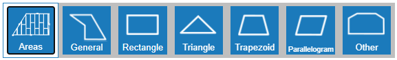
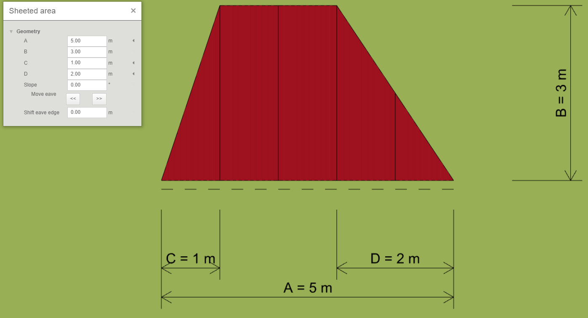
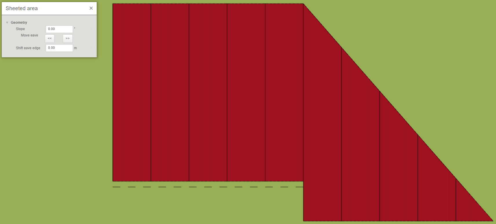

# Modelování střešní roviny
Nakreslení střešní roviny je jedním ze způsobů, jakým lze namodelovat celou střechu. Existují hned dva způsoby, jakými to lze provést. Pokud chci nakreslit jednoduchý tvar, bude nejjednodušší, když vyberu jeden z předdefinovaných tvarů. Pokud je však tvar střešní roviny složitější, je vhodné použít obecný tvar.

## Předdefinovaný tvar
Způsob vytvoření střešní roviny s využitím předdefinovaných tvarů ukážeme na střešní rovině, která je ve tvaru lichoběžníku. V nabídce předdefinovaných tvarů si vyberu příslušný tvar, tedy *Lichoběžník* a kliknutím do scény vybraný tvar vložím. Ovšem nyní potřebuji změnit rozměry tohoto lichoběžníku, aby odpovídal naší střešní rovině. To provedu po kliknutí na tlačítko *Upravit*, kde mohu snadno změnit jednotlivé rozměry našeho lichoběžníku. 
Pokud mám náčrtek s rozměry střechy již ve sklonu, mám to jednodušší, a nemusím se zabývat dalšími úpravami geometrie a pouze pootočím střešní rovinu o potřebný úhel. Avšak, pokud jsou rozměry mé střechy pouze v půdorysu, je nezbytné přidat střeše také sklon. Sklon můžu zadat ve stupních a s pomocí šipek mohu volit směr, kterým bude sklon nastaven. Obdobným způsobem přidám zbylé střešní roviny, čímž vymodeluji celou střechu
  

## Obecný tvar
Přidání střešní roviny pomocí obecného tvaru přináší mnoho variability a s využitím několika chytrých funkcí pro [přidání polygonu](insertPolygon.md) je i snadné. Vytvoření takové roviny se provádí pouze s vybíráním jednotlivých vrcholů střešní roviny. Díky tomu lze snadno vymodelovat jakýkoliv tvar střešní roviny. Opět můžu zvedat střešní rovinu do požadováného sklonu a nebo pouze pootočit rovinu o požadovaný sklon.
  

