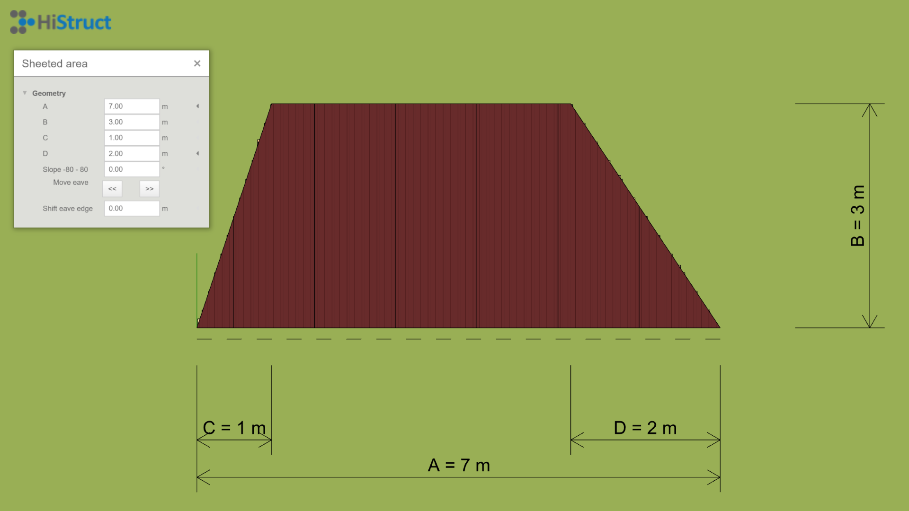

# 🏗️ Krok za krokem modelování střešních rovin v HiStruct
Nakreslení střešní roviny je jedním ze způsobů, jakým lze namodelovat celou střechu. Existují hned dva způsoby, jakými to lze provést. Pokud chci nakreslit jednoduchý tvar, bude nejjednodušší, když vyberu jeden z předdefinovaných tvarů. Pokud je však tvar střešní roviny složitější, je vhodné použít obecný tvar.

## Modelování po plochách 

### Předdefinovaný tvar
Způsob vytvoření střešní roviny s využitím předdefinovaných tvarů ukážeme na střešní rovině, která je ve tvaru lichoběžníku. V nabídce předdefinovaných tvarů si vyberu příslušný tvar, tedy *Lichoběžník* a kliknutím do scény vybraný tvar vložím. Ovšem nyní potřebuji změnit rozměry tohoto lichoběžníku, aby odpovídal naší střešní rovině. To provedu po kliknutí na tlačítko *Upravit*, kde mohu snadno změnit jednotlivé rozměry našeho lichoběžníku. 
Pokud mám náčrtek střechy již se sklonem, je postup jednodušší, protože se nemusím zabývat dalšími úpravami geometrie. Stačí pouze pootočit střešní rovinu o požadovaný úhel. Pokud jsou však rozměry střechy uvedeny pouze v půdorysu, je nutné přidat sklon. Sklon lze zadat ve stupních a pomocí šipek určit směr, kterým bude střecha nakloněna. Čárkovaná černá čára označuje okapovou hranu, ke které se střešní plocha naklání podle zvoleného sklonu. Stejným způsobem přidám i ostatní střešní roviny a tím vymodeluji celou střechu.
  

### Obecný tvar
Přidání střešní roviny pomocí obecného tvaru přináší mnoho variability a s využitím několika chytrých funkcí pro [přidání polygonu](insertPolygon.md) je i snadné. Vytvoření takové roviny se provádí pouze s vybíráním jednotlivých vrcholů střešní roviny. Díky tomu lze snadno vymodelovat jakýkoliv tvar střešní roviny. Opět můžu zvedat střešní rovinu do požadováného sklonu a nebo pouze pootočit rovinu o požadovaný sklon.
  

### Kompletní střecha
Stejným způsobem přidám zbylé střešní roviny a vytvořím kompletní střechu postupný přidáváním jednotlivých střešních rovin. Natáčením je o správný úhel a nastavování správné výšky. Na takovém modelu jde většinou spustit i automatický [generátor lemovek a okapového systému](roofFlashingGenerator.md). 

## Generování z obrysu
### Obrys střechy
Druhým možný přístupem je generování střechy pouze z obrysu. Nejprve je nutné nakreslit obrys střechy. Pro tento postup je samozřejmě možné importovat [soubory ve formátu *.dxf](importDxf.md), případně převést vektorové [*.pdf na *.dxf](convertPdfToDxf.md) a [naimportovat je do HiStruct](importDxf.md). Díky podkladu snadno nekreslím libovolný obrys střechy

### Vygenerování hřebenů střechy
Ihned po nakreslení obrysu střechy dojde k automatickému vyřešení hřebenů této střechy. Vygeneruje se valbová střecha u které lze následně měnit různé vlastnosti.

### Úprava jednotlivých obrysových hran střechy

Veškeré nakreslené obrysové hrany lze snadno upravovat. Každé hraně lze přiřadit sadu parametrů podle jejího typu. Nejprve můžete změnit typ hrany z výchozí okapové hrany, například na štítovou hranu nebo zvednutou okapovou hranu. Tuto volbu provedete jednoduše kliknutím na příslušný obrázek. Poté můžete nastavit přesah střešní roviny nebo, v případě okapové hrany, sklon přiléhající střešní roviny.

### Vygenerování celé střechy

Správným nastavením jednotlivých hran a jejich parametrů lze poté snadno vygenerovat celou střechu. Navíc generátor automaticky generuje i veškeré potřebné [oplechování, lemovky](roofFlashingOptions.md) a [okapový systém](roofFlashingGutterOptions.md).

