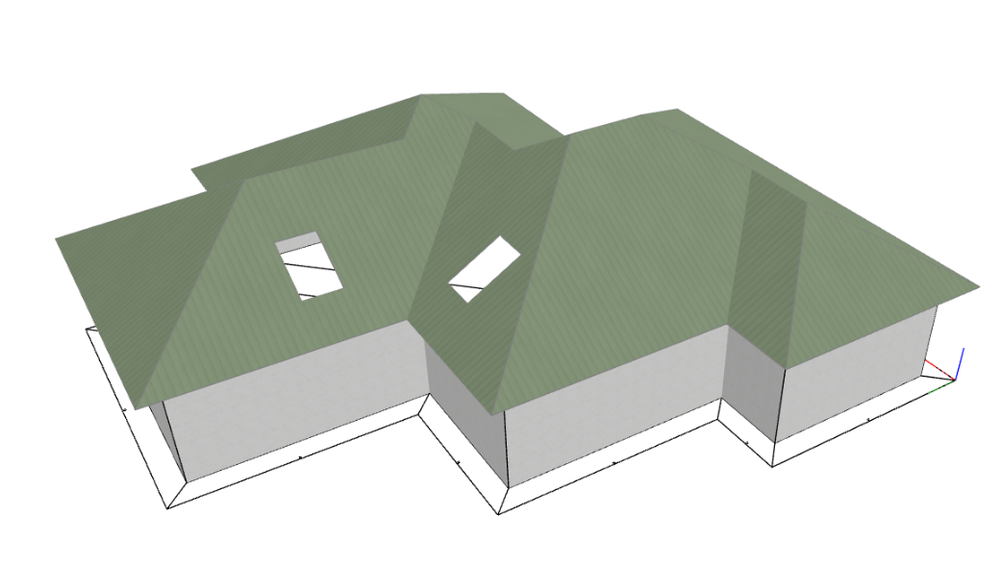
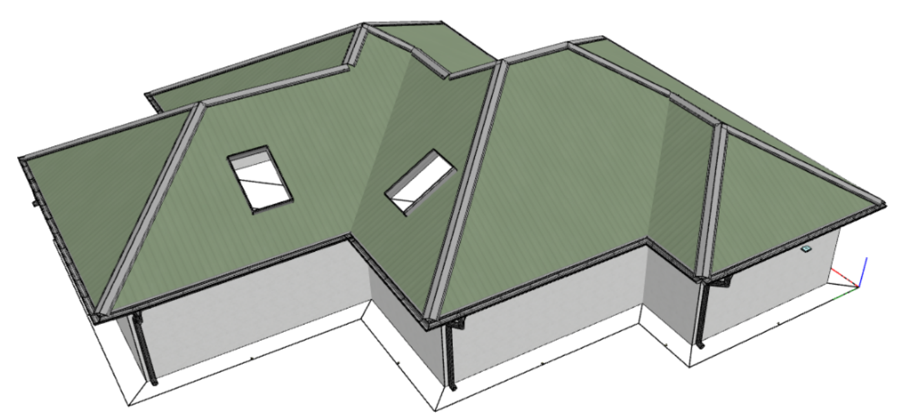

# Generátor lemovek a okapového systému

Je určen zejména k **úspoře času** pro zhotovení 3d modelu lemovek a okapů pro importované nebo zadané geometrie střešních rovin.

Generátor lze použít obecně i na geometrie ploch, které jsou zadané z výkresu nebo zcela ručně a jen spasované, aby co nejlépe seděly hrany střešních ploch, které se mají dotýkat. Nemusí sedět úplně, stačí se vejít do běžných tolerancí.

HiStruct rozpozná z geometrií blízkých střešních rovin potřebná umístění lemovek a ze zvolených typů provede nagenerování. Nagenerované lemovky lze dále upravovat.

