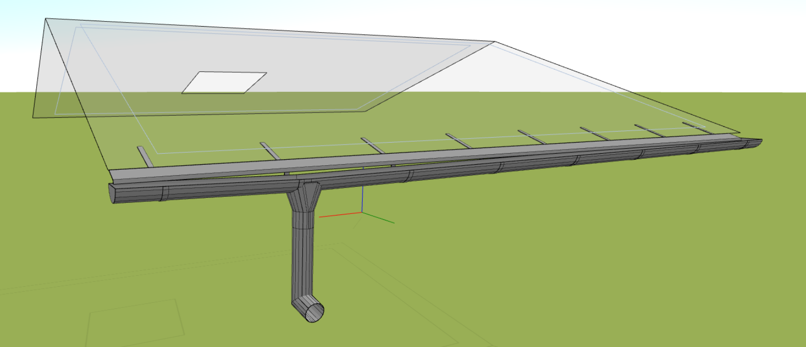
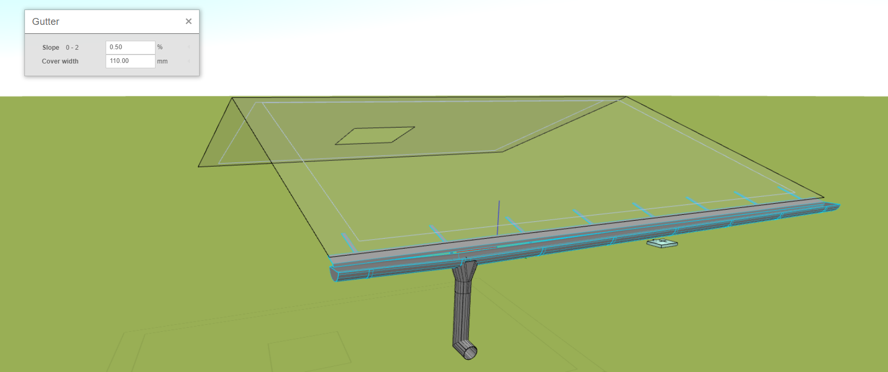
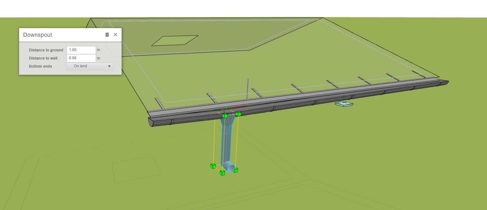
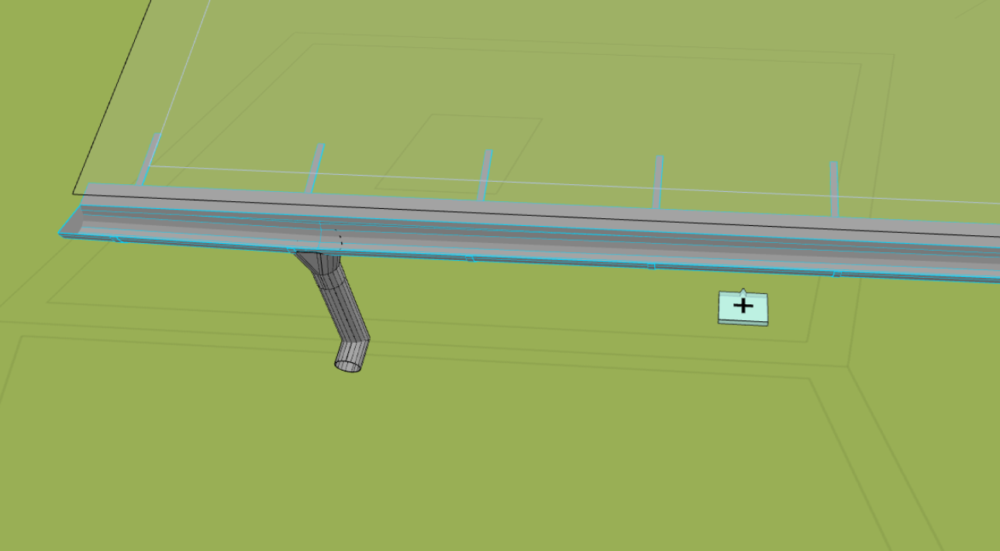

# Okapový systém

Okapový systém je jedním z klíčových prvků střešní konstrukce, který chrání konstrukci před negativními vlivy vody. Tento důležitý stavební prvek zahrnuje několik komponent, jako jsou okapnice, okapová potrubí a žlaby, které společně tvoří systém pro správné odvádění vody z povrchu střechy a my se podíváme jakým způsobem lze modelovat okapový systém v HiStruct.

## Zadání okapového systému

Nejrychlejší způsob vytvoření kompletního okapového systému je použití [generátoru okapů a lemovek](roofFlashingGenerator.md) a následné upravení jednotlivých prvků. Existuje ovšem i možnost přidat okap, či okapnici, pomocí [polylinie](polylineInput.md), která určuje okraje střechy, kam má být oplechování aplikováno.

## Úprava geometrie žlabu a okapnice

Okapový systém lze upravovat z hlediska geometrie. Můžete posunout vrcholy polylinie a tím změnit polohu okapu, nebo můžete také upravit úhel ohybu žlabových háků. Generátor to dělá automaticky, ale můžete to měnit kliknutím na tlačítko *Upravit* a následně *Geometrie*, kde můžete změnit úhel či polohu polylinie. Změna úhlu či geometrie se provede obdobným způsobem jako u [oplechování střechy](roofFlashingOptions.md). 
Zároveň je možné po  kliknutí na tlačítko *Upravit* a vybráním žlabu, měnit sklon žlabu, čímž dojde ke změně polohy okapu pro dodržení sklonu. Posledním parametr představuje krycí šířka, která určuje šířku okapnicového plechu.

## Úprava geometrie okapového svodu

Po kliknutí na tlačítko *Upravit* a vybráním okapového svodu se mi otevře nabídka pro úpravu okapového svodu. Je možné měnit vzdálenost okapového svodu pro přidání svodových kolen a přiblížení svodu ke stěně. Dále je možné prodlužovat délku svodu, ať už pomocí dialogového okna, nebo jednoduše protažením zelených bodů na okapovém svodu. Další možností je změna polohy okapového svodu, což se provede snadno vybráním daného svodu a posunutím pomocí myši.

 

## Přidání okapového svodu
Jednotlivé svody se generují automaticky, tak aby docházelo k dostatečnému odtoku k okapového žlabu, ovšem pokud bych chtěl přidat další okapový svod, lze to jednoduše provest pomocí tlačítka *plus*, které svod na vybraný žlab přidá. 

