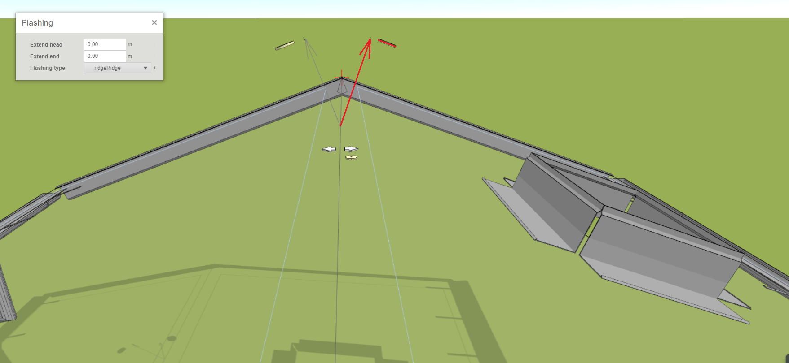
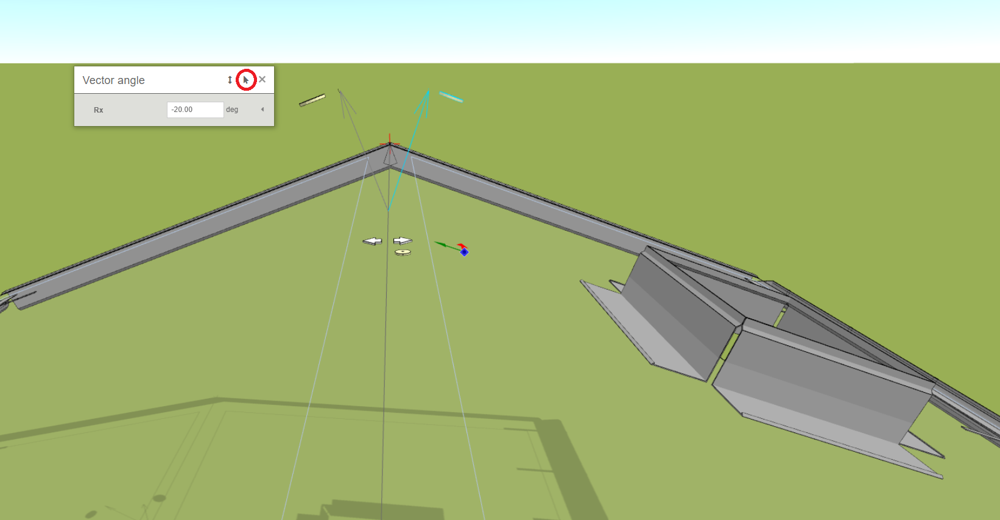
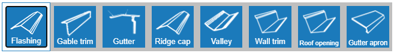
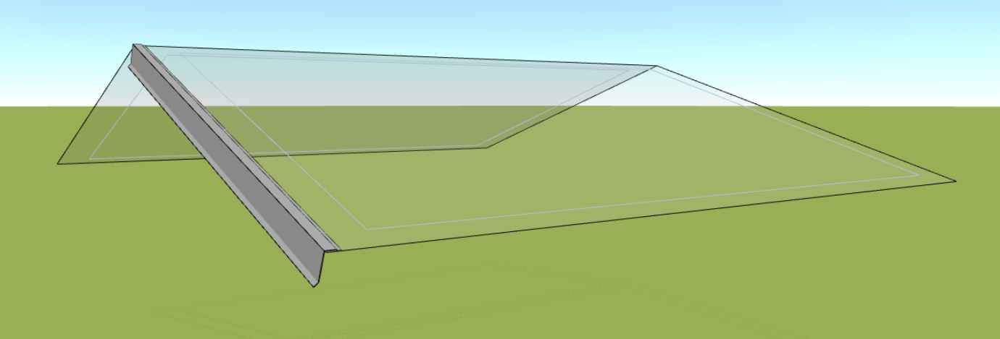
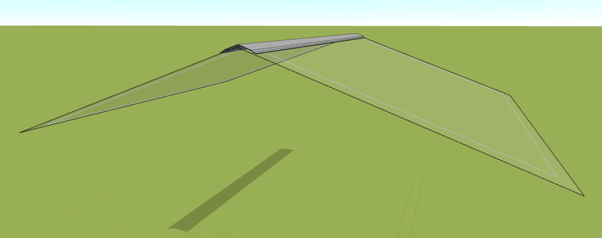
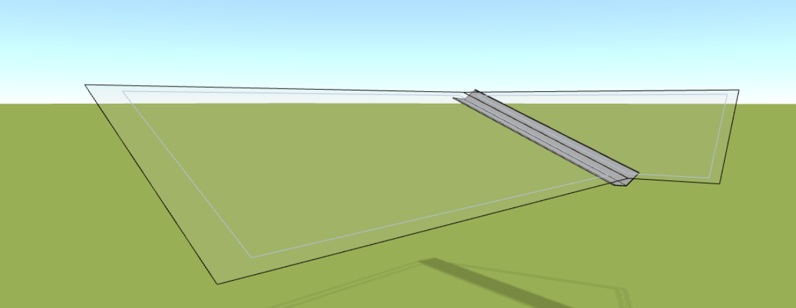
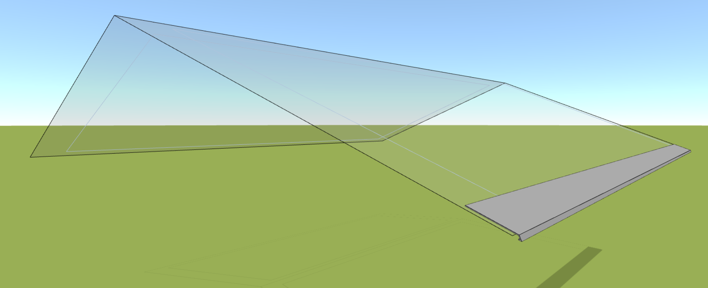
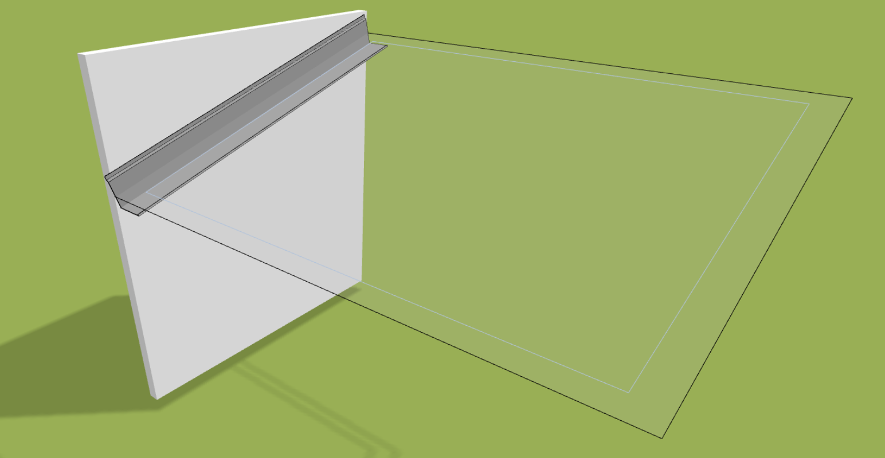
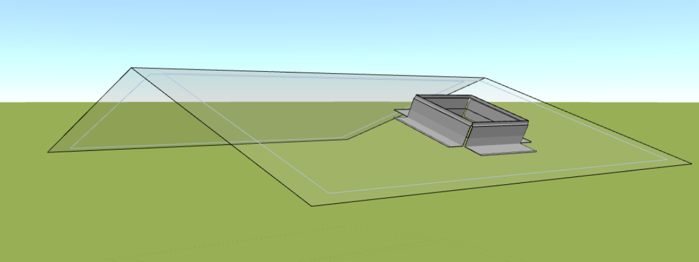

# Oplechování a lemování střech

Oplechování střechy a doplnění lemovek do střešního návrhu jsou zásadním krokem při vytváření kvalitního střešního projektu. V HiStruct lze ručně přidávat lemovky ke každé straně střešní roviny nebo využít [generátor střešního oplechování](roofFlashingGenerator.md) pro celou skupinu střešních rovin. Modelování jednotlivých lemovek a oplechování je snadné, a já vám ukážu, jak na to.

## Zadání oplechování

Nejrychlejší způsob vytvoření lemovek je použití [generátoru střešního oplechování](roofFlashingGenerator.md) a následné upravení jednotlivých prvků. Ale všechno oplechování střechy může být také definováno pomocí [polylinie](..\instructor-roofs\insertPolyline.md), která určuje okraje střechy, kam má být oplechování aplikováno.

## Úprava geometrie oplechování

Veškeré oplechování lze upravovat z hlediska geometrie. Můžete posunout vrcholy polylinie a tím změnit polohu lemovek. U některých lemovek můžete také upravit úhel ohybu jednotlivých částí. Generátor to dělá automaticky, ale můžete to měnit kliknutím na tlačítko *Upravit* a následně *Geometrie*, kde můžete změnit úhel či polohu polylinie.

### Úprava úhlu

Změnu úhlu provedete kliknutím na šipku, která znázorňuje normálu plochy, na kterou lemovek přiléhá.

Po kliknutí na šipku klikněte na kurzorovou ikonu a následně vyberte plochu, na kterou má lemovka navazovat.

### Úprava polohy

Změna polohy se provede stejným způsobem jako změna geometrie [polylinie](..\instructor-roofs\insertPolyline.md).

## Výběr oplechování z knihovny

Můžete vybrat různé typy oplechování z [knihovny](roofFlashingLibrary.md) pro jednotlivé prvky oplechování. Toto může být provedeno buď u jednotlivých prvků nebo najednou pro celou skupinu prvků.

## Druhy oplechování

Každá část střechy vyžaduje specifický typ oplechování a lemovek. V HiStruct je široká nabídka oplechování a lemovek, které pokryjí téměř všechny části střech. V následujícím textu se budeme postupně zabývat jednotlivými prvky.

### Štítová lemovka
Štítová lemovka zvaná též závětrná lišta je speciální oplechování, který se používá k zakončení štítového průčelí střechy. Štítové průčelí je část střechy, která se nachází na štítové straně budovy, a štítová lemovka slouží k estetickému nebo ochrannému dokončení této části střechy.

### Hřebenáč
Hřebenáč je střešní prvek, který se používá k zakrytí hřebene střechy. Tento prvek slouží k ochraně tohoto místa před povětrnostními vlivy, vniknutím vody a dalšími potenciálními problémy. Tímto způsobem hřebenáč zajišťuje kompletní a bezpečné zakončení střechy.

### Úžlabí
Úžlabí je místo na střeše, kde se setkávají dvě střešní plochy a tvoří údolí. Tento prvek slouží k odvádění vody a sněhu a chrání budovu před pronikání vlhkosti.
 

### Okapnice 
Okapnice je stavební prvek umístěný na okraji střechy, který slouží k řízení odtoku dešťové vody do žlabu nebo okapového potrubí, čímž chrání budovu před poškozením způsobeným vodou, která by zatékala do konstrukce střechy.

  

### Lemování ke zdi
Tato lemovka se obvykle nachází na místě, kde se střecha setkává se svislou stěnou a slouží k těsnému a esteticky čistému spojení mezi těmito dvěma částmi budovy.

 

### Oplechování otvoru
Tento prvek slouží k oplechování otvoru na střeše pro zamezení zatékání vody kolem otvoru.

 