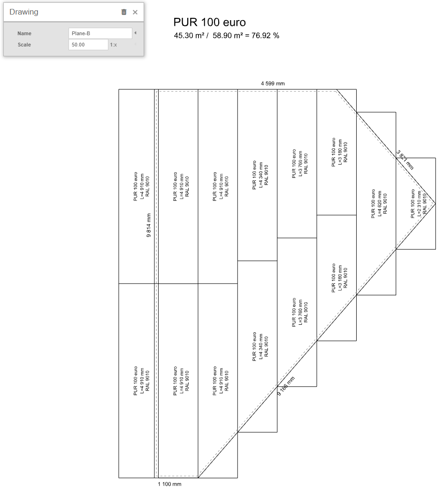
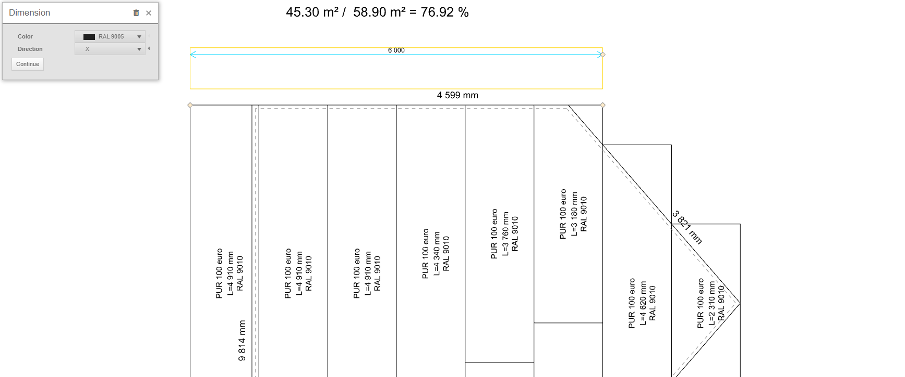

# Kladečský výkres střešní roviny

Kladečský výkres střešní roviny představuje klíčovou část v procesu stavebního projektu, která umožňuje převést konstrukční plány do praktického provedení na střeše. Tento výkres slouží jako podrobný průvodce pro stavebníky při instalaci střešního systému a obsahuje důležité informace o rozmístění materiálů, spojích a všech technických aspektech, které jsou nezbytné pro kvalitní a bezpečnou střešní konstrukci. 

V HiStruct jsou kompletní výkresy pro všechny střešní roviny generovány automaticky na základě 3D modelu. Pro úpravu těchto výkresů stačí přejít na konkrétní střešní rovinu a stisknout na tlačítko *Výkresy*.

Zároveň jsou tyto výkresy vždy generovány automaticky v rámci výstupů, například v kusovníku střešní krytiny.

## Přidání kóty

Kótu lze zadat po kliknutí na tlačítko *Kóta* vybráním dvou bodů, pro které chceme kotu vynést, a následně určením vzdálenosti vynášecí čáry. Po kliknutí na kótu je možné nejen změnit její barvu, ale také určit směr, ve kterém bude kóta vynášena. Směr může být nastaven na *X*, *Y*, nebo *Default*, které změří nejkratší vzdálenost mezi těmito body. Alternativně lze zvolit směr *Úhel*, který vynese kótu ve zvoleném úhlu. Poslední možností v úpravě kóty je tlačítko Pokračovat, které vygeneruje další kótu ve stejném směru.

Pokud bych chtěl upravit kterýkoliv bod mé přidané kóty, stačí kliknout na kótu a přesunutím žlutých bodů již upravuji kótu.

## Přidání čáry

Dalším prvkem, který je možné do výkresu přidat je [polylinie](..\instructor-roofs\insertPolyline.md). U této čáry je možné měnit pouze barvu.

