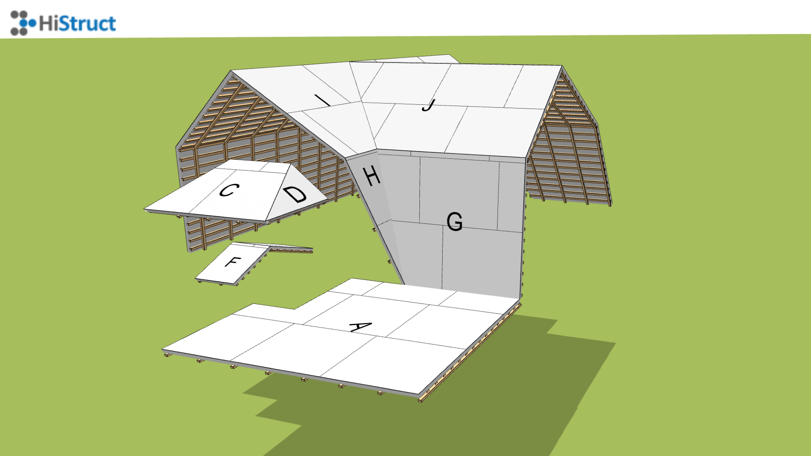
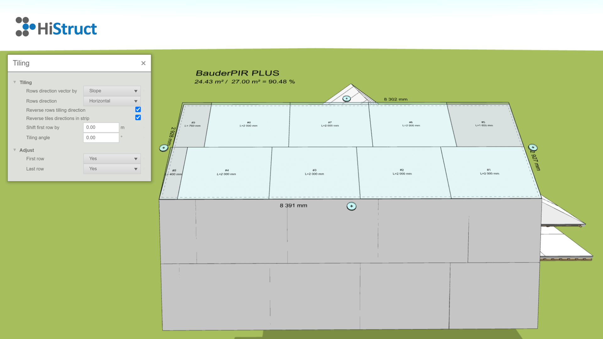
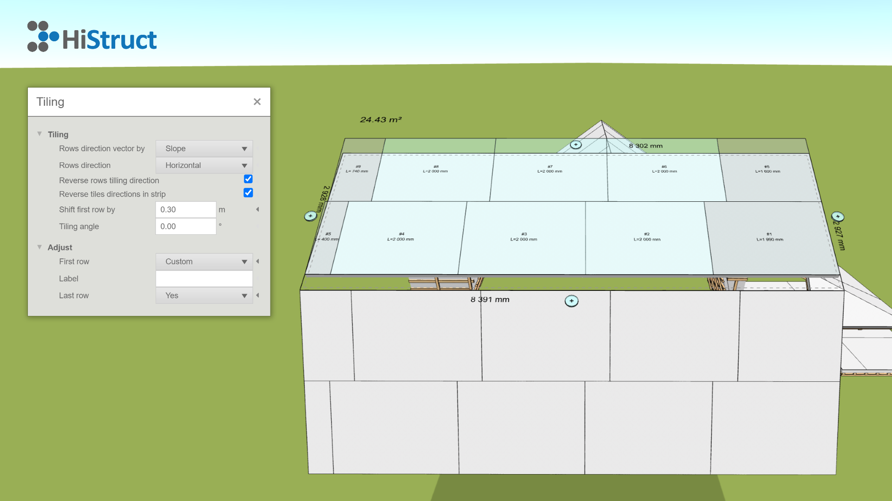

# Jak pracovat s naším generátorem střešních desek 🛠️

Vítejte u našeho generátoru střešních desek! 🎉 Tento nástroj vám pomůže snadno rozložit střešní desky na vašem projektu. Žádné složité nastavování předem – vše se odehrává přímo na obrazovce, kde si můžete přizpůsobit jednotlivé části střechy podle svého.

Nejdříve generátor automaticky rozvrhne desky tak, aby pokryly celou střechu. Teď přichází ta zábavnější část! 💡 Můžete se pustit do přizpůsobování každé střešní roviny zvlášť. Pro každou rovinu střechy máte k dispozici několik parametrů, které vám pomůžou doladit detaily podle vašich představ.

Podívejme se, jak to funguje 👇:

1. **Vstup do generátoru:** Jakmile je střecha vygenerována, můžete začít upravovat jednotlivé roviny. Klikněte na rovinu, kterou chcete upravit, a otevřou se vám možnosti pro úpravu.
   

2. **Nastavení parametrů - kladení:** Každá střešní rovina má své parametry, které vám umožní jemně doladit pokládku desek, optimalizovat využití materiálu a zajistit perfektní výsledek.
   

    - **Řídící směr kladení:** Tento parametr určuje směr kladení desek, buď podle směru sklonu, nebo podle jedné z hran střešní roviny. Pomocí šipek můžete vybrat, na kterou hranu bude kladení započato; tato hrana je v modelu zvýrazněna čárkovanou čárou.
    - **Směr kladení řad:** Určuje, zda jsou pruhy kladeny horizontálně nebo vertikálně vůči směru kladení. ↔️
    - **Obrátit směr kladení řad:** Zaškrtnutím tohoto parametru dojde k obrácení směru kladení řad.
    - **Obrátit směr kladení tvarovek:** Tento parametr umožňuje obrátit směr kladení tvarovek v jednotlivých pruzích. 
    - **Posunout první řadu:** Určuje umístění první vodorovné spáry od počátku. Hlavní využití tohoto parametru je při vypínání první řady, což se dozvíte, když budete pokračovat dále. 
    - **Úhel kladení:** Velikost úhlu určuje odklon kladení od určené hrany.

3. **Nastavení parametrů - úprava:** Tato část slouží k vypnutí první nebo poslední řady, pokud je třeba. To může být užitečné, pokud je poslední řada například pouze 5 cm široký pruh, který bude doplněn z jiné střešní roviny. 
Použití je snadné: v nabídce pro každý pruh máte 3 možnosti: *Ano, Ne* a *Obecně*. Pokud máte například 30 cm zbytek z jiné střešní roviny, můžete nastavit posun první řady o 30 cm, nastavit první řadu na *Obecně* a do pole *Popis* napsat: "Bude použit pruh ze střešní roviny K". Tento popis se poté promítne do modelu, výkresu a kusovníku. 📝  

4. **Nastavení offsetu:** Pokud chcete nastavit odsazení hrany nebo prodloužení krytiny přes hranu, je to snadné. Klikněte na tlačítko ➕ u zvolené hrany a nastavte hodnotu pro zvětšení nebo zmenšení plochy o daný offset.

A to je vše! Nyní je kladení desek nastaveno! 🎉
