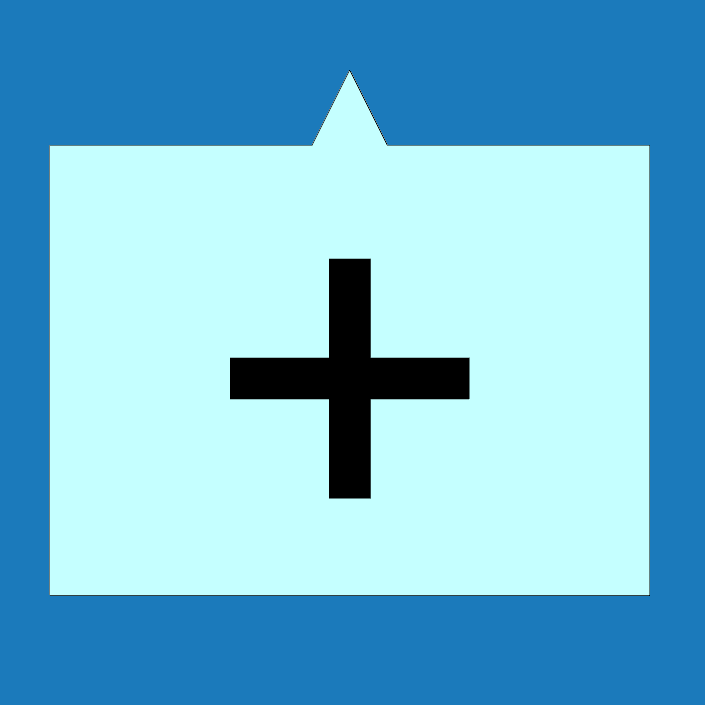

# Lemovky
Umožňuje měnit barvu jednotlivých lemovacích prvků.

Barvu lze upravit pomocí tlačítek vlevo pro všechny lemovací prvky z dané skupiny, případně je možné kliknout přímo na jednotlivé prvky v modelu a upravit jim barvu jednotlivě.

<b><u>Počet skupin editovatelných lemovacích prvků se může měnit podle možností jednotlivých modelů.</u></b>

#

## Editace skupin prvků pomocí tlačítek vlevo
Kliknutím na tlačítko lemovacího prvku na levé straně je možné editovat vlastnosti celé příslušné skupiny lemovacích prvků. 

<table>
  <tr>
    <td>
      

        
      

      Lemovky
      

      

    </td>
    <td>
      

        
      

      Svod
      

      

    </td>
    <td style="vertical-align: middle; font-size: 20px;">
      ... a další
    </td>
  </tr>
</table>

Provedené změny vlastností se propíší na všechny prvky spadající do určené skupiny.
#
## Editace jednotlivých prvků
Vlastnosti jednotlivých prvků je možné měnit přímo kliknutím na jednotlivé prvky v modelu. 

#
<table>
  <tr>
    <td>
      
    </td>
    <td style="vertical-align: middle; font-size: 20px;">
      Přidat
    </td>
  </tr> 
</table>

Tlačítko <u>Přidat</u> umožňuje přidat k příslušnému okapovému žlabu další okapový svod.

#

### Nepomohla Vám nápověda?
Pro více informací o funkcích HiStruct Building Configurator můžete navštívit náš blog nebo zaslat dotaz na naší podporu. 
<table>
  <tr>
    <td>
      <a href="https://docs.histruct.com/cs/"> 
        <button class="btn">
        Navštívit blog
        </button>
      </a>
    </td>
    <td>
      <a href="mailto:support@histruct.com?subject=Dotaz na Support HiStruct">
         <button class="btn">
         Zaslat dotaz
         </button>
      </a>
    </td>
  </tr>
</table>