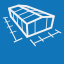
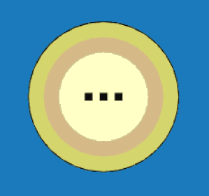

# Geometrie
Umožňuje měnit geometrické parametry modelu, tedy rozměry budovy a střechy včetně sklonu a přesahů. Rovněž je zde možné nastavit typ skladby střechy.

<b><u>Ovládací tlačítka</u> upravují vlastnosti konstrukce pouze na vybrané střešní či stěnové rovině.</b>

#

<table>
  <tr>
    <td>
      

        
      

      Budova
      

      

    </td>
    <td style="vertical-align: middle; font-size: 20px;">
      Budova
    </td>
  </tr>
</table>

Tlačítko <u>Budova</u> slouží k zadání půdorysných rozměrů objektu, k nastavení výšky objektu, sklonu a přesahu střechy a k otáčení okapové hrany. 

Základní půdorysné rozměry je možné zadávat buď pro střešní konstrukci nebo pro svislé stěny.

#
<table>
  <tr>
    <td>
      

        
      

      Střecha
      

      

    </td>
    <td style="vertical-align: middle; font-size: 20px;">
      Střecha
    </td>
  </tr>
</table>

Tlačítko <u>Střecha</u> umožňuje nastavit typ skladby střechy. Typ krytiny a rozměry sekundární střešní konstrukce lze měnit přes tlačítko <u>Opláštění</u>.

#
<table>
  <tr>
    <td>
      

        
      

      Stěny
      

      

    </td>
    <td style="vertical-align: middle; font-size: 20px;">
      Stěny
    </td>
  </tr>
</table>

Tlačítko <u>Stěny</u> umožňuje nastavit způsob zarovnání stěny, typ výroby stěny, způsob kladení řad opláštění a výšku soklu.

Tato nastavení lze upravit pro jednotlivé stěny pomocí příslušných Ovládacích tlačítek.

#
<table>
  <tr>
    <td>
      

        
      

      Přidat stěnu 2D
      

      

    </td>
    <td style="vertical-align: middle; font-size: 20px;">
      Přidat stěnu 2D
    </td>
  </tr>
</table>

Tlačítko <u>Přidat stěnu 2D</u> umožňuje do konstrukce přidávat vnitřní svislé stěny a upravovat vlastnosti stěn.

#
<table>
  <tr>
    <td>
      

        
      

      Pole
      

      

    </td>
    <td style="vertical-align: middle; font-size: 20px;">
      Pole
    </td>
  </tr>
</table>

Tlačítko <u>Pole</u> umožňuje nastavit počet rámů primární nosné konstrukce a rozteče polí mezi nimi při zachování nastavených půdorysných rozměrů.

#
<table>
  <tr>
    <td>
      

        
      

      Anotace
      

      

    </td>
    <td style="vertical-align: middle; font-size: 20px;">
      Anotace
    </td>
  </tr>
</table>

Tlačítko <u>Anotace</u> umožňuje do modelu přidávat libovolné půdorysné kóty.

#
<table>
  <tr>
    <td>
      

        
      

      Měření
      

      

    </td>
    <td style="vertical-align: middle; font-size: 20px;">
      Měření
    </td>
  </tr>
</table>

Tlačítkem <u>Měření</u> je možné zkontrolovat rozměry modelu.

#
<table>
  <tr>
    <td></td>
    <td style="vertical-align: middle; font-size: 20px;">Ovládácí tlačítko</td>
  </tr> 
</table>

<b><u>Ovládací tlačítko na střešní rovině</u></b> umožňuje nastavení typu skladby střechy pro jednotlivé střešní roviny.

<b><u>Ovládací tlačítko na stěnové rovině</u></b> umožňuje nastavit zarovnání stěny, typ výroby a způsob kladení řad. Stěnu je zde možné taktéž vypnout.

#
<table>
  <tr>
    <td></td>
    <td style="vertical-align: middle; font-size: 20px;">Ovládácí tlačítko základní komponenty</td>
  </tr> 
</table>

<b><u>Ovládací tlačítko základní stěnové komponenty</u></b> umožňuje nastavit typ výroby a způsob rozdělení stěny.

#
<table>
  <tr>
    <td></td>
    <td style="vertical-align: middle; font-size: 20px;">Ovládácí tlačítko rozdělené komponenty</td>
  </tr> 
</table>

Podle počtu úrovní rozdělení původní stěnové komponenty se ovládací tlačítko komponenty rozšiřuje - umožňuje tak upravovat tytéž vlastnosti na celé původní stěnové komponentě nebo na jejích různých částech, případně jednotlivé části dále dělit a vytvářet další úrovně původní stěnové komponenty.

Nejnižší úroveň rozdělené komponenty se ovládá pomocí středové části tlačítka, další úrovně pak vždy pomocí vnějších částí po obvodu tlačítka. 

#

### Nepomohla Vám nápověda?
Pro více informací o funkcích HiStruct Building Configurator můžete navštívit náš blog nebo zaslat dotaz na naší podporu.
<table>
  <tr>
    <td>
      <a href="https://docs.histruct.com/cs/"> 
        <button class="btn">
        Navštívit blog
        </button>
      </a>
    </td>
    <td>
      <a href="mailto:support@histruct.com?subject=Dotaz na Support HiStruct">
         <button class="btn">
         Zaslat dotaz
         </button>
      </a>
    </td>
  </tr>
</table>