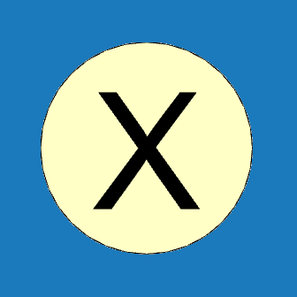

# Konstrukce
Menu <u><i>Konstrukce</i></u> umožňuje nastavit parametry primární nosné konstrukce, upravit materiály a průřezy prvků a přidávat stěnová a střešní ztužidla. 

Nastavení a úpravy pro celou primární konstrukci je možné provádět kliknutím na <b><u>Ovládací tlačítko</u></b> ve středu modelu.

<b><u>Kliknutím na vybraný prvek nosné konstrukce</u></b> se provádí editace vlastností pro celou skupinu, do které daný prvek náleží.

Pokud chcete upravit pouze jeden vybraný prvek, je třeba kliknout na jeho <b><u>Editační tlačítko</u></b> a vyřadit jej z jeho skupiny.

Kliknutím na tlačítko <b><u>Ztužidlo v rovině</u></b> je možné do příslušné části stěny nebo střechy přidat ztužidlo, kterému lze následně nastavit materiál, průřez, geometrii a rozmístění v rámci dané roviny. Úpravy jednotlivých sekcí ztužidel je možné provádět přímo kliknutím na daný prut. Do dané roviny je možné přidávat více typů ztužidel. 

#
<table>
  <tr>
    <td>
      

        
      

      Nastavení
      

      

    </td>
    <td style="vertical-align: middle; font-size: 20px;">
      Nastavení
    </td>
  </tr>
</table>

...Funkcionalita tlačítka <u>Nastavení</u> se připravuje pro budoucí verzi programu...

#
<table>
  <tr>
    <td></td>
    <td style="vertical-align: middle; font-size: 20px;">Ovládácí tlačítko</td>
  </tr> 
  </table>

<b><u>Ovládací tlačítko uprostřed modelu umožňuje nastavit:</u></b>

- Typ primární konstrukce.

- Typ nosníku použitý pro přesah střechy.

- Minimální délku pro přesah střechy.

- Výškové umístění paty sloupu.

- Generování tlačených výztuh, pokud je uživatel chce v konstrukci použít.

#
<table>
  <tr>
    <td></td>
    <td style="vertical-align: middle; font-size: 20px;">Editační tlačítko</td>
  </tr> 
</table>

<b><u>Pro jednotlivé prvky primární konstrukce umožňuje:</u></b>

- Nastavení zda má být prvek součástí defaultní skupiny prvků.

Pokud je prvek z dané skupiny vyřazen, je možné jej dále upravovat nezávisle na původní skupině. Podle typu prvku je možné dále upravit jeho materiál, průřez, náběhy, umístění paty či aktivovat táhla.

#
<table>
  <tr>
    <td></td>
    <td style="vertical-align: middle; font-size: 20px;">Ztužidlo v rovině</td>
  </tr> 
</table>

<b><u>Pro jednotlivé střešní či stěnové roviny umožňuje:</u></b>

- Do příslušné části stěny nebo střechy přidat ztužidlo, kterému lze následně nastavit materiál, průřez, geometrii a rozmístění v rámci dané roviny. 

- Úpravy jednotlivých sekcí ztužidel je možné provádět přímo kliknutím na daný prut. 

- Do dané roviny je možné přidávat více typů ztužidel. 

#

### Nepomohla Vám nápověda?
Pro více informací o funkcích HiStruct Building Configurator můžete navštívit náš blog nebo zaslat dotaz na naší podporu. 
<table>
  <tr>
    <td>
      <a href="https://docs.histruct.com/cs/"> 
        <button class="btn">
        Navštívit blog
        </button>
      </a>
    </td>
    <td>
      <a href="mailto:support@histruct.com?subject=Dotaz na Support HiStruct">
         <button class="btn">
         Zaslat dotaz
         </button>
      </a>
    </td>
  </tr>
</table>