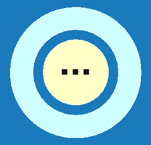

# Geometrie
Umožňuje měnit geometrické parametry modelu, tedy rozměry budovy a střechy včetně sklonu a přesahů. Rovněž je zde možné nastavit typ skladby střechy.

<b><u>Ovládací tlačítka</u> upravují vlastnosti střešní konstrukce pouze na vybrané střešní rovině.</b>

#

<table>
  <tr>
    <td>
      

        
      

      Rozměry
      

      

    </td>
    <td style="vertical-align: middle; font-size: 20px;">
      Rozměry
    </td>
  </tr>
</table>

Tlačítko <u>Rozměry</u> slouží k zakreslení půdorysného tvaru objektu, k nastavení výšky objektu a sklonu střechy a také k doplnění otvorů ve střešní konstrukci. 

Základní půdorysné rozměry je možné zadávat buď pro střešní konstrukci nebo pro svislé stěny.

#
<table>
  <tr>
    <td>
      

        
      

      Střecha
      

      

    </td>
    <td style="vertical-align: middle; font-size: 20px;">
      Střecha
    </td>
  </tr>
</table>

Tlačítko <u>Střecha</u> umožňuje nastavit typ skladby střechy. Typ krytiny a rozměry sekundární střešní konstrukce lze měnit přes tlačítko <u>Opláštění</u>.

#
<table>
  <tr>
    <td>
      

        
      

      Anotace
      

      

    </td>
    <td style="vertical-align: middle; font-size: 20px;">
      Anotace
    </td>
  </tr>
</table>

Tlačítko <u>Anotace</u> umožňuje do modelu přidávat libovolné půdorysné kóty.

#
<table>
  <tr>
    <td>
      

        
      

      Měření
      

      

    </td>
    <td style="vertical-align: middle; font-size: 20px;">
      Měření
    </td>
  </tr>
</table>

Tlačítkem <u>Měření</u> je možné zkontrolovat rozměry modelu.

#
<table>
  <tr>
    <td></td>
    <td style="vertical-align: middle; font-size: 20px;">Ovládácí tlačítko</td>
  </tr> 
  </table>

Umožňuje nastavení typu skladby střechy pro jednotlivé střešní roviny.

#
 

### Nepomohla Vám nápověda?
Pro více informací o funkcích HiStruct Roofs můžete navštívit náš blog nebo zaslat dotaz na naší podporu. 
<table>
  <tr>
    <td>
      <a href="https://docs.histruct.com/cs/"> 
        <button class="btn">
        Navštívit blog
        </button>
      </a>
    </td>
    <td>
      <a href="mailto:support@histruct.com?subject=Dotaz na Support HiStruct">
         <button class="btn">
         Zaslat dotaz
         </button>
      </a>
    </td>
  </tr>
</table>