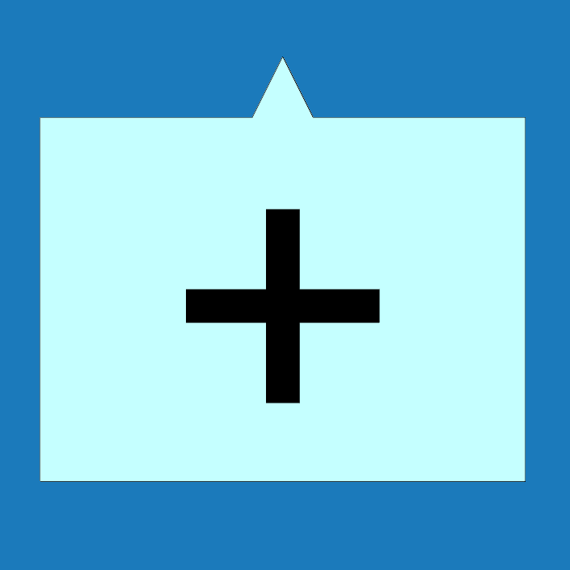

<h1>Lemovky</h1>

Umožňuje měnit jednotlivé lemovací prvky včetně typu materiálu nebo barvy.

Tyto vlastnosti lze upravit pomocí tlačítek vlevo pro všechny lemovací prvky z dané skupiny.

Vlastnosti jednotlivých prvků je možné měnit přímo kliknutím na jednotlivé prvky v modelu. Pro jednotlivé prvky je možné měnit i typ hrany.

<b><u>Počet skupin editovatelných lemovacích prvků se může měnit podle možností jednotlivých modelů.</u></b>

 <!-- Vodorovná čára jako oddělovač sekce -->

<h2>Editace skupin prvků pomocí tlačítek vlevo</h2>

Kliknutím na tlačítko lemovacího prvku na levé straně je možné editovat vlastnosti celé příslušné skupiny lemovacích prvků.

<table>
  <tr>
    <td>
      

        
        

          Štít
        

      

    </td>
    <td>
      

        
        

          Okap
        

      

    </td>
    <td>
      

        
        

          Okapnice
        

      

    </td>
    <td>
      

        
        

          Hřeben
        

      

    </td>
    <td style="vertical-align: middle; font-size: 20px; padding-left: 30px;">
      ... a další
    </td>
  </tr>
</table>

Provedené změny vlastností se propíší na všechny prvky spadající do určené skupiny.

 <!-- Vodorovná čára jako oddělovač sekce -->

<h2>Editace jednotlivých prvků</h2>

Vlastnosti jednotlivých prvků je možné měnit přímo kliknutím na jednotlivé prvky v modelu.

Pro jednotlivé prvky je možné měnit i typ hrany nebo prvky prodloužit o příslušnou délku.

{{ modal_video_button("img/VideoEditFlashing.mp4") }}

 <!-- Vodorovná čára jako oddělovač sekce -->

<table>
  <tr>
    <td>
      

        
        

          Měření
        

      

    </td>
    <td style="vertical-align: middle; font-size: 20px;padding-left: 30px;">
      Měření
    </td>
  </tr>
</table>

Tlačítkem <u>Měření</u> je možné zkontrolovat rozměry modelu.

 <!-- Vodorovná čára jako oddělovač sekce -->

<table>
  <tr>
    <td>
      
    </td>
    <td style="vertical-align: middle; font-size: 20px;padding-left: 30px;">
      Přidat
    </td>
  </tr> 
</table>

Tlačítko <u>Přidat</u> umožňuje přidat k příslušnému okapovému žlabu další okapový svod.

 <!-- Vodorovná čára jako oddělovač sekce -->

<!-- product: HiStruct Roofs -->

