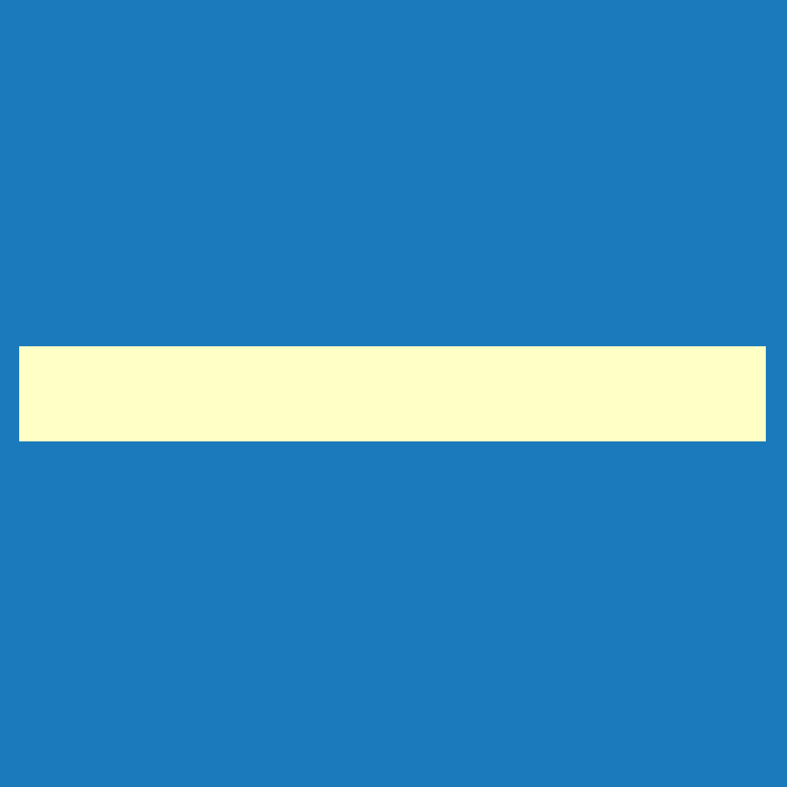

<h1>Konstrukce</h1>

Menu <u><i>Konstrukce</i></u> umožňuje nastavit parametry primární nosné konstrukce, upravit materiály a průřezy prvků a přidávat stěnová a střešní ztužidla.

Nastavení a úpravy pro celou primární konstrukci je možné provádět kliknutím na <b><u>Ovládací tlačítko</u></b> ve středu modelu.

<b><u>Kliknutím na vybraný prvek nosné konstrukce</u></b> se provádí editace vlastností pro celou skupinu, do které daný prvek náleží.

Pokud chcete upravit pouze jeden vybraný prvek, je třeba kliknout na jeho <b><u>Editační tlačítko</u></b> a vyřadit jej z jeho skupiny.

Kliknutím na tlačítko <b><u>Ztužidlo v rovině</u></b> je možné do příslušné části stěny nebo střechy přidat ztužidlo, kterému lze následně nastavit materiál, průřez, geometrii a rozmístění v rámci dané roviny. Úpravy jednotlivých sekcí ztužidel je možné provádět přímo kliknutím na daný prut. Do dané roviny je možné přidávat více typů ztužidel.

 <!-- Vodorovná čára jako oddělovač sekce -->

<table>
  <tr>
    <td>
      

        
        

          Nastavení
        

      

    </td>
    <td style="vertical-align: middle; font-size: 20px; padding-left: 30px;">
      Nastavení
    </td>
  </tr>
</table>

...Funkcionalita tlačítka <u>Nastavení</u> se připravuje pro budoucí verzi programu...

 <!-- Vodorovná čára jako oddělovač sekce -->

<table>
  <tr>
    <td></td>
    <td style="vertical-align: middle; font-size: 20px; padding-left: 30px;">Ovládácí tlačítko</td>
  </tr>
</table>

<b><u>Ovládací tlačítko uprostřed modelu umožňuje nastavit:</u></b>

<ul>
  <li>
Typ primární konstrukce.
</li>
  <li>
Typ nosníku použitý pro přesah střechy.
</li>
  <li>
Minimální délku pro přesah střechy.
</li>
  <li>
Výškové umístění paty sloupu.
</li>
  <li>
Generování tlačených výztuh, pokud je uživatel chce v konstrukci použít.
</li>
</ul>

 <!-- Vodorovná čára jako oddělovač sekce -->

<table>
  <tr>
    <td></td>
    <td style="vertical-align: middle; font-size: 20px; padding-left: 30px;">Editační tlačítko</td>
  </tr>
</table>

<b><u>Pro jednotlivé prvky primární konstrukce umožňuje:</u></b>

<ul>
  <li>
Nastavení, zda má být prvek součástí defaultní skupiny prvků.
</li>
</ul>

Pokud je prvek z dané skupiny vyřazen, je možné jej dále upravovat nezávisle na původní skupině. Podle typu prvku je možné dále upravit jeho materiál, průřez, náběhy, umístění paty či aktivovat táhla.

 <!-- Vodorovná čára jako oddělovač sekce -->

<table>
  <tr>
    <td></td>
    <td style="vertical-align: middle; font-size: 20px; padding-left: 30px;">Ztužidlo v rovině</td>
  </tr>
</table>

<b><u>Pro jednotlivé střešní či stěnové roviny umožňuje:</u></b>

<ul>
  <li>
Do příslušné části stěny nebo střechy přidat ztužidlo, kterému lze následně nastavit materiál, průřez, geometrii a rozmístění v rámci dané roviny.
</li>
  <li>
Úpravy jednotlivých sekcí ztužidel je možné provádět přímo kliknutím na daný prut.
</li>
  <li>
Do dané roviny je možné přidávat více typů ztužidel.
</li>
</ul>

 <!-- Vodorovná čára jako oddělovač sekce -->

<!-- product: HiStruct Building Configurator -->
