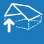

<h1>Geometrie &gt; Budova &gt; Rozměry</h1>

Umožňuje měnit geometrické parametry modelu, tedy rozměry okapových hran, sklon a přesah střechy. Taktéž je možné změnit výšku celé střešní konstrukce.

 <!-- Vodorovná čára jako oddělovač sekce -->

<h2>Editace jednotlivých hran</h2>
<b>Po kliknutí na příslušnou okapovou hranu je možné nastavit typ hrany, provést úpravu její délky, nastavení sklonu příslušné části střechy a jejího přesahu.</b>

<button onclick="document.getElementById('modal').style.display='flex';" class="btn">
  Přehrát videoukázku
</button>

  <video id="modalVideo" controls autoplay style="max-width: 90%; max-height: 80vh;">
    <source src="img/VideoEditEdges.mp4" type="video/mp4">
    Váš prohlížeč nepodporuje přehrávání videa.
  </video>
   
  <button onclick="
    document.getElementById('modal').style.display='none';
    const vid = document.getElementById('modalVideo');
    vid.pause();
    vid.currentTime = 0;
  " class="btn">
    Zavřít video
  </button>

 <!-- Vodorovná čára jako oddělovač sekce -->

<table>
  <tr>
    <td>
      

        
        

          Podklad
        

      

    </td>
    <td style="vertical-align: middle; font-size: 20px; padding-left: 30px;">
      Podklad
    </td>
  </tr>
</table>

Tlačítko <u>Podklad</u> slouží k importu podkladu pro rychlejší kreslení obrysu střechy.
 

<b>Po importu pokladu je třeba zkontrolovat jeho rozměry a případně upravit měřítko.</b>

<ul>
  <li>
Nastavení měřítka je možné změnit po importu podkladu kliknutím na šedé obdélníkové tlačítko v modelovacím prostoru.
</li>
</ul>

 <!-- Vodorovná čára jako oddělovač sekce -->

<table>
  <tr>
    <td>
      

        
        

          Otvor
        

      

    </td>
    <td style="vertical-align: middle; font-size: 20px; padding-left: 30px;">
      Otvor
    </td>
  </tr>
</table> 

Tlačítkem <u>Otvor</u> je možné do vygenerované střešní roviny vsadit otvor, zakresluje se jako půdorysný průmět.

Otvor může být obdélníkový či obecného tvaru a lze mu přiřadit typ otvoru pro komín.

Otvor obdélníkového tvaru lze zadat volným klikáním do půdorysné roviny nebo pomocí jeho rozměrů ve tvaru "X;Y", tedy např. <b>2;4</b>. Otvor obecného tvaru lze zakreslit volným klikáním nebo pomocí souřadnicových systémů podobně jako obrys střešní konstrukce.

Po kliknutí na příslušný otvor lze pomocí tlačítek v horní části otevřené tabulky měnit jeho typ, polohu či jej smazat.

 <!-- Vodorovná čára jako oddělovač sekce -->

<table>
  <tr>
    <td>
      

        
        

          Sklon
        

      

    </td>
    <td style="vertical-align: middle; font-size: 20px; padding-left: 30px;">
      Sklon
    </td>
  </tr>
</table>

Tlačítkem <u>Sklon</u> je možné nastavit stejný sklon pro všechny střešní roviny.

 <!-- Vodorovná čára jako oddělovač sekce -->

<table>
  <tr>
    <td>
      

        
        

          Zvednout
        

      

    </td>
    <td style="vertical-align: middle; font-size: 20px; padding-left: 30px;">
      Zvednout
    </td>
  </tr>
</table>

Tlačítkem <u>Zvednout</u> je možné upravit výšku stěn modelovaného objektu.

 <!-- Vodorovná čára jako oddělovač sekce -->

<table>
  <tr>
    <td>
      

        
        

          Vlastnosti
        

      

    </td>
    <td style="vertical-align: middle; font-size: 20px; padding-left: 30px;">
      Vlastnosti
    </td>
  </tr>
</table>

Umožňuje upravit způsob zadání geometrie, podle nastavení je možné kreslit obrys střechy nebo stěn.

Taktéž je zde možné nastavit prolínání střešních rovin mezi jednotlivými objekty.

 <!-- Vodorovná čára jako oddělovač sekce -->

<table>
  <tr>
    <td>
      

        
        

          Smazat
        

      

    </td>
    <td style="vertical-align: middle; font-size: 20px; padding-left: 30px;">
      Smazat
    </td>
  </tr>
</table>

Smaže všechny importované podklady a konstrukce zakreslené pomocí funkce <u>Obrys</u>.

 <!-- Vodorovná čára jako oddělovač sekce -->

<table>
  <tr>
    <td>
      

        
        

          Anotace
        

      

    </td>
    <td style="vertical-align: middle; font-size: 20px; padding-left: 30px;">
      Anotace
    </td>
  </tr>
</table>

Tlačítko <u>Anotace</u> umožňuje do modelu přidávat libovolné půdorysné kóty.

 <!-- Vodorovná čára jako oddělovač sekce -->

<table>
  <tr>
    <td>
      

        
        

          Měření
        

      

    </td>
    <td style="vertical-align: middle; font-size: 20px; padding-left: 30px;">
      Měření
    </td>
  </tr>
</table>

Tlačítkem <u>Měření</u> je možné zkontrolovat rozměry modelu.

 <!-- Vodorovná čára jako oddělovač sekce -->

<table>
  <tr>
    <td>
      

        
        

          Přidat
        

      

    </td>
    <td style="vertical-align: middle; font-size: 20px; padding-left: 30px;">
      Přidat
    </td>
  </tr>
</table>

Tlačítkem <u>Přidat</u> je možné do modelového prostoru přidat další střešní konstrukce.

<ul>
  <li>
Pultovou střechu na obdélníkovém půdorysu
</li>
  <li>
Sedlovou střechu na obdélníkovém půdorysu
</li>
  <li>
Další střechu definovanou obrysem
</li>
  <li>
Střechu určenou pomocí 3D souboru typu ".obj"
</li>
</ul>

 <!-- Vodorovná čára jako oddělovač sekce -->

<h2>Nepomohla Vám nápověda?</h2>

Pro více informací o funkcích HiStruct Building Configurator můžete navštívit náš blog nebo zaslat dotaz na naší podporu.

<table>
  <tr>
    <td>
      <a href="https://docs.histruct.com/cs/" target="_blank" rel="noopener noreferrer"> 
        <button class="btn">
          Navštívit blog
        </button>
      </a>
    </td>
    <td>
      <a href="mailto:support@histruct.com?subject=Dotaz na Support HiStruct">
         <button class="btn">
           Zaslat dotaz
         </button>
      </a>
    </td>
  </tr>
</table>
