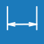

<h1>Geometrie</h1>

Umožňuje měnit geometrické parametry modelu, tedy rozměry budovy a střechy včetně sklonu a přesahů. Rovněž je zde možné nastavit typ skladby střechy.

<table>
  <tr>
    <td>
      

        
        
Podklad

      

    </td>
    <td style="vertical-align: middle; font-size: 20px; padding-left: 30px;">
      Podklad
    </td>
  </tr>
</table>

Tlačítko <u>Podklad</u> slouží k importu podkladu pro rychlejší kreslení obrysu střechy.

<b>Po importu pokladu je třeba zkontrolovat jeho rozměry a případně upravit měřítko.</b>

<ul>
  <li>
Nastavení měřítka je možné změnit po importu podkladu kliknutím na šedé obdélníkové tlačítko v modelovacím prostoru.
</li>
</ul>

<table>
  <tr>
    <td>
      

        
        
Obrys

      

    </td>
    <td style="vertical-align: middle; font-size: 20px; padding-left: 30px;">
      Obrys
    </td>
  </tr>
</table>

Tlačítko <u>Obrys</u> slouží k zakreslení půdorysného obrysu střechy. Pro zadání délky a směru jednotlivých okapových hran je možné využít:

<b><u>Volné kreslení pomocí kurzoru</u></b>

<ul>
  <li>
Hrany lze kreslit volným klikáním do modelovacího prostoru.
</li>
  <li>
Během kreslení hran je možné využít funkce zarovnávání kurzoru podle směrů os X a Y, případně zarovnávání kurzoru kolmo k poslední zadané hraně.
</li>
</ul>

  <button onclick="document.getElementById('modal0').style.display='flex';" class="btn">&#9654; Videoukázka</button>

  <video id="modalVideo0" controls autoplay style="max-width: 90%; max-height: 80vh;">
    <source src="img/VideoOutlineFree.mp4" type="video/mp4">
    Váš prohlížeč nepodporuje přehrávání videa.
  </video>
   
  <button onclick="
    document.getElementById('modal0').style.display='none';
    const vid = document.getElementById('modalVideo0');
    vid.pause();
    vid.currentTime = 0;
  " class="btn">Zavřít video</button>

<b><u>Globální souřadnice vrcholů polygonu</u></b>

<ul>
  <li>
Globální souřadnice pro následující vrchol se zapíší ve formátu "X;Y", tedy např. <b>2;4</b>
</li>
</ul>

  <button onclick="document.getElementById('modal1').style.display='flex';" class="btn">&#9654; Videoukázka</button>

  <video id="modalVideo1" controls autoplay style="max-width: 90%; max-height: 80vh;">
    <source src="img/VideoOutlineGlobal.mp4" type="video/mp4">
    Váš prohlížeč nepodporuje přehrávání videa.
  </video>
   
  <button onclick="
    document.getElementById('modal1').style.display='none';
    const vid = document.getElementById('modalVideo1');
    vid.pause();
    vid.currentTime = 0;
  " class="btn">Zavřít video</button>

<b><u>Relativní souřadnice vrcholů polygonu</u></b>

<ul>
  <li>
Relativní souřadnice pro následující vrchol se zapíší ve formátu "@X;Y", tedy např. <b>@2;4</b>
</li>
</ul>

  <button onclick="document.getElementById('modal2').style.display='flex';" class="btn">&#9654; Videoukázka</button>

  <video id="modalVideo2" controls autoplay style="max-width: 90%; max-height: 80vh;">
    <source src="img/VideoOutlineRelative.mp4" type="video/mp4">
    Váš prohlížeč nepodporuje přehrávání videa.
  </video>
   
  <button onclick="
    document.getElementById('modal2').style.display='none';
    const vid = document.getElementById('modalVideo2');
    vid.pause();
    vid.currentTime = 0;
  " class="btn">Zavřít video</button>

<b><u>Polární souřadnice vrcholů polygonu</u></b>

<ul>
  <li>
Polární souřadnice pro následující vrchol se zapíší ve formátu "&gt;alfa;L", tedy např. <b>&gt;135;6</b>
</li>
  <li>
Zadávaný úhel se odměřuje o kladného směru globální osy X proti směru hodinových ručiček.
</li>
</ul>

  <button onclick="document.getElementById('modal3').style.display='flex';" class="btn">&#9654; Videoukázka</button>

  <video id="modalVideo3" controls autoplay style="max-width: 90%; max-height: 80vh;">
    <source src="img/VideoOutlinePolar.mp4" type="video/mp4">
    Váš prohlížeč nepodporuje přehrávání videa.
  </video>
   
  <button onclick="
    document.getElementById('modal3').style.display='none';
    const vid = document.getElementById('modalVideo3');
    vid.pause();
    vid.currentTime = 0;
  " class="btn">Zavřít video</button>

Poslední vložený bod je možné smazat pomocí klávesy <b><u>DELETE</u></b>.

<table>
  <tr>
    <td>
      

        
        
Otvor

      

    </td>
    <td style="vertical-align: middle; font-size: 20px; padding-left: 30px;">
      Otvor
    </td>
  </tr>
</table>

Tlačítkem <u>Otvor</u> je možné do vygenerované střešní roviny vsadit otvor, zakresluje se jako půdorysný průmět.

Otvor může být obdélníkový či obecného tvaru a lze mu přiřadit typ otvoru pro komín.

<table>
  <tr>
    <td>
      

        
        
Vlastnosti

      

    </td>
    <td style="vertical-align: middle; font-size: 20px; padding-left: 30px;">
      Vlastnosti
    </td>
  </tr>
</table>

Umožňuje upravit způsob zadání geometrie, podle nastavení je možné kreslit obrys střechy nebo stěn.

<table>
  <tr>
    <td>
      

        
        
Smazat

      

    </td>
    <td style="vertical-align: middle; font-size: 20px; padding-left: 30px;">
      Smazat
    </td>
  </tr>
</table>

Smaže všechny importované podklady a konstrukce zakreslené pomocí funkce <u>Obrys</u>.

<table>
  <tr>
    <td>
      

        
        
Anotace

      

    </td>
    <td style="vertical-align: middle; font-size: 20px; padding-left: 30px;">
      Anotace
    </td>
  </tr>
</table>

Tlačítko <u>Anotace</u> umožňuje do modelu přidávat libovolné půdorysné kóty.

<table>
  <tr>
    <td>
      

        
        
Měření

      

    </td>
    <td style="vertical-align: middle; font-size: 20px; padding-left: 30px;">
      Měření
    </td>
  </tr>
</table>

Tlačítkem <u>Měření</u> je možné zkontrolovat rozměry modelu.

<table>
  <tr>
    <td>
      

        
        
Přidat

      

    </td>
    <td style="vertical-align: middle; font-size: 20px; padding-left: 30px;">
      Přidat
    </td>
  </tr>
</table>

Tlačítkem <u>Přidat</u> je možné do modelového prostoru přidat další konstrukce.

<ul>
  <li>
Objekt s pultovou střechou na obdélníkovém půdorysu
</li>
  <li>
Objekt se sedlovou střechou na obdélníkovém půdorysu
</li>
  <li>
Další objekt definovaný obrysem
</li>
  <li>
Objekt určenou pomocí 3D souboru typu „.obj“
</li>
</ul>

<!-- product: HiStruct Building Configurator -->
