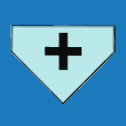

<!DOCTYPE html>
<html>
<head>
  <meta charset="UTF-8">
  <title>Opláštění &gt; Stěna</title>
</head>
  

<body>

<h1>Opláštění &gt; Stěna</h1>

V menu <u><i>Opláštění &gt; Stěna</i></u> je možné nastavit typ výroby stěny, kladení řad opláštění a výšku soklu. Taktéž je zde možné upravit jednotlivé vrstvy opláštění.

U jednotlivých stěn je navíc možné upravovat barevné schéma a materiály jednotlivých vrstev opláštění. Také je zde možné generovat kusovník s položkami opláštění nebo pohled na stěnu ve formě editovatelného výkresu.

<b>Nastavení a úpravy jednotlivých stěnových rovin je možné provést pomocí <u>Ovládacích a Editačních tlačítek</u>.</b>

<ul>
  <li>
Přes <u>Ovládací tlačítka</u> v modelu je možné nastavit typ opláštění stěny, typ a rozměry prvků sekundární konstrukce zvlášť pro jednotlivé stěnové roviny, taktéž umožňují vytvářet výkazy materiálů a výkresy stěnové konstrukce.
</li>
  <li>
Přes <u>Editační tlačítka</u> v modelu je možné editovat vlastnosti jednotlivých vrstev stěnové konstrukce na určené stěnové rovině, taktéž umožňují vytvářet výkazy materiálů a výkresy příslušných vrstev stěnové konstrukce.
</li>
</ul>

 <!-- Vodorovná čára jako oddělovač sekce -->

<table>
  <tr>
    <td>
      

        
        

          Rozvržení
        

      

    </td>
    <td style="vertical-align: middle; font-size: 20px; padding-left: 30px;">
      Rozvržení
    </td>
  </tr>
</table>

Tlačítko <u>Rozvržení</u> umožňuje nastavit typ výroby, kladení řad opláštění a výšku soklu.

 <!-- Vodorovná čára jako oddělovač sekce -->

<h2>Nastavení vrstev opláštění stěny</h2>

Nastavení skladby střešní konstrukce se provádí pomocí tlačítek:

<ul>
  <li>
<u>Vrchní vrstva</u>
</li>
  <li>
<u>Vnitřní vrstvy</u>
</li>
  <li>
<u>Sokl</u>
</li>
</ul>

Pro některé typy opláštění může být v defaultním stavu tlačítko <u>Vnitřní vrstvy</u> schované a sekundární konstrukce pak pro takový typ opláštění není generována.

Tlačítko <u>Sokl</u> je dostupné podle typu výroby stěny nastavené v <u>Rozvržení</u>.

 <!-- Vodorovná čára jako oddělovač sekce -->

<table>
  <tr>
    <td>
      

        
      

      Vrchní vrstva
      

      

    </td>
    <td style="vertical-align: middle; font-size: 20px; padding-left: 30px">
      Vrchní vrstva
    </td>
  </tr>
</table>

<ul>
  <li>
Umožňuje výběr materiálu opláštění z připravené galerie výrobků.
</li>
</ul>

 <!-- Vodorovná čára jako oddělovač sekce -->

<table>
  <tr>
    <td>
      

        
      

      Vnitřní vrstvy
      

      

    </td>
    <td style="vertical-align: middle; font-size: 20px; padding-left: 30px">
      Vnitřní vrstvy
    </td>
  </tr>
</table>

<ul>
  <li>
Umožňuje výběr typu skladby sekundární konstrukce z připravené galerie výrobků.
</li>
</ul>

 <!-- Vodorovná čára jako oddělovač sekce -->

<table>
  <tr>
    <td>
      

        
      

      Sokl
      

      

    </td>
    <td style="vertical-align: middle; font-size: 20px; padding-left: 30px">
      Sokl
    </td>
  </tr>
</table>

<ul>
  <li>
Umožňuje výběr materiálu soklu z připravené galerie výrobků.
</li>
</ul>

 <!-- Vodorovná čára jako oddělovač sekce -->

<table>
  <tr>
    <td></td>
    <td style="vertical-align: middle; font-size: 20px; padding-left: 30px;">Ovládací tlačítko</td>
  </tr>
</table>

<b><u>Pro jednotlivé střešní roviny umožňuje:</u></b>

<ul>
  <li>
Nastavení typu skladby střechy - typu krytiny a sekundární konstrukce.
</li>
  <li>
Generování kusovníku s položkami střešní krytiny a také generování půdorysu střešní konstrukce se všemi vrstvami ve formě editovatelného výkresu.
</li>
</ul>

  

    Funkce pro STŘECHU přístupné přes Ovládací tlačítko
  

  

  <h1>Opláštění > Střešní rovina</h1>

V menu <u><i>Opláštění > Střešní rovina</i></u> přístupném přes <u>Ovládací tlačítko</u> je pro jednotlivé střešní roviny možné :

<ul>
  <li>
Nastavení typu skladby střechy - typu krytiny a sekundární konstrukce.
</li>
  <li>
Generování kusovníku s položkami střešní krytiny a také generování půdorysu střešní konstrukce se všemi vrstvami ve formě editovatelného výkresu.
</li>
</ul>

<b><u>Ovládací a Editační tlačítka</u> upravují vlastnosti střešní konstrukce pouze na vybrané střešní rovině.</b>

 <!-- Vodorovná čára jako oddělovač sekce -->

<table>
  <tr>
    <td>
      

        
        
Vlastnosti

      

    </td>
    <td style="vertical-align: middle; font-size: 20px; padding-left: 30px;">Vlastnosti</td>
  </tr>
</table>

Tlačítko <u>Vlastnosti</u> umožňuje pojmenovat určenou střešní rovinu a upravit excentricitu střechy, tedy odsazení vygenerované střešní roviny od její skutečné polohy.

 <!-- Vodorovná čára jako oddělovač sekce -->

<table>
  <tr>
    <td>
      

        
        
Materiály

      

    </td>
    <td style="vertical-align: middle; font-size: 20px; padding-left: 30px;">Materiály</td>
  </tr>
</table>

Nastavení skladby střešní konstrukce se provádí pomocí tlačítek:

<ul>
  <li>
<u>Vrchní vrstva</u>
</li>
  <li>
<u>Nižší vrstvy</u>
</li>
</ul>

Pro některé krytiny může být v defaultním stavu tlačítko <u>Nižší vrstvy</u> schované a sekundární konstrukce pak pro takovou krytinu není generována.

 

 <!-- Vodorovná čára jako oddělovač sekce -->

<table>
  <tr>
    <td>
      

        
      

      Vrchní vrstva
      

      

    </td>
    <td style="vertical-align: middle; font-size: 20px; padding-left: 30px">
      Vrchní vrstva
    </td>
  </tr>
</table>

<ul>
  <li>
Umožňuje výběr střešní krytiny z připravené galerie výrobků.
</li>
</ul>

 <!-- Vodorovná čára jako oddělovač sekce -->

<table>
  <tr>
    <td>
      

        
      

      Nižší vrstvy
      

      

    </td>
    <td style="vertical-align: middle; font-size: 20px; padding-left: 30px">
      Nižší vrstvy
    </td>
  </tr>
</table>

<ul>
  <li>
Umožňuje výběr typu skladby sekundární konstrukce z připravené galerie výrobků.
</li>
</ul>

 <!-- Vodorovná čára jako oddělovač sekce -->

<table>
  <tr>
    <td>
      

        
        
Kusovník

      

    </td>
    <td style="vertical-align: middle; font-size: 20px; padding-left: 30px;">Kusovník</td>
  </tr>
</table>

Generuje soupis položek střešní krytiny pro příslušnou střešní rovinu do přehledné tabulky.

 <!-- Vodorovná čára jako oddělovač sekce -->

<table>
  <tr>
    <td>
      

        
        
Výkres

      

    </td>
    <td style="vertical-align: middle; font-size: 20px; padding-left: 30px;">Výkres</td>
  </tr>
</table>

Generuje výkres určené střešní roviny včetně celé skladby střešní konstrukce. Výkres je možné dále editovat, doplnit popisky a kótami.

<b><u>Pro jednotlivé stěnové roviny umožňuje:</u></b>

<ul>
<li>
Nastavení typu výroby stěny, způsobu kladení řad opláštění, výšku soklu nebo barevné schéma.
</li>
<li>
Nastavení materiálu stěny a úpravu jednotlivých vrstev opláštění podle typu výroby stěny.
</li>
<li>
Generování kusovníku s položkami opláštění stěny a pohledu na stěnu ve formě editovatelného výkresu.
</li>
</ul>

  

    Funkce pro STĚNU přístupné přes Ovládací tlačítko
  

  

<h1>Opláštění &gt; Stěnová rovina</h1>

V menu <u><i>Opláštění &gt; Stěnová rovina</i></u> přístupném přes <u>Ovládací tlačítko</u> je možné nastavit typ výroby stěny, kladení řad opláštění a výšku soklu.

Dále je možné upravovat barevné schéma a materiály jednotlivých vrstev opláštění. Také je zde možné generovat kusovník s položkami opláštění nebo pohled na stěnu ve formě editovatelného výkresu.

<b><u>Ovládací a Editační tlačítka</u> upravují vlastnosti konstrukce pouze na vybrané stěnové rovině.</b>

 <!-- Vodorovná čára jako oddělovač sekce -->

<table>
  <tr>
    <td>
      

        
        
Rozvržení

      

    </td>
    <td style="vertical-align: middle; font-size: 20px; padding-left: 30px;">Rozvržení</td>
  </tr>
</table>

Tlačítko <u>Rozvržení</u> umožňuje nastavit typ výroby, kladení řad opláštění a výšku soklu.

 <!-- Vodorovná čára jako oddělovač sekce -->

<table>
  <tr>
    <td>
      

        
        
Barvy

      

    </td>
    <td style="vertical-align: middle; font-size: 20px; padding-left: 30px;">Barvy</td>
  </tr>
</table>

Tlačítko <u>Barvy</u> umožňuje nastavit barevné schéma pro danou stěnovou rovinu, podle typu schématu je možné nastavit barvy pro vybrané stěnové panely.

Stěnové panely jsou číslovány od 0.

 <!-- Vodorovná čára jako oddělovač sekce -->

<table>
  <tr>
    <td>
      

        
        
Materiály

      

    </td>
    <td style="vertical-align: middle; font-size: 20px; padding-left: 30px;">Materiály</td>
  </tr>
</table>

Nastavení skladby střešní konstrukce se provádí pomocí tlačítek:

<ul>
  <li>
<u>Vrchní vrstva</u>
</li>
  <li>
<u>Vnitřní vrstvy</u>
</li>
  <li>
<u>Sokl</u>
</li>
</ul>

Pro některé typy opláštění může být v defaultním stavu tlačítko <u>Vnitřní vrstvy</u> schované a sekundární konstrukce pak pro takový typ opláštění není generována.

Tlačítko <u>Sokl</u> je dostupné podle typu výroby stěny nastavené v <u>Rozvržení</u>.

 <!-- Vodorovná čára jako oddělovač sekce -->

<table>
  <tr>
    <td>
      

        
      

      Vrchní vrstva
      

      

    </td>
    <td style="vertical-align: middle; font-size: 20px; padding-left: 30px">
      Vrchní vrstva
    </td>
  </tr>
</table>

<ul>
  <li>
Umožňuje výběr materiálu opláštění z připravené galerie výrobků.
</li>
</ul>

 <!-- Vodorovná čára jako oddělovač sekce -->

<table>
  <tr>
    <td>
      

        
      

      Vnitřní vrstvy
      

      

    </td>
    <td style="vertical-align: middle; font-size: 20px; padding-left: 30px">
      Vnitřní vrstvy
    </td>
  </tr>
</table>

<ul>
  <li>
Umožňuje výběr typu skladby sekundární konstrukce z připravené galerie výrobků.
</li>
</ul>

 <!-- Vodorovná čára jako oddělovač sekce -->

<table>
  <tr>
    <td>
      

        
      

      Sokl
      

      

    </td>
    <td style="vertical-align: middle; font-size: 20px; padding-left: 30px">
      Sokl
    </td>
  </tr>
</table>

<ul>
  <li>
Umožňuje výběr materiálu soklu z připravené galerie výrobků.
</li>
</ul>

 <!-- Vodorovná čára jako oddělovač sekce -->

<table>
  <tr>
    <td>
      

        
        
Kusovník

      

    </td>
    <td style="vertical-align: middle; font-size: 20px; padding-left: 30px;">Kusovník</td>
  </tr>
</table>

Generuje soupis položek opláštění stěny pro příslušnou stěnovou rovinu do přehledné tabulky.

 <!-- Vodorovná čára jako oddělovač sekce -->

<table>
  <tr>
    <td>
      

        
        
Výkres

      

    </td>
    <td style="vertical-align: middle; font-size: 20px; padding-left: 30px;">Výkres</td>
  </tr>
</table>

Generuje výkres určené stěnové roviny včetně celé skladby opláštění stěny. Výkres je možné dále editovat, doplnit popisky a kótami.

 <!-- Vodorovná čára jako oddělovač sekce -->

<table>
  <tr>
    <td></td>
    <td style="vertical-align: middle; font-size: 20px; padding-left: 30px;">Editační tlačítko</td>
  </tr>
</table>

<b><u>Pro jednotlivé vrstvy skladby střechy na určené střešní rovině umožňuje:</u></b>

<ul>
  <li>
Nastavení typu krytiny nebo jednotlivých vrstev sekundární konstrukce včetně rozměrů, směru kladení, taktéž úpravu pozice a úhlu kladení.
</li>
  <li>
Generování půdorysu příslušné vrstvy střešní konstrukce ve formě editovatelného výkresu.
</li>
  <li>
Pro střešní krytinu je možné také vygenerovat výkaz materiálu s položkami střešní krytiny.
</li>
</ul>

  

    Funkce pro STŘECHU přístupné přes Editační tlačítko
  

  

  <h1>Opláštění &gt; Střešní vrstva</h1>

  Menu <u><i>Opláštění &gt; Střešní vrstva</i></u> přístupném přes <u>Editační tlačítko</u> umožňuje pro jednotlivé vrstvy skladby střechy na určené střešní rovině:

<ul>
  <li>
Nastavení typu krytiny nebo jednotlivých vrstev sekundární konstrukce včetně rozměrů, směru kladení, taktéž úpravu pozice a úhlu kladení.
</li>
  <li>
Generování půdorysu příslušné vrstvy střešní konstrukce ve formě editovatelného výkresu.
</li>
  <li>
Pro střešní krytinu je možné také vygenerovat výkaz materiálu s položkami střešní krytiny.
</li>
</ul>

  Možnosti nastavení se liší v závislosti na typu střešní krytiny či sekundární konstrukce.

  <b><u>Ovládací a Editační tlačítka</u> upravují vlastnosti střešní konstrukce pouze na vybrané střešní rovině.</b>

 <!-- Vodorovná čára jako oddělovač sekce -->

<table>
  <tr>
    <td>
      

        
        
Kladení

      

    </td>
    <td>
      

        
        
Síť

      

    </td>
    <td>
      

        
        
Rámy

      

    </td>
    <td>
      

        
        
Vrstva

      

    </td>
    <td style="vertical-align: middle; font-size: 20px; padding-left: 30px;">
      Kladení / Síť / Rámy / Vrstva
    </td>
  </tr>
</table>

<h3>Kladení</h3>

<ul>
<li>

  Tlačítko <u>Kladení</u> umožňuje výběr materiálu pro danou vrstvu střešní konstrukce z připravené galerie výrobků.
  
</li>
<li>
Dále umožňuje nastavit směr, úhel a posun kladení prvků střešní krytiny od okraje střechy.

</li>

<li>

  Po kliknutí na zvolený prvek střešní krytiny je možné prvek prodloužit na začátku i na konci o zvolenou délku, případně editovat jeho barvu.
  Taktéž umožňuje nastavení přesahů a barvy jednotlivých kusů krytiny.

</li>

<li>

<table>
  <tr>
    <td>
      
    </td>
    <td style="vertical-align: middle; font-size: 15px; padding-left: 30px;">
      Přesah
    </td>
  </tr> 
</table>

</li>

<ul><li>

  Tlačítko <u>Přesah</u> v modelu umožňuje nastavit přesah krytiny přes danou střešní hranu.

</li></ul>
</ul>

<h3>Síť</h3>

<ul>
<li>
Tlačítko <u>Síť</u> umožňuje výběr materiálu pro danou vrstvu střešní konstrukce z připravené galerie výrobků, zde je možné vybrat požadovaný průřez latí včetně jejich rozteče.

</li>

<li>
Dále umožňuje nastavit rozteče mezi prvky laťování, upravit úhel kladené vrstvy laťování a odsazení prvního prvku od kraje střechy.

</li>
</ul>

<h3>Rámy</h3>

<ul>
<li>

  Tlačítko <u>Rámy</u> umožňuje výběr materiálu pro danou vrstvu střešní konstrukce z připravené galerie výrobků, zde je možné vybrat požadovaný průřez prvků sekundární konstrukce.
  
</li>
</ul>

<h3>Vrstva</h3>
<ul>
<li>

  ...Funkcionalita tlačítka <u>Vrstva</u> se připravuje pro budoucí verzi programu...

</li>
</ul>

 <!-- Vodorovná čára jako oddělovač sekce -->

<table>
  <tr>
    <td>
      

        
        
Kusovník

      

    </td>
    <td style="vertical-align: middle; font-size: 20px; padding-left: 30px;">
      Kusovník
    </td>
  </tr>
</table>

  Generuje soupis položek dané vrstvy skladby střešní konstrukcepro příslušnou střešní rovinu do přehledné tabulky.

Funckionalita nemusí být dočasně přístupná pro všechny vrstvy sklaby střechy

 <!-- Vodorovná čára jako oddělovač sekce -->

<table>
  <tr>
    <td>
      

        
        
Výkres

      

    </td>
    <td style="vertical-align: middle; font-size: 20px; padding-left: 30px;">
      Výkres
    </td>
  </tr>
</table>

  Generuje výkres určené vrstvy střešní roviny. Výkres je možné dále editovat, doplnit popisky a kótami.

 <!-- Vodorovná čára jako oddělovač sekce -->

<table>
  <tr>
    <td>
      

        
        
Měření

      

    </td>
    <td style="vertical-align: middle; font-size: 20px; padding-left: 30px;">
      Měření
    </td>
  </tr>
</table>

  Tlačítkem <u>Měření</u> je možné zkontrolovat rozměry modelu.

 <!-- Vodorovná čára jako oddělovač sekce -->

<b><u>Pro jednotlivé vrstvy skladby opláštění na určené stěnové rovině umožňuje:</u></b>

<ul>
<li>
Nastavení materiálu opláštění nebo jednotlivých vrstev sekundární konsturkce či soklu, dále nastavení směru kladení, taktéž úpravu pozice a úhlu kladení opláštění.
</li>
<li>
Úpravu barevného schématu opláštění, prodloužení přesahů opláštění.
</li> 
<li>
Generování výkresu příslušné vrstvy stěnové konstrukce ve formě editovatelného výkresu.
</li>
<li>
Pro vrstvu vnějšího opláštění je možné také vygenerovat výkaz materiálu s položkami.
</li>
</ul>

  

    Funkce pro STĚNU přístupné přes Editační tlačítko
  

  

  <body>

<h1>Opláštění &gt; Stěnová vrstva</h1>

V menu <u><i>Opláštění &gt; Stěnová vrstva</i></u> přístupném přes <u>Editační tlačítko</u> je možné pro jednotlivé vrstvy skladby opláštění na určené stěnové rovině nastavit:

<ul>
<li>
Nastavení materiálu opláštění nebo jednotlivých vrstev sekundární konsturkce či soklu, dále nastavení směru kladení, taktéž úpravu pozice a úhlu kladení opláštění.
</li>
<li>
Úpravu barevného schématu opláštění, prodloužení přesahů opláštění.
</li> 
<li>
Generování výkresu příslušné vrstvy stěnové konstrukce ve formě editovatelného výkresu.
</li>
<li>
Pro vrstvu vnějšího opláštění je možné také vygenerovat výkaz materiálu s položkami.
</li>
</ul>

  Možnosti nastavení se liší v závislosti na typu materiálu opláštění, sekundární konstrukce či soklu.

  <b><u>Ovládací a Editační tlačítka</u> upravují vlastnosti střešní konstrukce pouze na vybrané střešní rovině.</b>

 <!-- Vodorovná čára jako oddělovač sekce -->

<table>
  <tr>
    <td>
      

        
        
Kladení

      

    </td>
    <td>
      

        
        
Síť

      

    </td>
    <td>
      

        
        
Rámy

      

    </td>
    <td>
      

        
        
Vrstva

      

    </td>
    <td style="vertical-align: middle; font-size: 20px; padding-left: 30px;">
      Kladení / Síť / Rámy / Vrstva
    </td>
  </tr>
</table>

<h3>Kladení</h3>

<ul>
<li>

  Tlačítko <u>Kladení</u> umožňuje výběr materiálu pro danou vrstvu stěnové konstrukce z připravené galerie výrobků.
  
</li>
<li>
Dále umožňuje nastavit směr, úhel a posun kladení prvků opláštění od okraje budovy.

</li>

<li>

  Po kliknutí na zvolený prvek stěnového opláštění je možné prvek prodloužit na začátku i na konci o zvolenou délku, případně editovat jeho barvu.
  Taktéž umožňuje nastavení přesahů a barvy jednotlivých kusů opláštění.

</li>

<li>

<table>
  <tr>
    <td>
      
    </td>
    <td style="vertical-align: middle; font-size: 15px; padding-left: 30px;">
      Přesah
    </td>
  </tr> 
</table>

</li>

<ul><li>

  Tlačítko <u>Přesah</u> v modelu umožňuje nastavit přesah stěnového opláštění přes danou hranu budovy.

</li></ul>
</ul>

<h3>Síť</h3>

<ul>
<li>
Tlačítko <u>Síť</u> umožňuje výběr materiálu pro danou vrstvu konstrukce opláštění z připravené galerie výrobků, zde je možné vybrat požadovaný průřez latí včetně jejich rozteče.

</li>

<li>
Dále umožňuje nastavit rozteče mezi prvky laťování, upravit úhel kladené vrstvy laťování a odsazení prvního prvku od kraje budovy.

</li>
</ul>

<h3>Rámy</h3>

<ul>
<li>

  Tlačítko <u>Rámy</u> umožňuje výběr materiálu pro danou vrstvu konstrukce opláštění z připravené galerie výrobků, zde je možné vybrat požadovaný průřez prvků sekundární konstrukce.
  
</li>
</ul>

<h3>Vrstva</h3>
<ul>
<li>

  ...Funkcionalita tlačítka <u>Vrstva</u> se připravuje pro budoucí verzi programu...

</li>
</ul>

 <!-- Vodorovná čára jako oddělovač sekce -->

<table>
  <tr>
    <td>
      

        
        
Barvy

      

    </td>
    <td style="vertical-align: middle; font-size: 20px; padding-left: 30px;">Barvy</td>
  </tr>
</table>

Tlačítko <u>Barvy</u> umožňuje nastavit barevné schéma pro danou stěnovou rovinu, podle typu schématu je možné nastavit barvy pro vybrané stěnové panely.

Stěnové panely jsou číslovány od 0.

 <!-- Vodorovná čára jako oddělovač sekce -->

<table>
  <tr>
    <td>
      

        
        
Kusovník

      

    </td>
    <td style="vertical-align: middle; font-size: 20px; padding-left: 30px;">
      Kusovník
    </td>
  </tr>
</table>

  Generuje soupis položek dané vrstvy skladby stěnové konstrukce pro příslušnou stěnovou rovinu do přehledné tabulky.

Funckionalita nemusí být dočasně přístupná pro všechny vrstvy sklaby opláštění.

 <!-- Vodorovná čára jako oddělovač sekce -->

<table>
  <tr>
    <td>
      

        
        
Výkres

      

    </td>
    <td style="vertical-align: middle; font-size: 20px; padding-left: 30px;">
      Výkres
    </td>
  </tr>
</table>

  Generuje výkres určené vrstvy stěnové roviny. Výkres je možné dále editovat, doplnit popisky a kótami.

 <!-- Vodorovná čára jako oddělovač sekce -->

<table>
  <tr>
    <td>
      

        
        
Měření

      

    </td>
    <td style="vertical-align: middle; font-size: 20px; padding-left: 30px;">
      Měření
    </td>
  </tr>
</table>

  Tlačítkem <u>Měření</u> je možné zkontrolovat rozměry modelu.

 <!-- Vodorovná čára jako oddělovač sekce -->

<h2>Chybí vám v galerii některá krytina? Napište nám, doplníme ji.</h2>

<table>
  <tr>
    <td>
      <a href="mailto:jiri.podval@histruct.com?subject=Dotaz na HiStruct konfigurátor budov">
        <button class="btn">Chci doplnit</button>
      </a>
    </td>
  </tr>
</table>

<h2>Nepomohla Vám nápověda?</h2>

Pro více informací o funkcích HiStruct Building Configurator můžete navštívit náš blog nebo zaslat dotaz na naší podporu.

<table>
  <tr>
    <td>
      <a href="https://docs.histruct.com/cs/" target="_blank" rel="noopener noreferrer"> 
        <button class="btn">Navštívit blog</button>
      </a>
    </td>
    <td>
      <a href="mailto:support@histruct.com?subject=Dotaz na Support HiStruct">
        <button class="btn">Zaslat dotaz</button>
      </a>
    </td>
  </tr>
</table>

</body>
</html>
