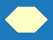

<h1>Geometrie &gt; Pole</h1>
  
Umožňuje nastavit počet rámů primární nosné kosntrukce a rozteče polí mezi nimi při zachování nastavených půdorysných rozměrů.

  
<b><u>Ovládací tlačítka</u> upravují vlastnosti konstrukce pouze na vybrané stěnové rovině.</b>

  
 <!-- Vodorovná čára jako oddělovač sekce -->

  <h2>Editace jednotlivých polí</h2>
  
<b>Délky a počty polí je možné upravovat po kliknutí na příslušný segment v otevřené tabulce.</b>

  

  <!-- Tlačítko pro otevření modálního videa -->
  <button onclick="document.getElementById('modal').style.display='flex';" class="btn">
    Přehrát videoukázku
  </button>

<!-- Modální okno (skryté) -->

  <video id="modalVideo" controls autoplay style="max-width: 90%; max-height: 80vh;">
    <source src="img/VideoEditBays.mp4" type="video/mp4">
    Váš prohlížeč nepodporuje přehrávání videa.
  </video>
   
  <button onclick="
    document.getElementById('modal').style.display='none';
    const vid = document.getElementById('modalVideo');
    vid.pause();
    vid.currentTime = 0;
  " class="btn">
    Zavřít video
  </button>

<!-- Skript -->

  
 <!-- Vodorovná čára jako oddělovač sekce -->

  <table>
    <tr>
      <td>
        

          
          

            Vlastnosti
          

        

      </td>
      <td style="vertical-align: middle; font-size: 20px; padding-left: 30px;">
        Vlastnosti
      </td>
    </tr>
  </table>
  
Tlačítkem <u>Vlastnosti</u> je možné nastavit pravidla pro generování polí mezi rámy primární nosné konstrukce.

  
Tytéž vlastnosti lze upravit pomocí <u>Ovládacího tlačítka</u> umístěného ve středu modelu.

  
 <!-- Vodorovná čára jako oddělovač sekce -->

  <table>
    <tr>
      <td></td>
      <td style="vertical-align: middle; font-size: 20px; padding-left: 30px;">Rozteče</td>
    </tr> 
  </table>
  
Tlačítko <u>Rozteče</u> umožňuje upravit počet a délku polí mezi rámy hlavní nosné konstrukce.

  
 <!-- Vodorovná čára jako oddělovač sekce -->

  <table>
    <tr>
      <td></td>
      <td style="vertical-align: middle; font-size: 20px; padding-left: 30px;">Ovládací tlačítko</td>
    </tr> 
  </table>
  
<u>Ovládací tlačítko</u> umožňuje přidání a nastavení portálových rámů v rámci jednotlivých polí.

  
Portálovým rámům je možné nastavit umístění pomocí vzdálenosti od konce pole a pomocí délky rámu. Rámu lze také nastavit vlastní výšku a případně vypnout jednotlivé sloupy.

  
Rám je možné ve stejné tabulce také smazat, toto lze provést pomocí tlačítka vpravo nahoře.

  
 <!-- Vodorovná čára jako oddělovač sekce -->

  <h2>Nepomohla Vám nápověda?</h2>
  
Pro více informací o funkcích HiStruct Building Configurator můžete navštívit náš blog nebo zaslat dotaz na naší podporu.

  <table>
    <tr>
      <td>
        <a href="https://docs.histruct.com/cs/" target="_blank" rel="noopener noreferrer"> 
          <button class="btn">Navštívit blog</button>
        </a>
      </td>
      <td>
        <a href="mailto:support@histruct.com?subject=Dotaz na Support HiStruct">
          <button class="btn">Zaslat dotaz</button>
        </a>
      </td>
    </tr>
  </table>
