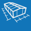
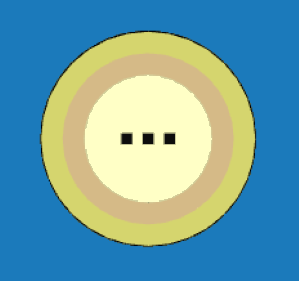

<h1>Geometrie</h1>

Umožňuje měnit geometrické parametry modelu, tedy rozměry budovy a střechy včetně sklonu a přesahů. Rovněž je zde možné nastavit typ skladby střechy.

<b><u>Ovládací tlačítka</u> upravují vlastnosti konstrukce pouze na vybrané střešní či stěnové rovině.</b>

 <!-- Vodorovná čára jako oddělovač sekce -->

<table>
  <tr>
    <td>
      

        
        
Budova

      

    </td>
    <td style="vertical-align: middle; font-size: 20px; padding-left: 30px;">Budova</td>
  </tr>
</table>

Tlačítko <u>Budova</u> slouží k zadání půdorysných rozměrů objektu, k nastavení výšky objektu, sklonu a přesahu střechy a k otáčení okapové hrany.

Základní půdorysné rozměry je možné zadávat buď pro střešní konstrukci nebo pro svislé stěny.

 <!-- Vodorovná čára jako oddělovač sekce -->

<!--<table>
  <tr>
    <td>
      

        
        
Střecha

      

    </td>
    <td style="vertical-align: middle; font-size: 20px; padding-left: 30px;">Střecha</td>
  </tr>
</table>

Tlačítko <u>Střecha</u> umožňuje nastavit typ skladby střechy. Typ krytiny a rozměry sekundární střešní konstrukce lze měnit přes tlačítko <u>Opláštění</u>.

 <!-- Vodorovná čára jako oddělovač sekce -->

<table>
  <tr>
    <td>
      

        
        
Stěny

      

    </td>
    <td style="vertical-align: middle; font-size: 20px; padding-left: 30px;">Stěny</td>
  </tr>
</table>

Tlačítko <u>Stěny</u> umožňuje nastavit způsob zarovnání stěny, typ výroby stěny, způsob kladení řad opláštění a výšku soklu.

Tato nastavení lze upravit pro jednotlivé stěny pomocí příslušných Ovládacích tlačítek.

 <!-- Vodorovná čára jako oddělovač sekce -->

<table>
  <tr>
    <td>
      

        
        
Přidat stěnu 2D

      

    </td>
    <td style="vertical-align: middle; font-size: 20px; padding-left: 30px;">Přidat stěnu 2D</td>
  </tr>
</table>

Tlačítko <u>Přidat stěnu 2D</u> umožňuje do konstrukce přidávat vnitřní svislé stěny a upravovat vlastnosti stěn.

 <!-- Vodorovná čára jako oddělovač sekce -->

<table>
  <tr>
    <td>
      

        
      

      Výkon
      

      

    </td>
    <td style="vertical-align: middle; font-size: 20px; padding-left: 30px">
      Výkon
    </td>
  </tr>
</table>

Umožňuje vyhodnotit potenciální výkon solárního záření na jednotlivé střešní plochy.

...Funkcionalita tlačítka <u>Výkon</u> se připravuje pro budoucí verzi programu...

 <!-- Vodorovná čára jako oddělovač sekce -->

<table>
  <tr>
    <td>
      

        
        
Pole

      

    </td>
    <td style="vertical-align: middle; font-size: 20px; padding-left: 30px;">Pole</td>
  </tr>
</table>

Tlačítko <u>Pole</u> umožňuje nastavit počet rámů primární nosné konstrukce a rozteče polí mezi nimi při zachování nastavených půdorysných rozměrů.

 <!-- Vodorovná čára jako oddělovač sekce -->

<table>
  <tr>
    <td>
      

        
        
Anotace

      

    </td>
    <td style="vertical-align: middle; font-size: 20px; padding-left: 30px;">Anotace</td>
  </tr>
</table>

Tlačítko <u>Anotace</u> umožňuje do modelu přidávat libovolné půdorysné kóty.

 <!-- Vodorovná čára jako oddělovač sekce -->

<table>
  <tr>
    <td>
      

        
        
Měření

      

    </td>
    <td style="vertical-align: middle; font-size: 20px; padding-left: 30px;">Měření</td>
  </tr>
</table>

Tlačítkem <u>Měření</u> je možné zkontrolovat rozměry modelu.

 <!-- Vodorovná čára jako oddělovač sekce -->

<table>
  <tr>
    <td></td>
    <td style="vertical-align: middle; font-size: 20px; padding-left: 30px;">Ovládácí tlačítko</td>
  </tr> 
</table>

<!--
<b><u>Ovládací tlačítko na střešní rovině</u></b> umožňuje nastavení typu skladby střechy pro jednotlivé střešní roviny.
-->

<b><u>Ovládací tlačítko na stěnové rovině</u></b> umožňuje nastavit zarovnání stěny, typ výroby a způsob kladení řad. Stěnu je zde možné taktéž vypnout.

 <!-- Vodorovná čára jako oddělovač sekce -->

<table>
  <tr>
    <td></td>
    <td style="vertical-align: middle; font-size: 20px; padding-left: 30px;">Ovládácí tlačítko základní komponenty</td>
  </tr> 
</table>

<b><u>Ovládací tlačítko základní stěnové komponenty</u></b> umožňuje nastavit typ výroby a způsob rozdělení stěny.

 <!-- Vodorovná čára jako oddělovač sekce -->

<table>
  <tr>
    <td></td>
    <td style="vertical-align: middle; font-size: 20px; padding-left: 30px;">Ovládácí tlačítko rozdělené komponenty</td>
  </tr> 
</table>

Podle počtu úrovní rozdělení původní stěnové komponenty se ovládací tlačítko komponenty rozšiřuje - umožňuje tak upravovat tytéž vlastnosti na celé původní stěnové komponentě nebo na jejích různých částech, případně jednotlivé části dále dělit a vytvářet další úrovně původní stěnové komponenty.

Nejnižší úroveň rozdělené komponenty se ovládá pomocí středové části tlačítka, další úrovně pak vždy pomocí vnějších částí po obvodu tlačítka.

 <!-- Vodorovná čára jako oddělovač sekce -->

<!-- product: HiStruct Building Configurator -->

