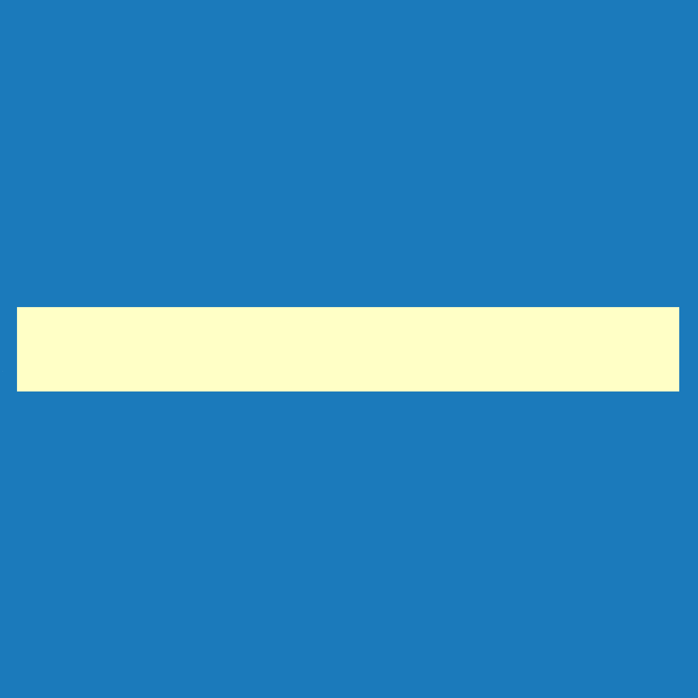

<!DOCTYPE html>
<html>
<head>
  <meta charset="UTF-8">
  <title>Opláštění</title>
</head>

<body>

<h1>Opláštění</h1>

Menu <u><i>Opláštění</i></u> umožňuje nastavit typ skladby střechy, typ střešní krytiny a rozměry sekundární střešní konstrukce.

U stěn pak lze nastavit typ výroby stěny a materiál jednotlivých vrstev stěny.

<b>Nastavení a úpravy jednotlivých střešních a stěnových rovin je možné provést pomocí <u>Ovládacích a Editačních tlačítek</u>.</b>

 <!-- Vodorovná čára jako oddělovač sekce -->

<table>
  <tr>
    <td>
      

        
        

          Střecha
        

      

    </td>
    <td style="vertical-align: middle; font-size: 20px; padding-left: 30px;">
      Střecha
    </td>
  </tr>
</table>

Tlačítko <u>Střecha</u> umožňuje nastavit typ skladby střechy, typ střešní krytiny a rozměry sekundární střešní konstrukce pro celou střechu.

 <!-- Vodorovná čára jako oddělovač sekce -->

<table>
  <tr>
    <td>
      

        
        

          Stěny #.#
        

      

    </td>
    <td style="vertical-align: middle; font-size: 20px; padding-left: 30px;">
      Stěny #.#
    </td>
  </tr>
</table>

Tlačítko <u>Stěny #.#</u> umožňuje nastavit typ výroby stěny, způsob kladení řad opláštění a výšku soklu.

 <!-- Vodorovná čára jako oddělovač sekce -->

<table>
  <tr>
    <td>
      

        
        

          Anotace
        

      

    </td>
    <td style="vertical-align: middle; font-size: 20px; padding-left: 30px;">
      Anotace
    </td>
  </tr>
</table>

Tlačítko <u>Anotace</u> umožňuje do modelu přidávat libovolné půdorysné kóty.

 <!-- Vodorovná čára jako oddělovač sekce -->

<table>
  <tr>
    <td>
      

        
        

          Měření
        

      

    </td>
    <td style="vertical-align: middle; font-size: 20px; padding-left: 30px;">
      Měření
    </td>
  </tr>
</table>

Tlačítko <u>Měření</u> umožňuje zkontrolovat rozměry modelu.

 <!-- Vodorovná čára jako oddělovač sekce -->

<table>
  <tr>
    <td></td>
    <td style="vertical-align: middle; font-size: 20px; padding-left: 30px;">Ovládací tlačítko</td>
  </tr>
</table>

<b><u>Pro jednotlivé střešní roviny umožňuje:</u></b>

<ul>
<li>
Nastavení typu skladby střechy, typu krytiny a rozměry sekundární konstrukce.
</li>
<li>
Generování kusovníku s položkami střešní krytiny a také generování půdorysu střešní konstrukce se všemi vrstvami ve formě editovatelného výkresu.
</li>
</ul>

<b><u>Pro jednotlivé stěnové roviny umožňuje:</u></b>

<ul>
<li>
Nastavení typu výroby stěny, způsobu kladení řad opláštění, výšku soklu nebo barevné schéma.
</li>
<li>
Nastavení materiálu stěny a úpravu jednotlivých vrstev opláštění podle typu výroby stěny.
</li>
<li>
Generování kusovníku s položkami opláštění stěny a pohledu na stěnu ve formě editovatelného výkresu.
</li>
</ul>

 <!-- Vodorovná čára jako oddělovač sekce -->

<table>
  <tr>
    <td></td>
    <td style="vertical-align: middle; font-size: 20px; padding-left: 30px;">Editační tlačítko</td>
  </tr>
</table>

<b><u>Pro jednotlivé vrstvy skladby střechy na určené střešní rovině umožňuje:</u></b>

<ul>
<li>
Nastavení směru kladení, taktéž úpravu pozice a úhlu kladení.
</li>
<li>
Generování půdorysu příslušné vrstvy střešní konstrukce ve formě editovatelného výkresu.
</li>
<li>
Pro střešní krytinu je možné také vygenerovat výkaz materiálu s položkami střešní krytiny.
</li>
</ul>

<b><u>Pro jednotlivé vrstvy skladby opláštění na určené stěnové rovině umožňuje:</u></b>

<ul>
<li>
Nastavení směru kladení, taktéž úpravu pozice a úhlu kladení.
</li>
<li>
Generování pohledu na stěnu ve formě editovatelného výkresu.
</li>
<li>
Pro opláštění stěny je možné také vygenerovat výkaz materiálu s položkami.
</li>
</ul>

 <!-- Vodorovná čára jako oddělovač sekce -->

<h2>Chybí vám v galerii některá krytina? Napište nám, doplníme ji.</h2>

<table>
  <tr>
    <td>
      <a href="mailto:jiri.podval@histruct.com?subject=Dotaz na HiStruct konfigurátor budov">
        <button class="btn">Chci doplnit</button>
      </a>
    </td>
  </tr>
</table>

<h2>Nepomohla Vám nápověda?</h2>

Pro více informací o funkcích HiStruct Building Configurator můžete navštívit náš blog nebo zaslat dotaz na naší podporu.

<table>
  <tr>
    <td>
      <a href="https://docs.histruct.com/cs/" target="_blank" rel="noopener noreferrer">
        <button class="btn">Navštívit blog</button>
      </a>
    </td>
    <td>
      <a href="mailto:support@histruct.com?subject=Dotaz na Support HiStruct">
        <button class="btn">Zaslat dotaz</button>
      </a>
    </td>
  </tr>
</table>

</body>
</html>
