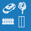
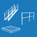

<h1>Příslušenství &gt; Vložit</h1>

Menu <u><i>Příslušenství &gt; Vložit</i></u> umožňuje do modelu přidávat různé doplňky pro lepší vzhled a realističnost modelu.

<b>Kliknutím na vložený doplněk je možné jej dále editovat:</b>

<ul>
  <li>
upravit jeho přesný typ (například typ vozidla nebo stromu)
</li>
  <li>
měnit jeho rozměry
</li>
  <li>
posouvat, otáčet či případně smazat
</li>
  <li>
u některých doplňků je také možné měnit jejich barvu
</li>
</ul>

 <!-- Vodorovná čára jako oddělovač sekce -->
    
<table>
      <tr>
        <td>
          

            
            

              Objemy
            

          

        </td>
        <td style="vertical-align: middle; font-size: 20px; padding-left: 30px;">
          Objemy
        </td>
      </tr>
    </table>

Tlačítkem <u>Objemy</u> je možné do modelu vložit 3D geometrické doplňky.

 <!-- Vodorovná čára jako oddělovač sekce -->

<table>
  <tr>
    <td>
      

        
        
.

      

    </td>
    <td>
      

        
        
.

      

    </td>
    <td style="vertical-align: middle; font-size: 20px; padding-left: 30px;">
      ... a další
    </td>
  </tr>
</table>

Doplňkovými tlačítky je možné do modelu vložit další 3D doplňky.

 <!-- Vodorovná čára jako oddělovač sekce -->

<!--<table>
      <tr>
        <td>
          

            
            

              Vložit
            

          

        </td>
        <td style="vertical-align: middle; font-size: 20px; padding-left: 30px;">
          Vložit
        </td>
      </tr>
    </table>

Tlačítkem <u>Vložit</u> je možné do modelu vložit vybrané doplňky.

 <!-- Vodorovná čára jako oddělovač sekce -->

<!--<table>
      <tr>
        <td>
          

            
            

              Měření
            

          

        </td>
        <td style="vertical-align: middle; font-size: 20px; padding-left: 30px;">
          Měření
        </td>
      </tr>
    </table>

Tlačítkem <u>Měření</u> je možné zkontrolovat rozměry modelu.

 <!-- Vodorovná čára jako oddělovač sekce -->

<!-- product: HiStruct Building Configurator -->

