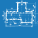
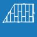
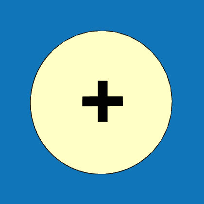

<h1>Geometrie</h1>

Umožňuje kreslit střešní roviny, měnit jejich tvary, rozměry či sklony.

<b>Pro přehlednější práci s programem se obsah menu <u>Geometrie</u> liší pro fázi před nakreslením první plochy a fázi po nakreslení první plochy.</b>

<b><u>Ovládací tlačítka</u> upravují vlastnosti střešní konstrukce pouze na vybrané střešní rovině.</b>

 <!-- Vodorovná čára jako oddělovač sekce -->

  

    FÁZE 1: Chci nakreslit první plochu
  

  

<h1>Geometrie</h1>

Umožňuje kreslit střešní roviny, měnit jejich tvary, rozměry či sklony, taktéž umožňuje nastavit typ skladby střechy.

 <!-- Vodorovná čára jako oddělovač sekce -->
<table>
  <tr>
    <td>
      

        
      

      Podklad
      

      

    </td>
    <td style="vertical-align: middle; font-size: 20px; padding-left: 30px">
      Podklad
    </td>
  </tr>
</table>

Tlačítko <u>Podklad</u> slouží k importu podkladu pro rychlejší kreslení obrysu střechy.
 

Po importu pokladu je třeba zkontrolovat jeho rozměry a případně upravit měřítko.

<b><u>Úprava měřítka importovaného podkladu</u></b>

<ul>

<li>
Po kliknutí na mřížku importovaného podkladu je možné měřítko změnit přímo v příslušné buňce v otevřené tabulce. 
</li>

<li>
Pro úpravu měřítka je taktéž možné použít tlačítko <u>Měřítko</u>, které je umístěno v horní části otevřené tabulky. Pomocí tohoto tlačítka je možné nastavit měřítko podkladu pomocí zvolené hrany, u které známe její skutečné rozměry.
</li>

</ul>

{{ modal_video_button("img/VideoImportDXF.mp4") }}

 <!-- Vodorovná čára jako oddělovač sekce -->

<table>
  <tr>
    <td>
      

        
      

      Plocha
      

      

    </td>
    <td style="vertical-align: middle; font-size: 20px; padding-left: 30px">
      Plocha
    </td>
  </tr>
</table>

Tlačítko <u>Plocha</u> slouží k zakreslení půdorysného obrysu střešní roviny. Střešní roviny lze kreslit pomocí předdefinovaných tvarů ploch:

<table>
  <tr>
    <td>
      

        
      

      Obecný
      

      

    </td>
    <td>
      

        
      

      Obdélník
      

      

    </td>
    <td>
      

        
      

      Trojúhelník
      

      

    </td>
    <td>
      

        
      

      Lichoběžník
      

      

    </td>
    <td style="vertical-align: middle; font-size: 20px; padding-left: 30px">
      ... a další
    </td>
  </tr>
</table>

Po zakreslení či vložení plochy je možné v závislosti na typu plochy upravovat její rozměry a sklon, a také výšku i směr okapové hrany v příslušné otevřené tabulce.

 <!-- Vodorovná čára jako oddělovač sekce -->

<table>
    <tr>
      <td>
        

          
          

            Obecný
          

        

      </td>
      <td style="vertical-align: middle; font-size: 20px; padding-left: 30px">
        Obecný
      </td>
    </tr>
  </table>

  
Tlačítkem <u>Obecný</u> je možné kreslit střešní rovinu libovolného tvaru, přičemž kreslení je možné jednak v půdorysné rovině, ale také ve 3D prostoru. K tomu lze využít:

  
<b><u>Volné kreslení pomocí kurzoru (lze i ve 3D prostoru)</u></b>

  <ul>
    <li>
Hrany lze kreslit volným klikáním do modelovacího prostoru.
</li>
    <li>
Během kreslení hran v půdorysné rovině je možné využít funkce zarovnávání kurzoru podle směrů os X a Y, případně zarovnávání kurzoru kolmo k poslední zadané hraně.
</li>
    <li>
<b>Při kreslení střešní plochy ve 3D prostoru je třeba využít koncových bodů již namodelovaných střešních ploch a poté změnit typ plochy PROMÍTÁNÍ -> OBECNÝ</b>.
  </ul>

{{ modal_video_button("img/VideoPlanes3D.mp4") }}

  
<b><u>Globální souřadnice vrcholů polygonu</u></b>

  <ul>
    <li>
Globální souřadnice pro následující vrchol se zapíší ve formátu "X;Y", tedy např. <b>2;4</b>
</li>
  </ul>

{{ modal_video_button("img/VideoPlanesGlobal.mp4") }}

  
<b><u>Relativní souřadnice vrcholů polygonu</u></b>

  <ul>
    <li>
Relativní souřadnice pro následující vrchol se zapíší ve formátu "@X;Y", tedy např. <b>@2;4</b>
</li>
  </ul>

{{ modal_video_button("img/VideoPlanesRelative.mp4") }}

  
<b><u>Polární souřadnice vrcholů polygonu</u></b>

  <ul>
    <li>
Polární souřadnice pro následující vrchol se zapíší ve formátu "&gt;alfa;L", tedy např. <b>&gt;135;6</b>
</li>
    <li>
Zadávaný úhel se odměřuje o kladného směru globální osy X proti směru hodinových ručiček.
</li>
  </ul>

{{ modal_video_button("img/VideoPlanesPolar.mp4") }}

  
Poslední vložený bod je možné smazat pomocí klávesy <b><u>DELETE</u></b>.

 <!-- Vodorovná čára jako oddělovač sekce -->

<table>
  <tr>
    <td>
      

        
      

      Obdélník
      

      

    </td>
    <td style="vertical-align: middle; font-size: 20px; padding-left: 30px">
      Obdélník
    </td>
  </tr>
</table>

Střešní rovinu obdélníkového tvaru lze zadat volným klikáním do půdorysné roviny nebo pomocí jeho rozměrů ve tvaru "X;Y", tedy např. <b>2;4</b>.

 <!-- Vodorovná čára jako oddělovač sekce -->

<table>
  <tr>
    <td>
      

        
      

      Trojúhelník
      

      

    </td>
    <td>
      

        
      

      Lichoběžník
      

      

    </td>
    <td style="vertical-align: middle; font-size: 20px; padding-left: 30px">
      ... a další
    </td>
  </tr>
</table>

Střešní rovinu dalších tvarů lze zadat přímo kliknutím do modelovacího prostoru, následně lze v editační tabulce upravit rozměry.

 <!-- Vodorovná čára jako oddělovač sekce -->

<h2>Editace střešních rovin</h2>

<b><u>Tabulku pro editaci roviny je možné otevřít kliknutím na zvolenou rovinu.</u></b>

Plochu lze pomocí tlačítek v horní části tabulky kopírovat, smazat, otáčet v půdorysné rovině nebo v rovině plochy, a také posouvat ve všech 3 směrech.

{{ modal_video_button("img/VideoEditPlanes.mp4") }}

  

    Další možnosti editace střešních rovin
  

  

<h1>Geometrie &gt; Rozměry &gt; Plocha</h1>

  
 Menu <u><i>Geometrie &gt; Rozměry &gt; Plocha</i></u> přístupné přes kliknutí na zvolenou plochu umožňuje provádět editace střešních rovin přes otevřenou tabulku.

  

  U jednotlivých střešních ploch lze upravovat typ geometrického promítání plochy, rozměry některých tvarů ploch, dále sklon a směr sklonu a také výšku okapové hrany nad půdorysným průmětem roviny.
  

  
  

  Plochu lze pomocí tlačítek v horní části tabulky kopírovat, smazat, otáčet v půdorysné rovině nebo v rovině plochy, a také posouvat ve všech 3 směrech.
  

 <!-- Vodorovná čára jako oddělovač sekce -->

<table>
    <tr>
      <td>
        

          
          

            Geometrie
          

        

      </td>
      <td style="vertical-align: middle; font-size: 20px; padding-left: 30px">
        Geometrie
      </td>
    </tr>
  </table>

  

  Tlačítko <u>Geometrie</u> umožňuje u příslušné střešní roviny provádět další úpravy geometrie. 
  

  

  <b>
  Úpravy je možné provádět po kliknutí na hranu přislušné plochy, u rovin zakreslených pomocí Obecného tvaru je možné využít i některá ze žlutých tlačítek zobrazených u hran.
  </b>
  

  
<b><u>Roviny zakreslenené pomocí předdefinovaných tvarů</u></b>

  
  <ul>
  <li>
  

  U rovin zakreselných pomocí předdefinovaných tvarů (Obdélník, Trojúhelník, Lichoběžník, ...) je možné změnit typ geometrického tvaru a rozměry, případně plochu otáčet kolem roviny Z.
  

  </li>
  </ul>

  
<b><u>Roviny zakreslené pomocí Obecného tvaru</u></b>

  <ul>
  <li>
  

  U rovin zakreselných pomocí Obecného tvar je možné po kliknutí na hranu plochy změnit typ jejího geometrického tvaru (a následně upravovat rozměry), případně plochu otáčet kolem roviny Z.
  

  </li>
  <li>
  

  Po kliknutí na jeden z rohových bodů (zobrazeny červeným křížkem) je možné tomuto bodu v příslušné tabulce upravit pozici v Globálních souřadnicích.
  Tyto body lze na hranu také přidávat pomocí žlutého tlačítka Přidat 
  .

  </ul>

  
 <!-- Vodorovná čára jako oddělovač sekce -->

  <table>
    <tr>
      <td>
        

          
          

            Akce
          

        

      </td>
      <td style="vertical-align: middle; font-size: 20px; padding-left: 30px">
        Akce
      </td>
    </tr>
  </table>

  

  Tlačítkem <u>Akce</u> je možné provádět úpravu pozice a orientace střešní roviny.
  

  

  Roviny je možné otáčet kolem hlavních os X,Y a Z, dále je možné upravit jejich pozici nebo je převrátit.
  

  

  

 <!-- Vodorovná čára jako oddělovač sekce -->

<table>
  <tr>
    <td>
      

        
      

      Otvor
      

      

    </td>
    <td style="vertical-align: middle; font-size: 20px; padding-left: 30px">
      Otvor
    </td>
  </tr>
</table>

Tlačítkem <u>Otvor</u> je možné do vygenerované střešní roviny vsadit otvor, zakresluje se jako půdorysný průmět.

Otvor může být obdélníkový či obecného tvaru a lze mu přiřadit typ otvoru pro komín.

Otvor obdélníkového tvaru lze zadat volným klikáním do půdorysné roviny nebo pomocí jeho rozměrů ve tvaru "X;Y", tedy např. <b>2;4</b>. Otvor obecného tvaru lze zakreslit volným klikáním nebo pomocí souřadnicových systémů podobně jako obrys střešní konstrukce.

Po kliknutí na příslušný otvor lze pomocí tlačítek v horní části otevřené tabulky měnit jeho typ, polohu či jej smazat.

{{ modal_video_button("img/VideoEditOpenings.mp4") }}

 <!-- Vodorovná čára jako oddělovač sekce -->

<table>
  <tr>
    <td>
      

        
      

      Anotace
      

      

    </td>
    <td style="vertical-align: middle; font-size: 20px; padding-left: 30px">
      Anotace
    </td>
  </tr>
</table>

Tlačítko <u>Anotace</u> umožňuje do modelu přidávat libovolné půdorysné kóty.

 <!-- Vodorovná čára jako oddělovač sekce -->

<table>
  <tr>
    <td>
      

        
      

      Měření
      

      

    </td>
    <td style="vertical-align: middle; font-size: 20px; padding-left: 30px">
      Měření
    </td>
  </tr>
</table>

Tlačítkem <u>Měření</u> je možné zkontrolovat rozměry modelu.

 <!-- Vodorovná čára jako oddělovač sekce -->

<table>
  <tr>
    <td>
      

        
      

      Přidat
      

      

    </td>
    <td style="vertical-align: middle; font-size: 20px; padding-left: 30px">
      Přidat
    </td>
  </tr>
</table>

Tlačítkem <u>Přidat</u> je možné do modelového prostoru přidat další (vedlejší) střešní konstrukce.

<ul>
  <li>
    
Střechu definovanou obrysem

  </li>
  <li>
    
Další střechu modelovanou po plochách

  </li>
</ul>

 <!-- Vodorovná čára jako oddělovač sekce -->

  

    FÁZE 2: Po nakreslení první plochy
  

  

  <h1>Geometrie</h1>

<table>
  <tr>
    <td>
      

        
      

      Rozměry
      

      

    </td>
    <td style="vertical-align: middle; font-size: 20px; padding-left: 30px">
      Rozměry
    </td>
  </tr>
</table>

Tlačítko <u>Rozměry</u> slouží ke kreslení a vkládání střešních rovin. Pro tyto roviny je možné dále upravovat jejich geometrii, vytvářet v nich otvory a nastavit parametry pro správné propojení rovin.

 <!-- Vodorovná čára jako oddělovač sekce -->

<!--<table>
  <tr>
    <td>
      

        
      

      Střecha
      

      

    </td>
    <td style="vertical-align: middle; font-size: 20px; padding-left: 30px">
      Střecha
    </td>
  </tr>
</table>

Tlačítko <u>Střecha</u> umožňuje nastavit typ skladby střechy. Typ krytiny a rozměry sekundární střešní konstrukce lze měnit přes tlačítko <u>Opláštění</u>.

 <!-- Vodorovná čára jako oddělovač sekce -->

<table>
  <tr>
    <td>
      

        
      

      Rosol
      

      

    </td>
    <td style="vertical-align: middle; font-size: 20px; padding-left: 30px">
      Rosol
    </td>
  </tr>
</table>

Umožňuje upravit rozměry a sklony vygenerovaných hran a ploch, změnit výšku a případně excentricitu střechy.

 <!-- Vodorovná čára jako oddělovač sekce -->

<table>
  <tr>
    <td>
      

        
      

      Výkon
      

      

    </td>
    <td style="vertical-align: middle; font-size: 20px; padding-left: 30px">
      Výkon
    </td>
  </tr>
</table>

Umožňuje vyhodnotit potenciální výkon solárního záření na jednotlivé střešní plochy.

...Funkcionalita tlačítka <u>Výkon</u> se připravuje pro budoucí verzi programu...

 <!-- Vodorovná čára jako oddělovač sekce -->

<table>
  <tr>
    <td>
      

        
      

      Anotace
      

      

    </td>
    <td style="vertical-align: middle; font-size: 20px; padding-left: 30px">
      Anotace
    </td>
  </tr>
</table>

Tlačítko <u>Anotace</u> umožňuje do modelu přidávat libovolné půdorysné kóty.

 <!-- Vodorovná čára jako oddělovač sekce -->

<table>
  <tr>
    <td>
      

        
      

      Měření
      

      

    </td>
    <td style="vertical-align: middle; font-size: 20px; padding-left: 30px">
      Měření
    </td>
  </tr>
</table>

Tlačítkem <u>Měření</u> je možné zkontrolovat rozměry modelu.

 <!-- Vodorovná čára jako oddělovač sekce -->

<!-- product: HiStruct Roofs -->

