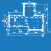

<!DOCTYPE html>
<html>
<head>
<meta charset="UTF-8">
<title>Geometrie</title>
</head>

<body>

<h1>Geometrie</h1>

Umožňuje měnit geometrické parametry modelu, tedy rozměry budovy a střechy včetně sklonu a přesahů. Rovněž je zde možné nastavit typ skladby střechy.

<b>Pro přehlednější práci s programem se obsah menu <u>Geometrie</u> liší pro fázi před nakreslením obrysu a fázi po nakreslení prvního obrysu.</b>

<b><u>Ovládací tlačítka</u> upravují vlastnosti střešní konstrukce pouze na vybrané střešní rovině.</b>

 <!-- Vodorovná čára jako oddělovač sekce -->

  

    FÁZE 1: Chci vytvořit první střechu z obrysu
  

  

  <h1>Geometrie</h1>

Umožňuje měnit geometrické parametry modelu, tedy rozměry budovy a střechy včetně sklonu a přesahů.

 <!-- Vodorovná čára jako oddělovač sekce -->

<table>
  <tr>
    <td>
      

        
        

        Podklad
        

      

    </td>
    <td style="vertical-align: middle; font-size: 20px; padding-left: 30px;">
      Podklad
    </td>
  </tr>
</table>

Tlačítko <u>Podklad</u> slouží k importu podkladu pro rychlejší kreslení obrysu střechy.
 

Po importu pokladu je třeba zkontrolovat jeho rozměry a případně upravit měřítko.

<b><u>Úprava měřítka importovaného podkladu</u></b>

<ul>

<li>
Po kliknutí na mřížku importovaného podkladu je možné měřítko změnit přímo v příslušné buňce v otevřené tabulce. 
</li>

<li>
Pro úpravu měřítka je taktéž možné použít tlačítko <u>Měřítko</u>, které je umístěno v horní části otevřené tabulky. Pomocí tohoto tlačítka je možné nastavit měřítko podkladu pomocí zvolené hrany, u které známe její skutečné rozměry.
</li>

</ul>

  <button onclick="document.getElementById('modal5').style.display='flex';" class="btn">
    &#9654; Videoukázka
  </button>

  <video id="modalVideo5" controls autoplay style="max-width: 90%; max-height: 80vh;">
    <source src="img/VideoImportDXF.mp4" type="video/mp4">
    Váš prohlížeč nepodporuje přehrávání videa.
  </video>
   
  <button onclick="
    document.getElementById('modal5').style.display='none';
    const vid = document.getElementById('modalVideo5');
    vid.pause();
    vid.currentTime = 0;
  " class="btn">
    Zavřít video
  </button>

 <!-- Vodorovná čára jako oddělovač sekce -->

<table>
  <tr>
    <td>
      

        
        

        Obrys
        

      

    </td>
    <td style="vertical-align: middle; font-size: 20px; padding-left: 30px;">
      Obrys
    </td>
  </tr>
</table>

Tlačítko <u>Obrys</u> slouží k zakreslení půdorysného obrysu střechy. Pro zadání délky a směru jednotlivých okapových hran je možné využít:

<b><u>Volné kreslení pomocí kurzoru</u></b>

<ul>
  <li>
Hrany lze kreslit volným klikáním do modelovacího prostoru.
</li>
  <li>
Během kreslení hran je možné využít funkce zarovnávání kurzoru podle směrů os X a Y, případně zarovnávání kurzoru kolmo k poslední zadané hraně.
</li>
</ul>

  <button onclick="document.getElementById('modal0').style.display='flex';" class="btn">
    &#9654; Videoukázka
  </button>

  <video id="modalVideo0" controls autoplay style="max-width: 90%; max-height: 80vh;">
    <source src="img/VideoOutlineFree.mp4" type="video/mp4">
    Váš prohlížeč nepodporuje přehrávání videa.
  </video>
   
  <button onclick="
    document.getElementById('modal0').style.display='none';
    const vid = document.getElementById('modalVideo0');
    vid.pause();
    vid.currentTime = 0;
  " class="btn">
    Zavřít video
  </button>

<b><u>Globální souřadnice vrcholů polygonu</u></b>

<ul>
  <li>
Globální souřadnice pro následující vrchol se zapíší ve formátu &quot;X;Y&quot;, tedy např. <b>2;4</b>
</li>
</ul>

  <button onclick="document.getElementById('modal1').style.display='flex';" class="btn">
    &#9654; Videoukázka
  </button>

  <video id="modalVideo1" controls autoplay style="max-width: 90%; max-height: 80vh;">
    <source src="img/VideoOutlineGlobal.mp4" type="video/mp4">
    Váš prohlížeč nepodporuje přehrávání videa.
  </video>
   
  <button onclick="
    document.getElementById('modal1').style.display='none';
    const vid = document.getElementById('modalVideo1');
    vid.pause();
    vid.currentTime = 0;
  " class="btn">
    Zavřít video
  </button>

<b><u>Relativní souřadnice vrcholů polygonu</u></b>

<ul>
  <li>
Relativní souřadnice pro následující vrchol se zapíší ve formátu &quot;@X;Y&quot;, tedy např. <b>@2;4</b>
</li>
</ul>

  <button onclick="document.getElementById('modal2').style.display='flex';" class="btn">
    &#9654; Videoukázka
  </button>

  <video id="modalVideo2" controls autoplay style="max-width: 90%; max-height: 80vh;">
    <source src="img/VideoOutlineRelative.mp4" type="video/mp4">
    Váš prohlížeč nepodporuje přehrávání videa.
  </video>
   
  <button onclick="
    document.getElementById('modal2').style.display='none';
    const vid = document.getElementById('modalVideo2');
    vid.pause();
    vid.currentTime = 0;
  " class="btn">
    Zavřít video
  </button>

<b><u>Polární souřadnice vrcholů polygonu</u></b>

<ul>
  <li>
Polární souřadnice pro následující vrchol se zapíší ve formátu &quot;&gt;alfa;L&quot;, tedy např. <b>&gt;135;6</b>
</li>
  <li>
Zadávaný úhel se odměřuje o kladného směru globální osy X proti směru hodinových ručiček.
</li>
</ul>

  <button onclick="document.getElementById('modal3').style.display='flex';" class="btn">
    &#9654; Videoukázka
  </button>

  <video id="modalVideo3" controls autoplay style="max-width: 90%; max-height: 80vh;">
    <source src="img/VideoOutlinePolar.mp4" type="video/mp4">
    Váš prohlížeč nepodporuje přehrávání videa.
  </video>
   
  <button onclick="
    document.getElementById('modal3').style.display='none';
    const vid = document.getElementById('modalVideo3');
    vid.pause();
    vid.currentTime = 0;
  " class="btn">
    Zavřít video
  </button>

Poslední vložený bod je možné smazat pomocí klávesy <b><u>DELETE</u></b>.

 <!-- Vodorovná čára jako oddělovač sekce -->

<table>
  <tr>
    <td>
      

        
        

        Otvor
        

      

    </td>
    <td style="vertical-align: middle; font-size: 20px; padding-left: 30px;">
      Otvor
    </td>
  </tr>
</table>

Tlačítkem <u>Otvor</u> je možné do vygenerované střešní roviny vsadit otvor, zakresluje se jako půdorysný průmět.

Otvor může být obdélníkový či obecného tvaru a lze mu přiřadit typ otvoru pro komín.

 <!-- Vodorovná čára jako oddělovač sekce -->

<table>
  <tr>
    <td>
      

        
        

        Vlastnosti
        

      

    </td>
    <td style="vertical-align: middle; font-size: 20px; padding-left: 30px;">
      Vlastnosti
    </td>
  </tr>
</table>

Umožňuje upravit způsob zadání geometrie, podle nastavení je možné kreslit obrys střechy nebo stěn.

Taktéž je zde možné nastavit prolínání střešních rovin mezi jednotlivými objekty.

 <!-- Vodorovná čára jako oddělovač sekce -->

<table>
  <tr>
    <td>
      

        
        

        Smazat
        

      

    </td>
    <td style="vertical-align: middle; font-size: 20px; padding-left: 30px;">
      Smazat
    </td>
  </tr>
</table>

Smaže všechny importované podklady a střešní konstrukce zakreslené pomocí funkce <u>Obrys</u>.

 <!-- Vodorovná čára jako oddělovač sekce -->

<table>
  <tr>
    <td>
      

        
        

        Anotace
        

      

    </td>
    <td style="vertical-align: middle; font-size: 20px; padding-left: 30px;">
      Anotace
    </td>
  </tr>
</table>

Tlačítko <u>Anotace</u> umožňuje do modelu přidávat libovolné půdorysné kóty.

 <!-- Vodorovná čára jako oddělovač sekce -->

<table>
  <tr>
    <td>
      

        
        

        Měření
        

      

    </td>
    <td style="vertical-align: middle; font-size: 20px; padding-left: 30px;">
      Měření
    </td>
  </tr>
</table>

Tlačítkem <u>Měření</u> je možné zkontrolovat rozměry modelu.

 <!-- Vodorovná čára jako oddělovač sekce -->

<table>
  <tr>
    <td>
      

        
        

        Přidat
        

      

    </td>
    <td style="vertical-align: middle; font-size: 20px; padding-left: 30px;">
      Přidat
    </td>
  </tr>
</table>

Tlačítkem <u>Přidat</u> je možné do modelového prostoru přidat další (vedlejší) střešní konstrukce.

<ul>
  <li>
Další střechu definovanou obrysem
</li>
  <li>
Střechu zakreslenou pomocí střešních ploch
</li>
</ul>

 <!-- Vodorovná čára jako oddělovač sekce -->

  

    FÁZE 2: Po vytvoření první střechy z obrysu
  

  

  <h1>Geometrie</h1>

<table>
  <tr>
    <td>
      

        
        

        Rozměry
        

      

    </td>
    <td style="vertical-align: middle; font-size: 20px; padding-left: 30px;">
      Rozměry
    </td>
  </tr>
</table>

Tlačítko <u>Rozměry</u> slouží k zakreslení půdorysného tvaru objektu, k nastavení výšky objektu a sklonu střechy a také k doplnění otvorů ve střešní konstrukci.

Základní půdorysné rozměry je možné zadávat buď pro střešní konstrukci nebo pro svislé stěny.

 <!-- Vodorovná čára jako oddělovač sekce -->

<!--<table>
  <tr>
    <td>
      

        
        

        Střecha
        

      

    </td>
    <td style="vertical-align: middle; font-size: 20px; padding-left: 30px;">
      Střecha
    </td>
  </tr>
</table>

Tlačítko <u>Střecha</u> umožňuje nastavit typ skladby střechy. Typ krytiny a rozměry sekundární střešní konstrukce lze měnit přes tlačítko <u>Opláštění</u>.

 <!-- Vodorovná čára jako oddělovač sekce -->

<table>
  <tr>
    <td>
      

        
      

      Výkon
      

      

    </td>
    <td style="vertical-align: middle; font-size: 20px; padding-left: 30px">
      Výkon
    </td>
  </tr>
</table>

Umožňuje vyhodnotit potenciální výkon solárního záření na jednotlivé střešní plochy.

...Funkcionalita tlačítka <u>Výkon</u> se připravuje pro budoucí verzi programu...

 <!-- Vodorovná čára jako oddělovač sekce -->

<table>
  <tr>
    <td>
      

        
        

        Anotace
        

      

    </td>
    <td style="vertical-align: middle; font-size: 20px; padding-left: 30px;">
      Anotace
    </td>
  </tr>
</table>

Tlačítko <u>Anotace</u> umožňuje do modelu přidávat libovolné půdorysné kóty.

 <!-- Vodorovná čára jako oddělovač sekce -->

<table>
  <tr>
    <td>
      

        
        

        Měření
        

      

    </td>
    <td style="vertical-align: middle; font-size: 20px; padding-left: 30px;">
      Měření
    </td>
  </tr>
</table>

Tlačítkem <u>Měření</u> je možné zkontrolovat rozměry modelu.

 <!-- Vodorovná čára jako oddělovač sekce -->

<h2>Nepomohla Vám nápověda?</h2>

Pro více informací o funkcích HiStruct Roofs můžete navštívit náš blog nebo zaslat dotaz na naší podporu.
 
<table>
  <tr>
    <td>
      <a href="https://docs.histruct.com/cs/" target="_blank" rel="noopener noreferrer">
        <button class="btn">Navštívit blog</button>
      </a>
    </td>
    <td>
      <a href="mailto:support@histruct.com?subject=Dotaz na Support HiStruct">
         <button class="btn">Zaslat dotaz</button>
      </a>
    </td>
  </tr>
</table>

</body>
</html>
