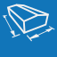

<h1>Geometrie</h1>

  
Umožňuje měnit geometrické parametry modelu, tedy rozměry budovy a střechy včetně sklonu.

  
 <!-- Vodorovná čára jako oddělovač sekce -->

  <table>
    <tr>
      <td>
        

          
          

            Budova
          

        

      </td>
      <td style="vertical-align: middle; font-size: 20px; padding-left: 30px;">
        Budova
      </td>
    </tr>
  </table>

  
Tlačítkem <u>Budova</u> lze nastavit půdorysné rozměry a výšku budovy a upravit sklon střechy.

  <ul>
    <li>
Základní půdorysné rozměry se zadávají pro střešní konstrukci.
</li>
    <li>
U některých modelů lze směr sklonu střechy otáčet pomocí tlačítka <u>Změnit okapovou hranu</u>.
</li>
  </ul>

  
 <!-- Vodorovná čára jako oddělovač sekce -->

<table>
  <tr>
    <td>
      

        
      

      Výkon
      

      

    </td>
    <td style="vertical-align: middle; font-size: 20px; padding-left: 30px">
      Výkon
    </td>
  </tr>
</table>

Umožňuje vyhodnotit potenciální výkon solárního záření na jednotlivé střešní plochy.

...Funkcionalita tlačítka <u>Výkon</u> se připravuje pro budoucí verzi programu...

 <!-- Vodorovná čára jako oddělovač sekce -->

  <h2>Nepomohla Vám nápověda?</h2>
  
Pro více informací o funkcích HiStruct Roofs můžete navštívit náš blog nebo zaslat dotaz na naší podporu.

  <table>
    <tr>
      <td>
        <a href="https://docs.histruct.com/cs/" target="_blank" rel="noopener noreferrer">
          <button class="btn">Navštívit blog</button>
        </a>
      </td>
      <td>
        <a href="mailto:support@histruct.com?subject=Dotaz na Support HiStruct">
          <button class="btn">Zaslat dotaz</button>
        </a>
      </td>
    </tr>
  </table>
