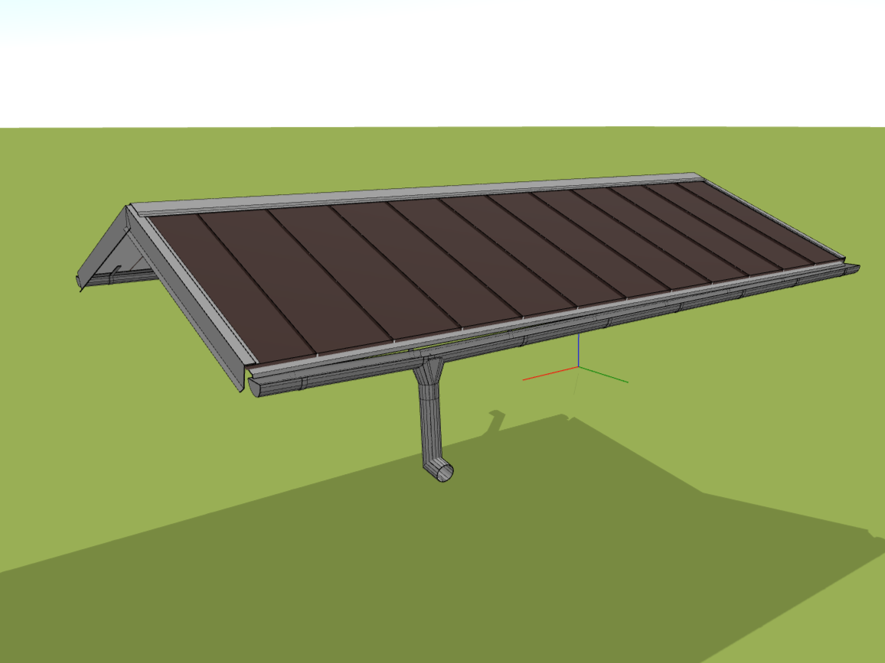

# Přidání okapu nebo lemovky

S tlačítkem *Lemovky* je přidání okapového systému nebo lemovky do vaší střechy jednoduché a efektivní. Způsob přidání se liší v závislosti na zvoleném typu, ale nejsnazší je použít náš automatický generátor. Tento inteligentní nástroj rozpozná jednotlivé hrany střešní roviny a sám jim přiřadí odpovídající lemovky. Takto vygenerované lemovky a okapový systém lze nadále libovolně upravovat, měnit či odstranit dle potřeby.

[❔Nápověda pro použití generátoru](../getting-started-roofs/roofFlashingGenerator.md)

[❔Nápověda pro přidání okapového systému](../getting-started-roofs/roofFlashingGutterOptions.md)

[❔Nápověda pro přidání oplechování a lemovek](../getting-started-roofs/roofFlashingOptions.md)