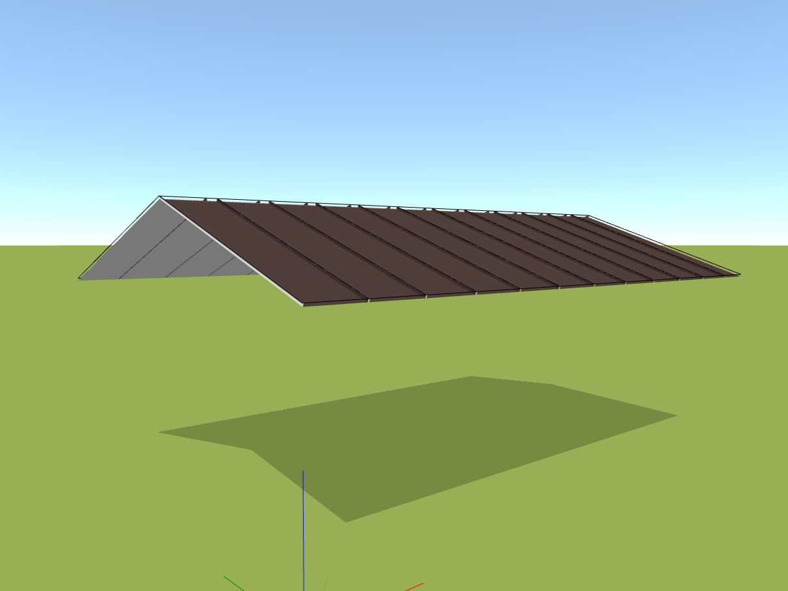

# Přidání střešní roviny

S tlačítkem *Plochy* je přidání střešní roviny hračkou. Můžete si vybrat z předefinovaných tvarů v naší nabídce, nebo se rozhodnout pro vlastní, unikátní tvar pomocí obecného tvaru.

[❔Nápověda pro přidání střešní roviny](../getting-started-roofs/modellingRoofs.md)
