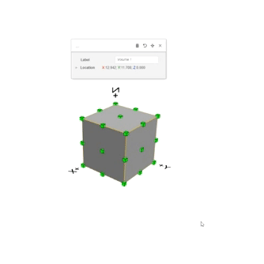

# Základní funkce

U každého objektu 3D modelu v HiStruct je možnost využití základních funkcí pro daný objekt. Nejzákladnější a nejčastější nástroje jsou: posun, otočení a vymazání objektu.

## Posun objektu

Posun provedete kliknutím na ikonu posunu. Následně vyberte referenční bod pro posun a poté vyberte další bod, čímž dojde k posunutí objektu.

## Otočení objektu

Po kliknutí na ikonu otočení vyberte referenční bod na ploše okolo, kterého se bude objekt otáčet. K tomu slouží úhloměr přiřazený ke kurzoru. Následně vyberte druhý bod a třetím bodem, nebo napsáním úhlu otočení, provedete natočení objektu.

## Vymazání objektu

Další základní funkcí je vymazání objektu, které provedete kliknutím na ikonu koše.

## Zavření dialogového okna

Poslední symbol, křížek, slouží k zavření dialogového okna. Toto okno lze znovu vyvolat kliknutím na daný objekt.

