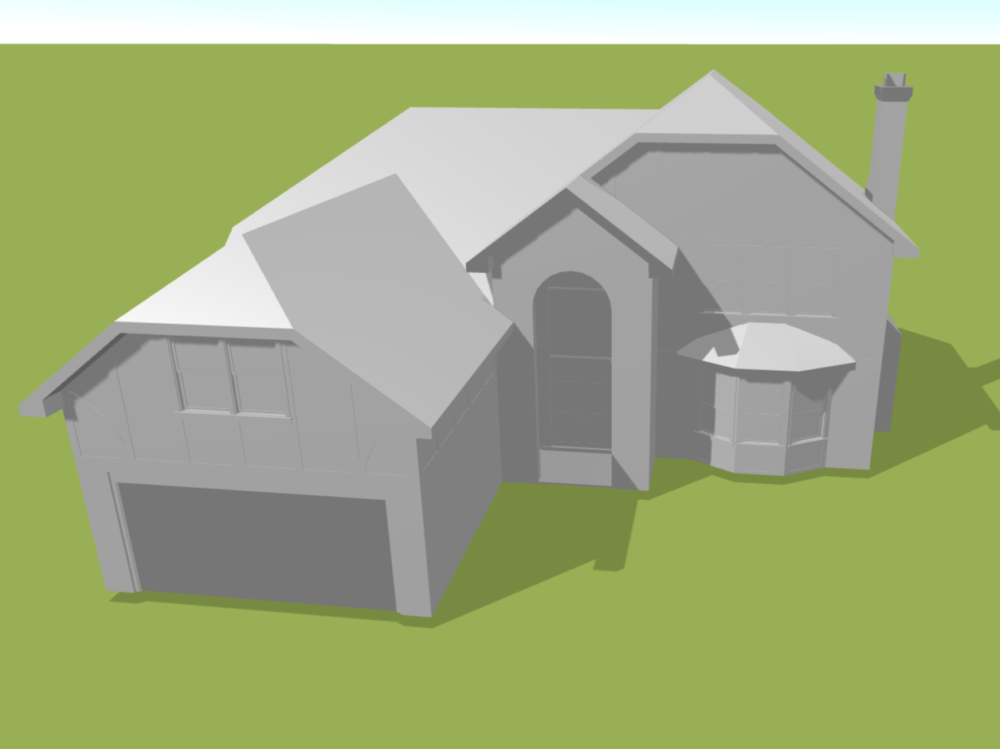

# Import

Tlačítko *Import* slouží k snadnému importování různých podkladů, které vám usnadní modelování požadovaného projektu. Můžete vložit soubory ve formátu DXF nebo OBJ. Navíc máte možnost převést své podklady z formátu PDF na jeden z podporovaných typů souborů, což vám otevírá nové možnosti a usnadňuje práci s modelováním.

[❔Nápověda pro import podkladů DXF](../getting-started-roofs/importDxf.md)

[❔Nápověda pro import podkladů OBJ](../getting-started-roofs/importObj.md)

[❔Nápověda pro konverzi PDF na DXF](../getting-started-roofs/convertPdfToDxf)

[❔Nápověda pro konverzi 3D PDF na OBJ](../getting-started-roofs/convert3dPdfToObj)

